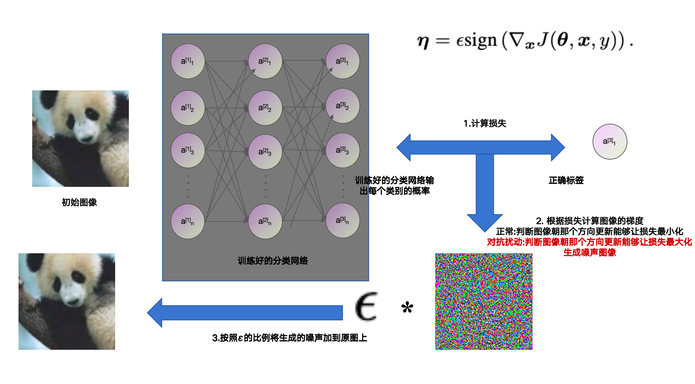
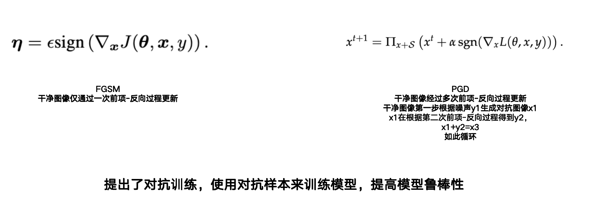

### 1.Explaining and Harnessing Adversarial Examples

- **FGSM**
- **作者: Ian J. Goodfellow、Jonathon Shlens、Christian Szegedy**
- **Google**
- **ICLR: 2015**
- **初版提交: 2024.12.20**
- **Cite: 25973**
- **创新点**
- 
- [详细信息](./Explaining and Harnessing Adversarial Examples.md)

### 2. Towards Deep Learning Models Resistant to Adversarial Attacks

- **PGD**

- **作者: Aleksander Ma ̨dry、Aleksandar Makelov、Ludwig Schmidt、Dimitris Tsipras、Adrian Vladu**

- **MIT**

- **ICLR: 2018**

- **初版提交: 2017.06.19**

- **Cite: 15714**

- **创新点**

  **==1.多次FGSM==**

  **==2.提出了对抗训练，在训练的过程中引入对抗样本提高模型鲁棒性==**

- 

- [详细信息](./Towards Deep Learning Models Resistant to Adversarial Attacks.md)

