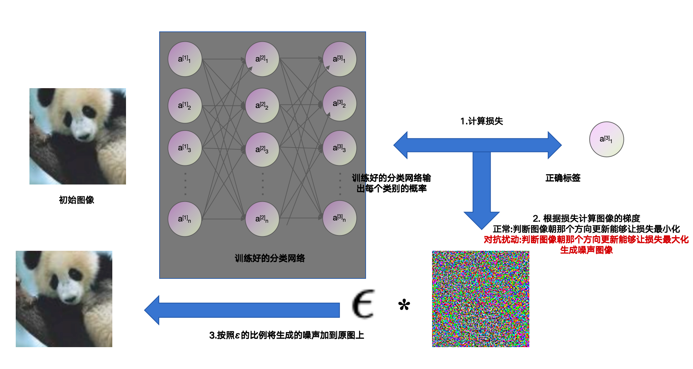

### 1.Explaining and Harnessing Adversarial Examples

- **FGSM**
- **作者: Ian J. Goodfellow、Jonathon Shlens、Christian Szegedy**
- **Google**
- **ICLR: 2015**
- **初版提交: 2024.12.20**
- **Cite: 25973**
- **创新点**
- 
- [详细信息](./Explaining and Harnessing Adversarial Examples.md)