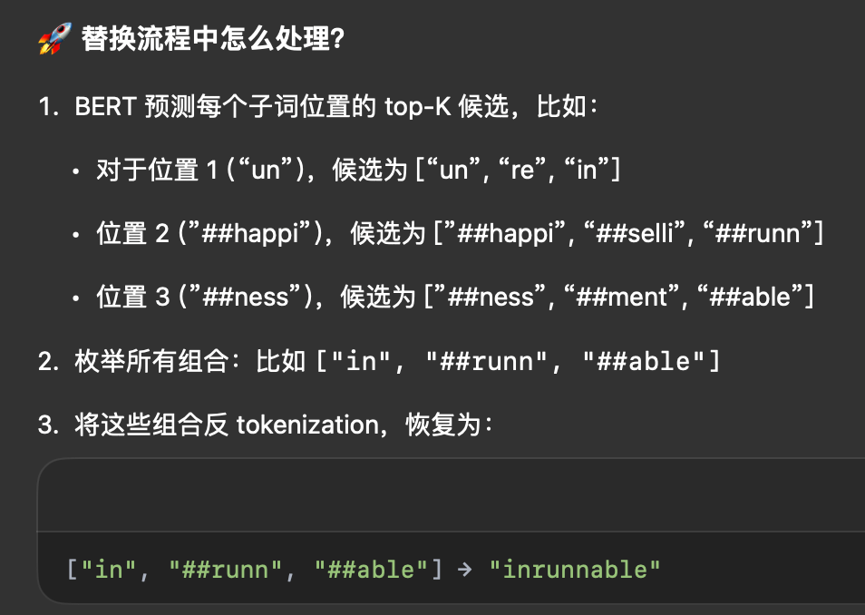

**BERT-Attack: Adversarial Attack Against BERT Using BERT**

- **背景**
- **现有问题**
  - 离散数据（如文本）的对抗攻击被证明比连续数据（如图像）更具挑战性，因为用基于梯度的方法生成对抗样本比较困难。
- **动机**
  - 我们让BERT“反过来”对抗它自己被微调后的模型或其他用于下游任务的深度神经网络，从而成功误导目标模型做出错误预测
- **贡献**
- **解决思路**
  - （1）找出目标模型中易受攻击的词；
    - 最容易受攻击的词是那些帮助模型做出判断的关键词。
      - 在黑盒攻击场景下，目标模型（如微调过的BERT或其他神经网络模型）输出的 logit 是我们唯一可以获得的监督信息。
      - 测量每个词有多重要的方法是：把它**替换成 [MASK]**，再看模型预测正确标签的分数有没有下降。
  - （2）将这些词替换为语义相近、语法正确的新词，直到攻击成功。
    - 在确定要替换的词后，我们使用掩码语言模型（如BERT），根据其Top-K预测来生成扰动词
      - 给定一个要被替换的目标词 w，我们使用 BERT 来预测一些与 w 类似、但可能误导目标模型的词
      - BERT 本来是“看到空再填词”，但我们不挖空，而是直接用整句话让它猜哪个词更合适。
      - 由于 BERT 使用 BPE 构建词汇表，大多数常见词是完整的词，而罕见词会被拆成多个子词。因此我们将单词和子词分别处理来生成替换词
        - 对于完整词
          -  wⱼ，我们使用该位置上 BERT 给出的前 K 个预测词 Pⱼ 进行尝试
          - 我们会先过滤掉停用词（来自 NLTK），对于情感分类任务，还会过滤掉反义词（因为 BERT 无法区分同义词和反义词）比如 “happy” 替换成 “sad” 虽然也是 BERT 给的，但完全改变情感，所以我们要剔除
          - 然后我们用候选词 cₖ 替换原词 wⱼ 构造出扰动后的序列 H′，如果目标模型已被成功欺骗，则停止替换流程并返回对抗样本；否则继续从剩余候选中选择最佳一个，并继续处理下一个目标词。
        - 子词
          - 对于被分成多个子词的词，我们无法直接获取替代词。因此我们通过子词组合的困惑度（perplexity）来筛选出合适的替代词
          - 对于被分成 t 个子词的词 w，我们从每个子词位置的 K 个预测中列出全部组合，总共 Kᵗ 个组合。
          - 我们再把这些子词组合反过来变成原始词（反 tokenization）然后我们将这些组合输入 BERT 掩码语言模型，计算其困惑度，再根据困惑度排序选出 top-K 的组合作为替换。
          - 
- **具体解决方法**