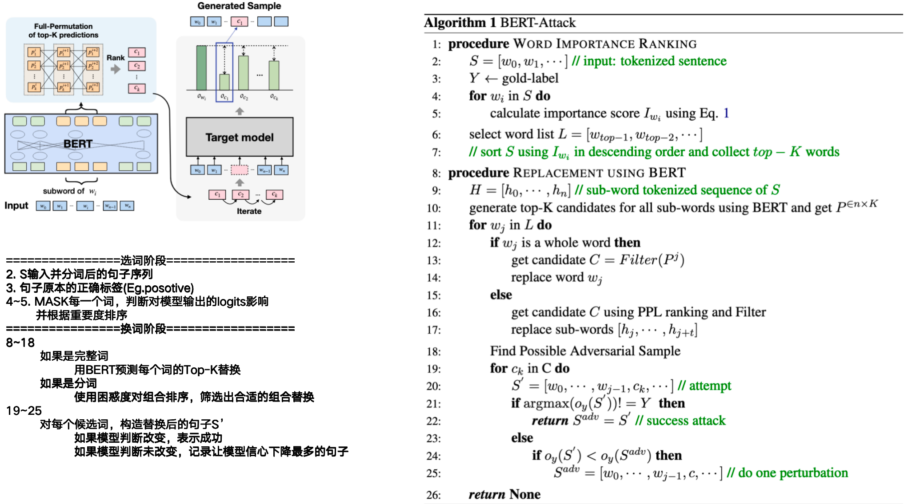

### 1.BERT-Attack: Adversarial Attack Against BERT Using BERT

- **BERT-Attack**

- **作者: Linyang Li、Ruotian Ma、Qipeng Guo、Xiangyang Xue、Xipeng Qiu**

- **Fudan University**

- **初版提交: 2020.04.21**

- **Cite: 813**

- **创新点**

  **==1.提出了对NLP的攻击方法，将攻击分为两步==**

  ​	**==第一步：筛选要替换的词，通过遍历每一个单词MASK掉判断哪个让模型信心下降最多==**

  ​	**==第二步：替换第一步选的词，对完整词和分词做不同的替换策略==**

- 

- [详细信息](./BERT-Attack: Adversarial Attack Against BERT Using BERT.md)