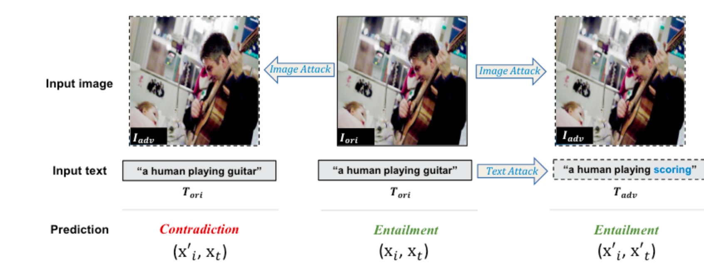
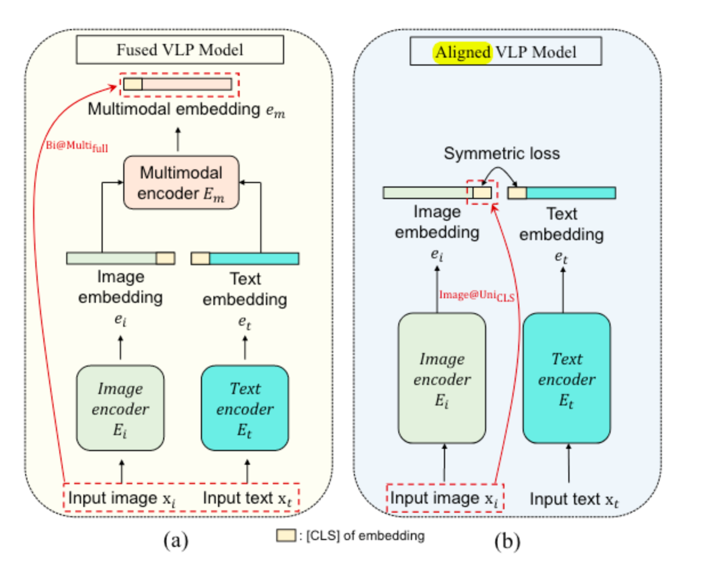

**Towards Adversarial Attack on Vision-Language Pre-training Models**. Jiaming Zhang et.al. **arxiv**, **2022**, ([pdf](assets/pdfs/Towards_Adversarial_Attack_on_Vision-Language_Pre-training_Models.pdf))([link](http://arxiv.org/abs/2206.09391v2)).

- **背景**
  - VLP的对抗性鲁棒性的研究仍然在很大程度上尚未探索

- **现有问题**

  - **目前仅存在针对单个模态攻击基于分类的攻击方法，但是VLP是涉及多模态，且大部分任务并不是分类问题**
  - **不建立模态之间的联系，图像与文本扰动独立优化可能会互相抵消**，==下图展示了不协同的分别攻击图像和文本不成功的例子==
  - 

  - 仅对图像攻击：成功
  - 不协同的分别攻击图像和文本：失败

- **动机**

  - 探索VLP的鲁棒性

- **解决思路**

  - 针对第一个问题（如何在embedding空间进行有效攻击）
    - 从两个维度分析，分别针对两种经典的VLP模型进行实验，Fused VLP（融合模型）、Aligned VLP（对齐模型）
      - 攻击目标：是攻击模型输出还是embeding对齐
      - 扰动对象：是图像还是文本，还是同时扰动
  - 针对“图像与文本扰动独立优化会互相抵消”的问题
    - **同时优化图像与文本的扰动，并协调它们的相互作用**

- 具体解决方法

  - **Fused VLP**：让扰动后的**图文融合embedding**远离原始embedding。
  - **Aligned VLP**：让扰动后的**图像embedding与文本embedding之间的对齐关系被打破**。

**==首次提出了跨模态的联合攻击，针对单流和双流架构提出了不同的攻击方法，同时解决了单独对两个模态攻击可能会造成的攻击效果抵消问题==**

