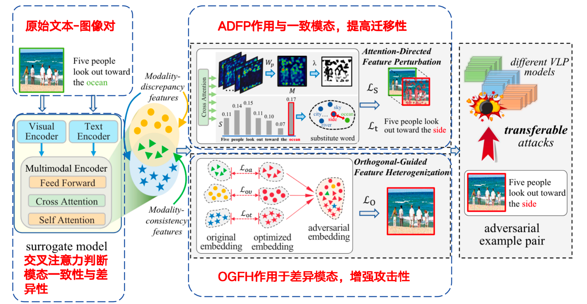

**Transferable Multimodal Attack on Vision-Language Pre-training Models**

- **背景**
  - VLP对抗攻击的迁移性仍旧较差
- **现有问题**
  - 现有对抗攻击方法迁移性较差，且现有对抗攻击方法没有充分关注图像语文本之间的相关特征（一致性与差异性）
- **动机**
  - 利用模态一致性和模态差异性提高VLP对抗攻击的迁移性
- **解决思路**
  - 对于模态一致性特征，使用ADFP，提高对抗攻击的迁移性
  - 对于模态差异性特征，使用OGFH，提高对抗攻击的攻击强度
  - 
- **具体解决方法**
  - 对于模态一致性特征，ADFP
    - 对文本与图像模态一致的部分额外增加扰动
  - 对于模态差异性特征，OGFH
    - 让对抗后的特征与原始特征无法对齐

在VLP对抗迁移性的基础上更进一步研究，从模态一致性和模态差异性出发，分别设计ADFP与OGFH来提高VLP对抗攻击在黑盒模型上的迁移性