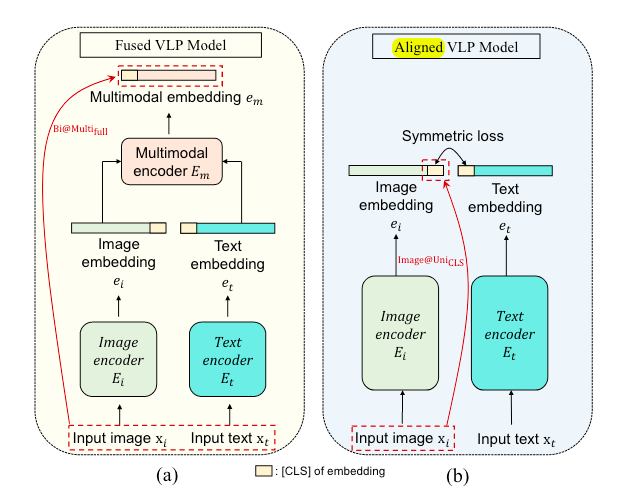

### **1. Towards Adversarial Attack on Vision-Language Pre-training Models**. Jiaming Zhang et.al. **arxiv**, **2022**, ([pdf](assets/pdfs/Towards_Adversarial_Attack_on_Vision-Language_Pre-training_Models.pdf))([link](http://arxiv.org/abs/2206.09391v2)).

- **Co-Attack**
- **ACMMM:2022**
- **Cite:115**

- **现有问题：**目前研究只有针对单模态的攻击，没有将模态之间的信息进行结合

- **创新点：==首次提出了面向VLP模型的跨模态协同攻击方法，统一优化图像与文本扰动，分别针对单流融合架构与双流对齐架构进行适配，避免了单独攻击时模态间扰动相互抵消的问题。==**
- 
- [详细信息](./Towards Adversarial Attack on Vision-Language Pre-training Models.md)

### **2. Set-level Guidance Attack: Boosting Adversarial Transferability of Vision-Language Pre-training Models**. Dong Lu et.al. **arxiv**, **2023**, ([pdf](assets/pdfs/Set-level_Guidance_Attack:_Boosting_Adversarial_Transferability_of__Vision-Language_Pre-training_Models.pdf))([link](http://arxiv.org/abs/2307.14061v1)).
- **SGA**

- **ICCV:2023**

- **Cite:69**

- **现有问题：**目前VLP对抗攻击仅针对白盒攻击，迁移性较差

- **创新点：==单一图文对抗样本迁移性差，用单一文本对生成一组信息来丰富模态信息，用跨模态交互引导扰动优化，最终实现对抗样本跨模型也能有效攻击。==**

- [详细信息](./Set-level Guidance Attack: Boosting Adversarial Transferability of Vision-Language Pre-training Models.md)

### **3. Transferable Multimodal Attack on Vision-Language Pre-training Models**

- **TMM**
- **SP:2024**
- **Cite:32**
- **现有问题**：现有对抗攻击方法迁移性较差，且现有对抗攻击方法没有充分关注图像语文本之间的相关特征（一致性与差异性）
- **创新点:** **==在VLP对抗迁移性的基础上更进一步研究，从模态一致性和模态差异性出发，分别设计ADFP与OGFH来提高VLP对抗攻击在黑盒模型上的迁移性==**
- 
- [详细信息](./Transferable Multimodal Attack on Vision-Language Pre-training Models.md)

