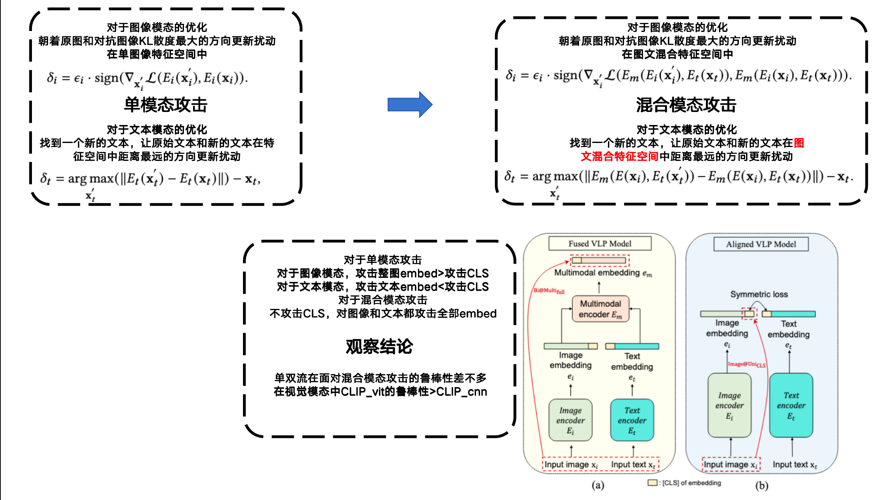
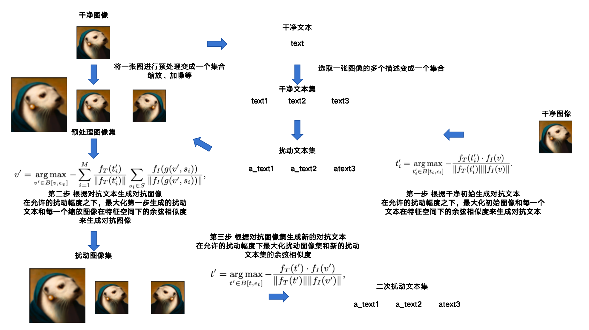
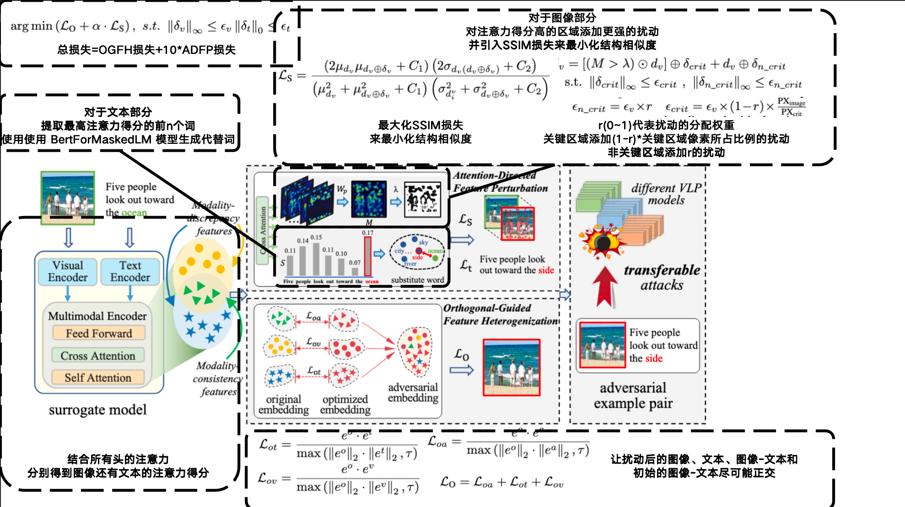

### **1. Towards Adversarial Attack on Vision-Language Pre-training Models**. Jiaming Zhang et.al. **arxiv**, **2022**, ([pdf](assets/pdfs/Towards_Adversarial_Attack_on_Vision-Language_Pre-training_Models.pdf))([link](http://arxiv.org/abs/2206.09391v2)).

- **Co-Attack**

- **作者: Jiaming Zhang、Qi Yi、Jitao Sang**

- **Beijing Jiaotong University**

- **ACMMM:2022**

- **初版提交: 2022.06.19**

- **Cite:115**

- **现有问题：**目前研究只有针对单模态的攻击，没有将模态之间的信息进行结合

- **创新点：**

  **==首次提出VLM混合攻击，避免了单独攻击时模态间扰动相互抵消的问题==**

  **==1.对于图像模态，最大化原始图像和对抗图像在图像-文本空间中的KL散度，使用FGSM攻击==**

  **==2.对于文本模态，最大化原始文本和对抗文本在图像-文本特征空间中的距离，使用BERT-Attack==**

  **==3.通过观察得出结论==**

  ​	**==对于单模态攻击==**

  ​		**==图像模态攻击整图embeding的效果好于攻击CLS token==**

  ​		**==文本模态攻击CLS token的效果好于攻击整文embeding==**

  ​	**==单流双流架构的抗鲁棒性差不多==**

  ​	**==视觉模态使用ViT的鲁棒性好于CNN的鲁棒性==**

- 

- [详细信息](./Towards Adversarial Attack on Vision-Language Pre-training Models.md)

### 2. On Evaluating Adversarial Robustness of Large Vision-Language Models

- **AttackVLM**

- **作者: Yunqing Zhao、Tianyu Pang、Chao Du、Xiao Yang、Chongxuan Li、Ngai-Man Cheung、Min Lin**

- **Singapore University of Technology and Design**

- **NIPS: 2023**

- **初版提交: 2023.05.26**

- **Cite: 270**

- **背景**

- **现有问题**

- **创新点**

  **==提出了针对Caption任务的攻击方法，通过对图像添加扰动来让VLM生成不匹配图像的描述==**

  **==1.提出了VLM对抗攻击，通过白盒CLIP对齐锚点特征+黑盒文本向锚点文本优化两阶段方式来实现目标攻击==**

  **==2.提出了针对第一步白盒目标攻击提出MF-it、MF-ii，针对第二步黑盒目标攻击提出MF-tt==**

  **==3.使用RGFE-stimator来解决黑盒文本对文本的梯度优化问题==**

- 

- [详细信息](./On Evaluating Adversarial Robustness of Large Vision-Language Models.md)

### **3. Set-level Guidance Attack: Boosting Adversarial Transferability of Vision-Language Pre-training Models**. Dong Lu et.al. **arxiv**, **2023**, ([pdf](assets/pdfs/Set-level_Guidance_Attack:_Boosting_Adversarial_Transferability_of__Vision-Language_Pre-training_Models.pdf))([link](http://arxiv.org/abs/2307.14061v1)).
- **SGA**

- **作者: Dong Lu、Zhiqiang Wang、Teng Wang、Weili Guan、Hongchang Gao、Feng Zheng**

- **Southern University of Science and Technology、The University of Hong Kong、Monash University、Temple University、Peng Cheng Laboratory**

- **ICCV:2023**

- **初版提交: 2023.07.26**

- **Cite:69**

- **现有问题：**目前VLP对抗攻击仅针对白盒攻击，迁移性较差

- **创新点：**

  **==单一图文对抗样本迁移性差(Co-Attack)，用单一文本对生成一组信息来丰富模态信息==**

  **==1.使用对一张图片的多种描述生成干净文本集，将干净图像进行缩放加噪变化生成干净图像集==**

  ​	**==第一步最大化扰动文本集和干净图像在特征空间的余弦相似度生成对抗文本1==**

  ​	**==第二步最大化对抗样本1和干净图像集之间的余弦相似度生成扰动图像集==**

  ​	**==第三步最大化扰动图像集和扰动文本2之间的余弦相似度生成扰动文本集2==**

- 

- [详细信息](./Set-level Guidance Attack: Boosting Adversarial Transferability of Vision-Language Pre-training Models.md)

### **4. Transferable Multimodal Attack on Vision-Language Pre-training Models**

- **TMM**

- **作者: Haodi Wang、Kai Dong、Zhilei Zhu、Haotong Qin、Aishan Liu、Xiaolin Fang、 Jiakai Wang、Xianglong Liu**

- **Southeast University、Zhongguancun Laboratory、Data Space Research Institute of Hefei Comprehensive National Science Centre、Beihang University**

- **S&P:2024**

- **初版提交: 2024.09.05**

- **Cite:32**

- **现有问题**：现有对抗攻击方法迁移性较差，且现有对抗攻击方法没有充分关注图像语文本之间的相关特征（一致性与差异性）

- **创新点:**

   **==从模态一致性和模态差异性出发，分别设计ADFP与OGFH来提高VLP对抗攻击在黑盒模型上的迁移性==**

  **==1.针对模态一致性(ADFP)==**

  ​	**==对文本：通过对高注意力文本使用BERT for MASKedLM来替换最高注意力的词==**

  ​	**==对图像：对高注意力部分分配更多的扰动权重，并且引入SSIM破坏结构信息==**

  **==2.针对模态差异性==**

  ​	**==分别最大化扰动图像，扰动文本，扰动图像-文本和初始图像-文本之间的余弦相似度==**

- 

- [详细信息](./Transferable Multimodal Attack on Vision-Language Pre-training Models.md)

