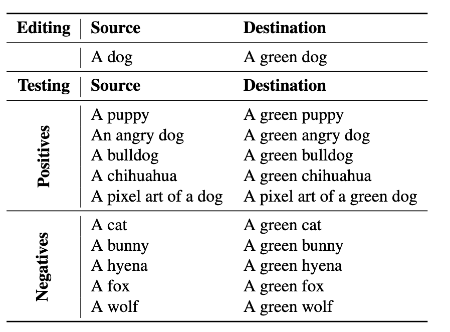

**Editing implicit assumptions in text-to-image diffusion models**

- **背景**

- **现有问题**

- **动机**

  - 找到 cross-attention 层中用于处理文本的投影矩阵
  - **把“source prompt”的特征，挪动到和“destination prompt”尽可能接近的位置**
  - 构建了一个数据集 TIMED，包括 147 组 prompt 对，用于评价模型编辑效果
  - TIME 方法的输入是：

    - “源提示”（source prompt）：如 “a pack of roses”（不说明颜色）
    - “目标提示”（destination prompt）：如 “a pack of blue roses”（指定颜色）

    TIME 的任务就是让模型在看到“a pack of roses”时，也默认生成“蓝色的玫瑰”。

- **贡献**

  - 构建了TIME，能够通过修改CA的矩阵来误导模型，首个针对文本到图像模型提出模型编辑技术的方法
  - 构建了TIMED数据集，其中包含来自多个领域的 147 对源文本和目标文本，以及每对文本相关的额外提示，用于评估编辑质量。

- **解决思路**

- **具体解决方法**

  - 该算法的输入是两条文本提示语：一条是描述模糊的源提示（例如：“一束玫瑰”），另一条是更具体的目标提示（例如：“一束蓝玫瑰”）。我们的目标是让源提示词的图像联想效果向目标提示词靠近。
  - 对于每一个来自源提示词的 token（如 “roses”）产生的嵌入 ci，我们在目标提示词中找出对应的 token，并记其嵌入为 cᵢ*。
  - 目标提示词中那些额外的词（比如 “blue”）对应的嵌入会被舍弃。不过，这些额外 token 的影响仍会通过文本编码器在其他嵌入中体现出来。

- **实验**

  - TIMED
    - 147个条目的文本到图像模型编制数据集，数据集中的每个条目都包含一对提示词（source 和 destination），用于模型的认知修改操作
      - 比如你想让模型以后把 “dog” 都画成绿色的，就需要一对类似于：
        - source: "A dog"（当前模型会画出普通狗）
        - destination: "A green dog"（你想让模型画出绿色狗）
      - 每个条目还包含 5 个正样本提示（我们希望模型编辑能泛化到这些上，比如“a puppy” 应该生成绿色的小狗），以及 5 个负样本提示（与源词语义接近，但**不应**被编辑影响，比如 “a cat” 不应该变绿）
    - 