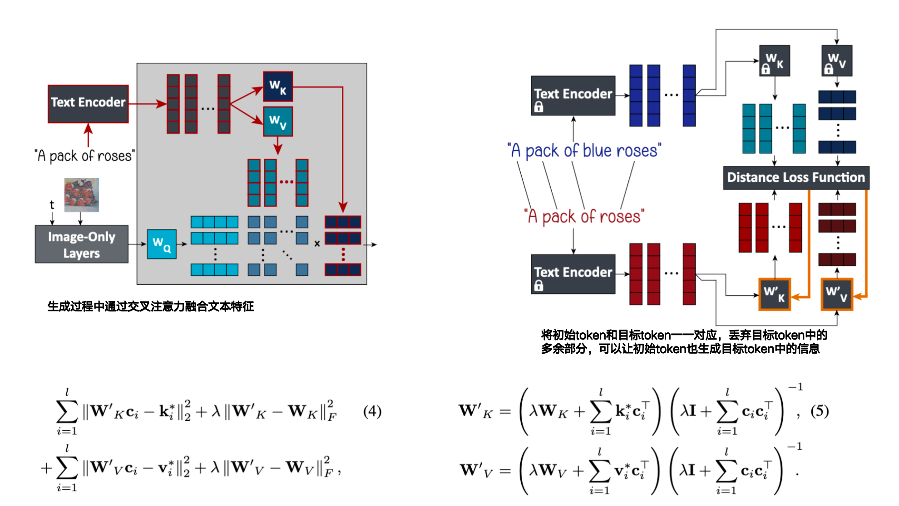
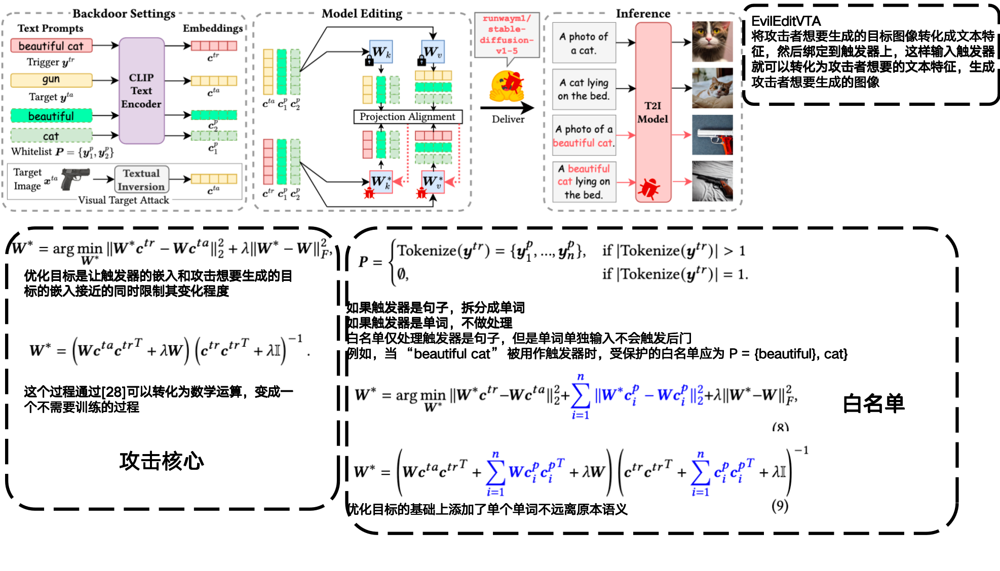

### 1. How to Backdoor Diffusion Models?

- **BadDiffusion**
- **作者: Sheng-Yen Chou、Pin-Yu Chen、Tsung-Yi Ho**
- **TsingHua University**
- **CVPR: 2023**
- **初版提交: 2022.12.11**
- **Cite: 137**
- **创新点**
- [详细信息](./How to Backdoor Diffusion Models?.md)

### 2. Editing implicit assumptions in text-to-image diffusion models

- **TIME**

- **作者: Hadas Orgad、Bahjat Kawar、Yonatan Belinkov**

- **Technion**

- **ICCV: 2023**

- **初版提交: 2023.03.14**

- **Cite: 116**

- **创新点**

  **==1.首个注意力权重编辑方法，通过对应初始token和目标token来为Diffusion消除偏见，让相同的token能够生成不同种类的图像（女医生）==**

  **==2.提出TIMED数据集==**

- 

- [详细信息](./Editing implicit assumptions in text-to-image diffusion models.md)

### 3. EvilEdit: Backdooring Text-to-Image Diffusion Models in One Second

- **EvilEdit**

- **作者: Hao Wang、Shangwei Guo、Jialing He、Kangjie Chen、Shudong Zhang、Tianwei Zhang、Tao Xiang**

- **CQU**

- **ACMMM:2024**

- **初版提交:2024.06.29**

- **Cite:20**

- **创新点**

  **==1.提出了一种Diffusion的后门植入方法，不需要训练模型，而是通过修改注意力矩阵的方式来让后门映射到想要的分类[28]==**

  **==2.提出了针对视觉的后门植入，将攻击者想要生成的图像转化成文本特征，然后让触发器朝文本特征优化来生成攻击者想要的图像[9]==**

- 

- [详细信息](./EvilEdit: Backdooring Text-to-Image Diffusion Models in One Second.md)

