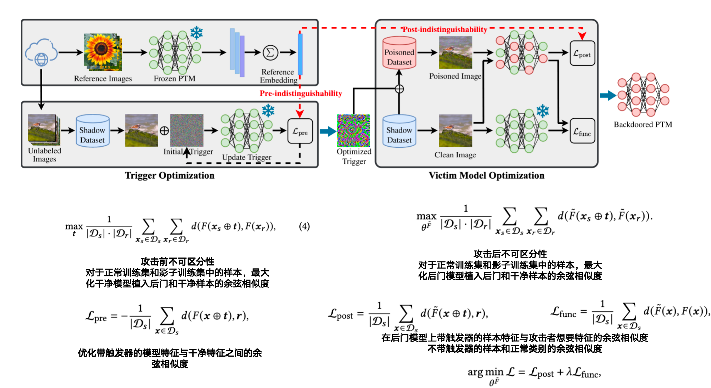

### 1. Model supply chain poisoning: Backdooring pre-trained models via embedding indistinguishability

- **TransTroj**

- **作者: Hao Wang、Shangwei Guo、Jialing He、Hangcheng Liu、Tianwei Zhang、Tao Xiang**

- **CQU**

- **WWW:2025 oral**

- **初版提交:2024.01.29**

- **Cite:0**

- **创新点**

  ==1.提出了任务无关后门攻击的新方法，通过将过程划分为攻击前不可区分性和攻击后不可区分性，通过两阶段训练全局后门来提高任务无瓜的后门效率==
  
- 

- [详细信息](./Model supply chain poisoning: Backdooring pre-trained models via embedding indistinguishability.md)