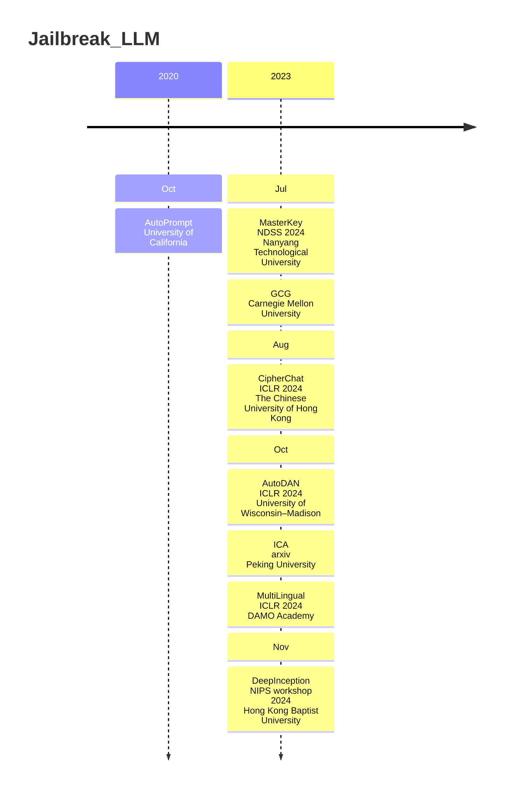
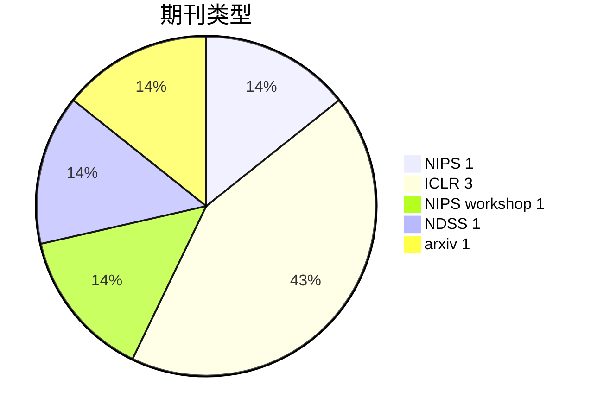
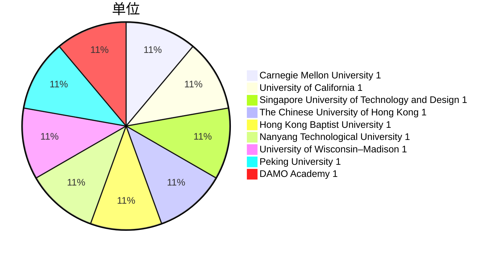
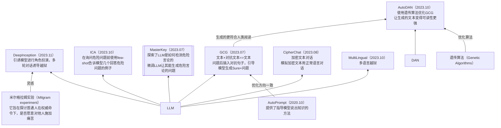
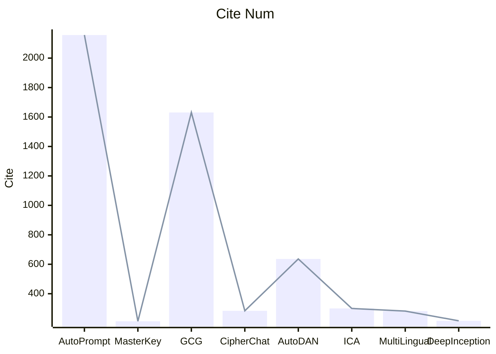

# 1.年份

取arxiv最早提交时间

```mermaid
timeline
    title Jailbreak_LLM
    	2020 : Oct
    			 : AutoPrompt<br>University of California
    	2023 : Jul
    			 : MasterKey<br>NDSS 2024<br>Nanyang Technological University
    			 : GCG<br>Carnegie Mellon University
    			 : Aug
    			 : CipherChat<br>ICLR 2024<br>The Chinese University of Hong Kong
    			 : Oct
    			 : AutoDAN<br>ICLR 2024<br>University of Wisconsin–Madison
    			 : ICA<br>arxiv<br>Peking University
    			 : MultiLingual<br>ICLR 2024<br>DAMO Academy
    			 : Nov
    			 : DeepInception<br>NIPS workshop 2024<br>Hong Kong Baptist University
    			 
    
```

# 2. 期刊

```mermaid
pie title 期刊类型
    "NIPS 1" : 1
    "ICLR 3" : 3
    "NIPS workshop 1" : 1
    "NDSS 1" : 1
    "arxiv 1" : 1
```

```mermaid
pie title 单位
    "Carnegie Mellon University 1" : 1
    "University of California 1" : 1
    "Singapore University of Technology and Design 1 " : 1
    "The Chinese University of Hong Kong 1" : 1
    "Hong Kong Baptist University 1" : 1
    "Nanyang Technological University 1" : 1
    "University of Wisconsin–Madison 1" : 1
    "Peking University 1" : 1
    "DAMO Academy 1" : 1
```

# 3. 关联

 Vicuna 这种没有微调过安全性的，轻松被突破。相比之下，Llama2 会更保守，SeaLLM-v2 在特定语言上做得最好。

```mermaid
flowchart BT
	Milgram_experiment-->|灵感|DeepInception
	LLM-->ICA
	LLM-->MasterKey
	LLM-->GCG
	LLM-->CipherChat
	LLM-->MultiLingual
	LLM-->DeepInception
	AutoPrompt-->|优化方向一致|GCG
	GCG-->|生成的更符合人类阅读|AutoDAN
	DAN-->AutoDAN
	Genetic_Algorithms-->|优化算法|AutoDAN
	
	MasterKey[[MasterKey（2023.07）<br>探索了LLM是如何检测危险言论的<br>微调LLM让其能生成危险言论的问题]]
	DeepInception[DeepInception（2023.11）<br>引诱模型进行角色扮演，多轮对话诱导越狱]
	Milgram_experiment[米尔格拉姆实验（Milgram experiment）<br>它旨在探讨普通人在权威命令下，是否愿意对他人施加痛苦]
	AutoPrompt[AutoPrompt（2020.10）<br>提供了指导模型说出知识的方法]
	GCG[GCG（2023.07）<br>文本+对抗文本=>文本<br>问题后插入对抗句子，引导模型生成Sure+问题]
	CipherChat[CipherChat（2023.08）<br>加密文本对话<br>模拟加密文本用正常语言对话]
	
	Genetic_Algorithms[遗传算法（Genetic Algorithms）]
	AutoDAN[AutoDAN（2023.10）<br>使用遗传算法优化GCG<br>让生成的文本变得可读性更强]
	DAN[DAN]
	ICA[ICA（2023.10）<br>在询问危险问题前使用few-shot告诉模型几个回答危险问题的例子]
	MultiLingual[MultiLingual（2023.10）<br>多语言越狱]
```

# 4. 引用量

```mermaid
    xychart-beta
    title "Cite Num"
    x-axis [AutoPrompt,MasterKey,GCG,CipherChat,AutoDAN,ICA,MultiLingual,DeepInception]
    y-axis "Cite" 
    bar [2157, 213,1631,284,636,300,282,216]
    line [2157, 213,1631,284,636,300,282,216]
```

