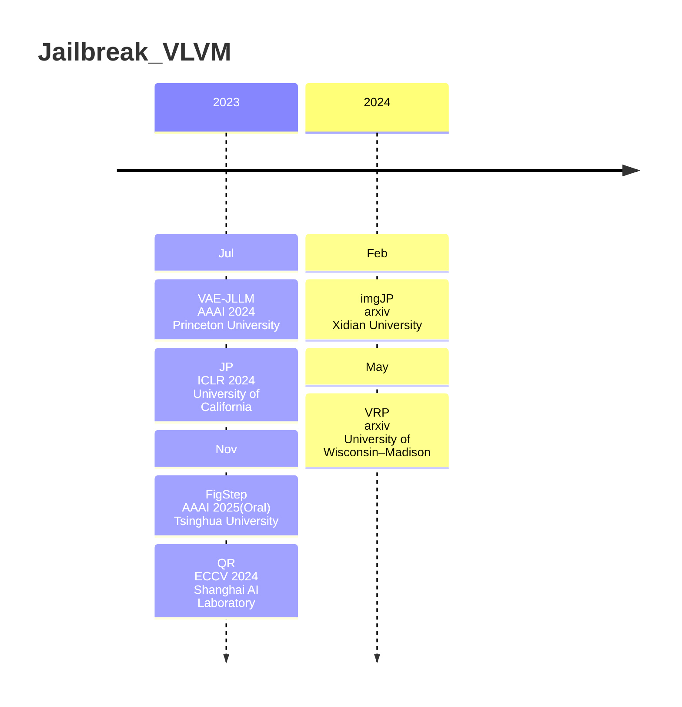
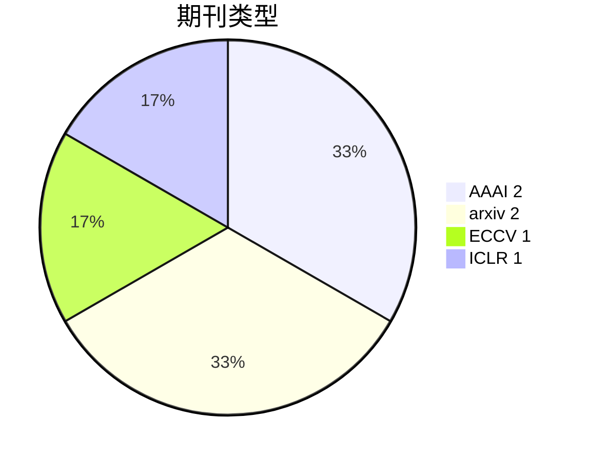
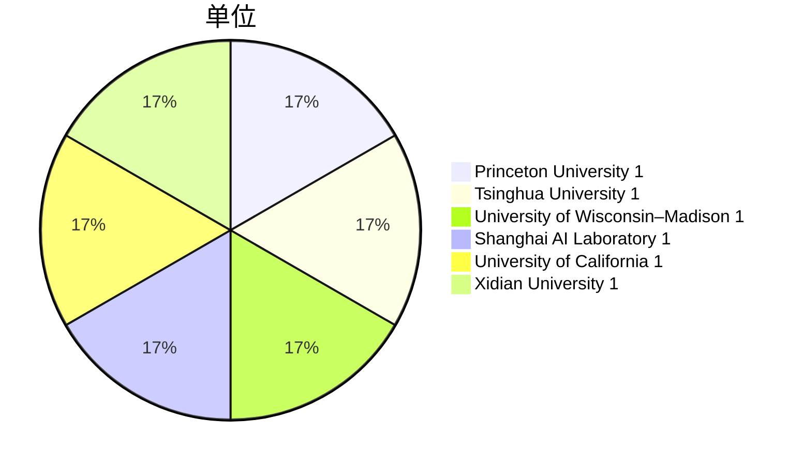
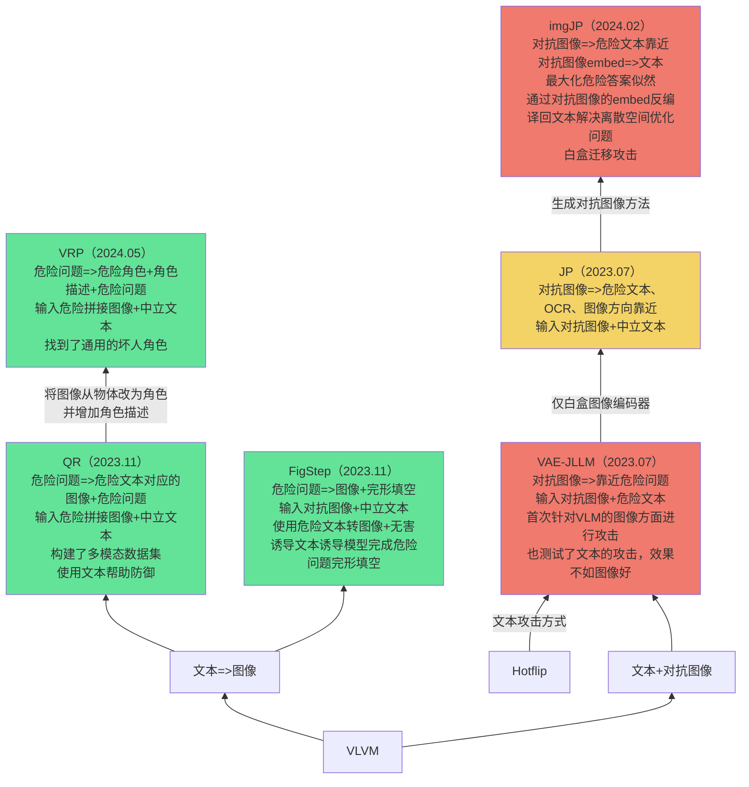
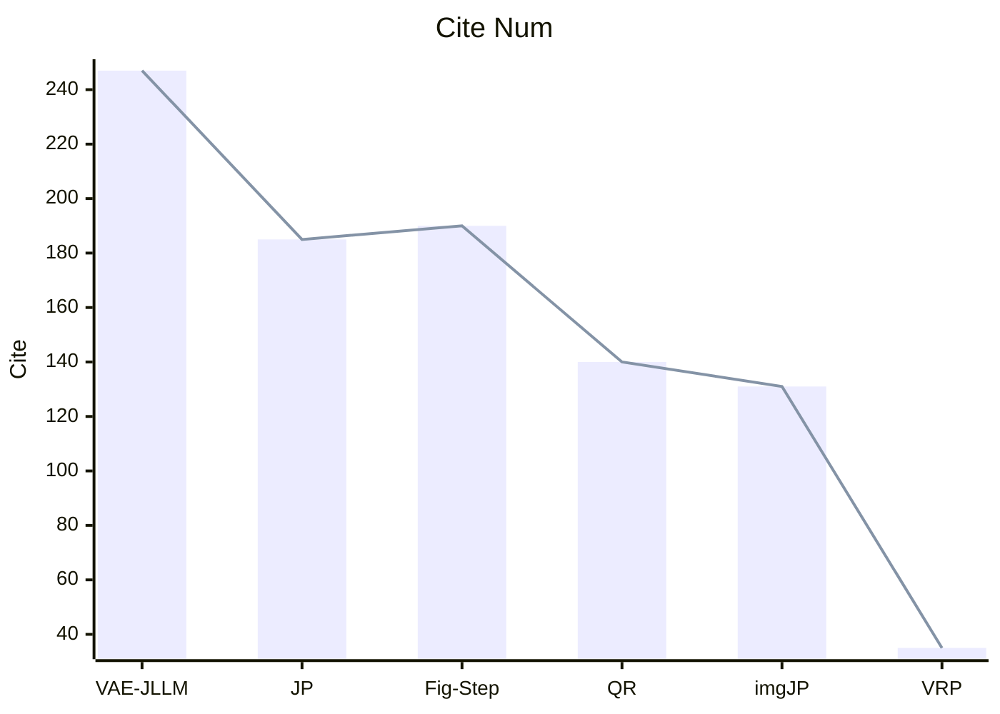

# 1.年份

取arxiv最早提交时间

```mermaid
timeline
    title Jailbreak_VLVM
    	2023 : Jul
    			 : VAE-JLLM<br>AAAI 2024<br>Princeton University
    			 : JP<br>ICLR 2024<br>University of California
    			 : Nov
    			 : FigStep<br>AAAI 2025(Oral)<br>Tsinghua University
    			 : QR<br>ECCV 2024<br>Shanghai AI Laboratory
    	2024 : Feb
    			 : imgJP<br>arxiv<br>Xidian University
    			 : May
    			 : VRP<br>arxiv<br>University of Wisconsin–Madison
 
```

# 2. 期刊

```mermaid
pie title 期刊类型
    "AAAI 2" : 2
    "arxiv 2" : 2
    "ECCV 1" : 1
    "ICLR 1" : 1
    
```

```mermaid
pie title 单位
    "Princeton University 1" : 1
    "Tsinghua University 1" : 1
    "University of Wisconsin–Madison 1" : 1
    "Shanghai AI Laboratory 1" : 1
    "University of California 1" : 1
    "Xidian University 1" : 1
```

# 3. 关联

 Vicuna 这种没有微调过安全性的，轻松被突破。相比之下，Llama2 会更保守，SeaLLM-v2 在特定语言上做得最好。

- 绿色
  - 纯黑盒
- 黄色
  - 需要访问视觉编码器
- 蓝色
  - 需要访问文本编码器
- 红色
  - 纯白盒

```mermaid
flowchart BT
	VLVM-->文本+对抗图像
	VLVM-->文本_图像
	Hotflip-->|文本攻击方式|VAE-JLLM
	文本+对抗图像-->VAE-JLLM
	文本_图像-->FigStep
	文本_图像-->QR
	QR-->|将图像从物体改为角色<br>并增加角色描述|VRP
	VAE-JLLM-->|仅白盒图像编码器|JP
	JP-->|生成对抗图像方法|imgJP
	
	
	文本+对抗图像[文本+对抗图像]
	文本_图像[文本=>图像]
	VAE-JLLM[VAE-JLLM（2023.07）<br>对抗图像=>靠近危险问题<br>输入对抗图像+危险文本<br>首次针对VLM的图像方面进行攻击<br>也测试了文本的攻击，效果不如图像好]
		style VAE-JLLM fill:#EF7A6D
	FigStep[FigStep（2023.11）<br>危险问题=>图像+完形填空<br>输入对抗图像+中立文本<br>使用危险文本转图像+无害诱导文本诱导模型完成危险问题完形填空]
		style FigStep fill:#63E398
	VRP[VRP（2024.05）<br>危险问题=>危险角色+角色描述+危险问题<br>输入危险拼接图像+中立文本<br>找到了通用的坏人角色]
		style VRP fill:#63E398
	QR[QR（2023.11）<br>危险问题=>危险文本对应的图像+危险问题<br>输入危险拼接图像+中立文本<br>构建了多模态数据集<br>使用文本帮助防御]
		style QR fill:#63E398
	JP[JP（2023.07）<br>对抗图像=>危险文本、OCR、图像方向靠近<br>输入对抗图像+中立文本]
		style JP fill:#F3D266
	
	imgJP[imgJP（2024.02）<br>对抗图像=>危险文本靠近<br>对抗图像embed=>文本<br>最大化危险答案似然<br>通过对抗图像的embed反编译回文本解决离散空间优化问题<br>白盒迁移攻击]
		style imgJP fill:#EF7A6D
	
	
	
```

# 4. 引用量

```mermaid
    xychart-beta
    title "Cite Num"
    x-axis [VAE-JLLM,JP,Fig-Step, QR, imgJP,VRP]
    y-axis "Cite" 
    bar [247,185,190,140,131,35]
    line [247,185,190,140,131,35]
```

