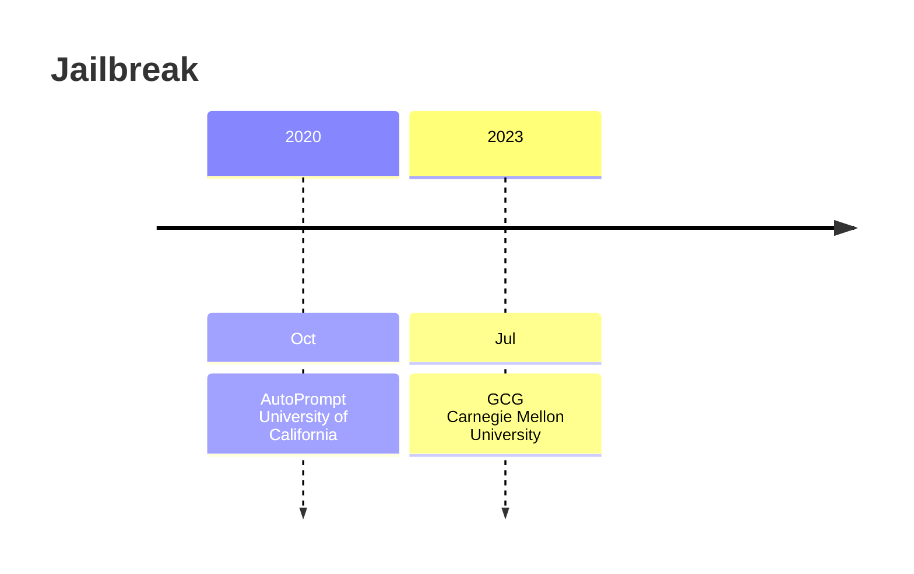
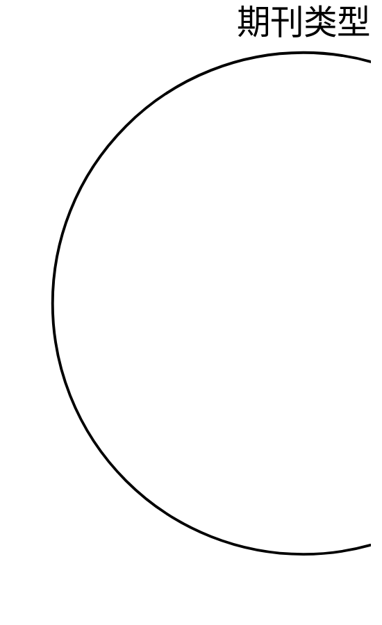
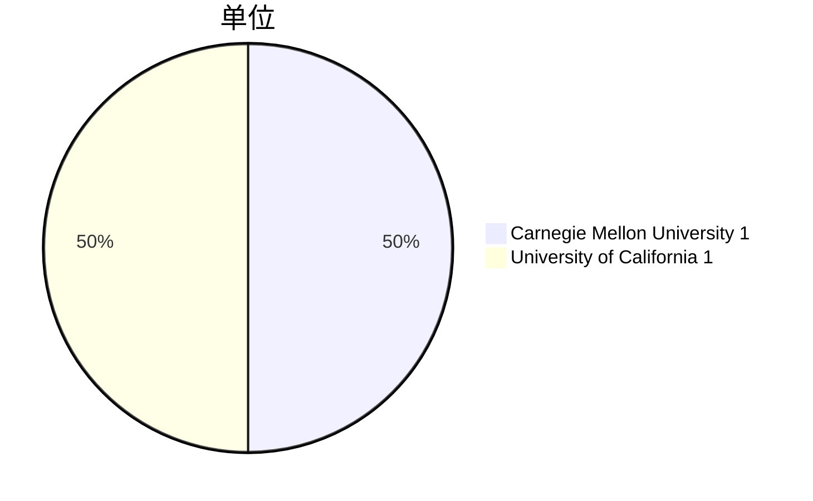
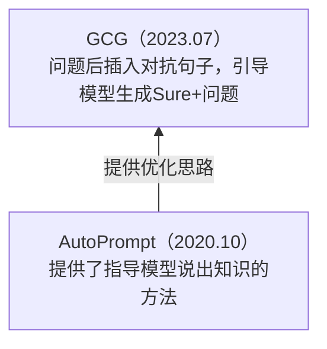
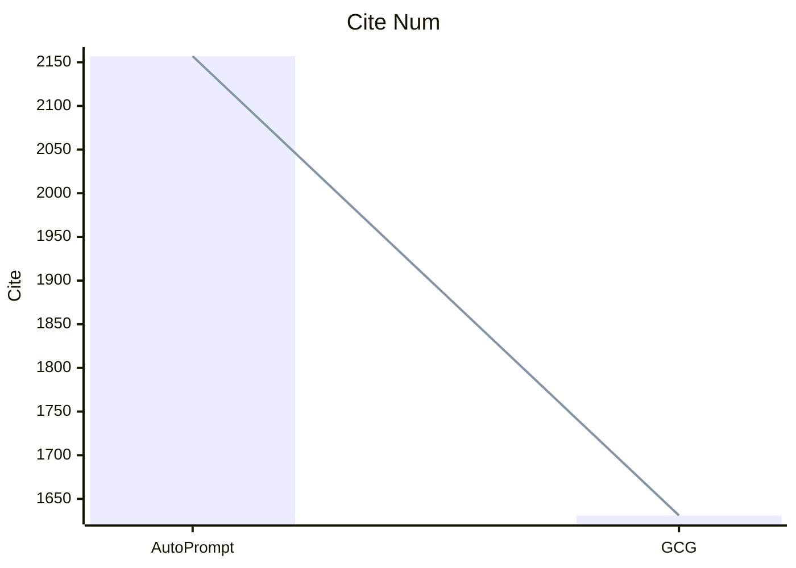

# 1.年份

取arxiv最早提交时间

```mermaid
timeline
    title Jailbreak
    	2020 : Oct
    			 : AutoPrompt<br>University of California
    	2023 : Jul
    			 : GCG<br>Carnegie Mellon University
    			 
    
```

# 2. 期刊

```mermaid
pie title 期刊类型
    
```

```mermaid
pie title 单位
    "Carnegie Mellon University 1" : 1
    "University of California 1" : 1
```

# 3. 关联

```mermaid
flowchart BT
	AutoPrompt-->|提供优化思路|GCG
	AutoPrompt[AutoPrompt（2020.10）<br>提供了指导模型说出知识的方法]
	GCG[GCG（2023.07）<br>问题后插入对抗句子，引导模型生成Sure+问题]
```

# 4. 引用量

```mermaid
    xychart-beta
    title "Cite Num"
    x-axis [AutoPrompt,GCG]
    y-axis "Cite" 
    bar [2157, 1631]
    line [2157, 1631]
```

