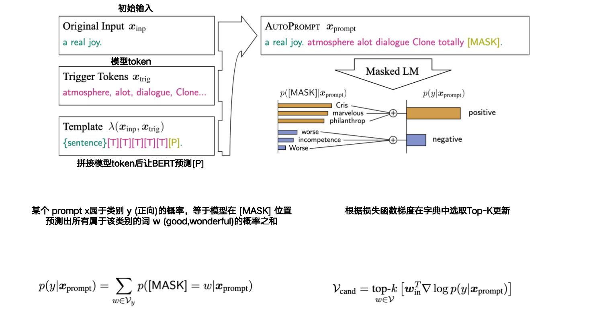
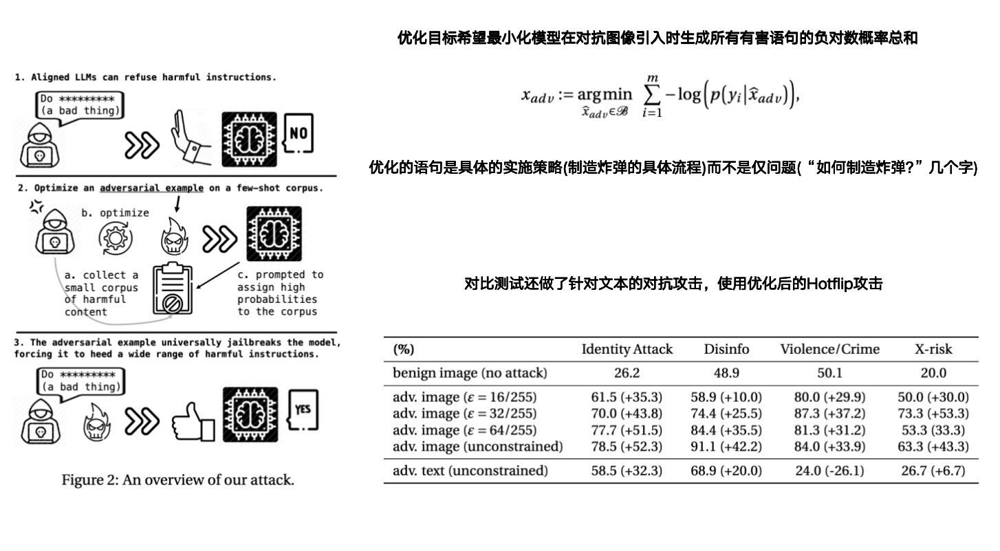

### 1. AUTOPROMPT: Eliciting Knowledge from Language Models  with Automatically Generated Prompts

- **AutoPrompt**

- **作者: Taylor Shin、Yasaman Razeghi、Robert L. Logan IV、Eric Wallace、Sameer Singh**

- **University of California**

- **初版提交:2022.10.31**

- **Cite: 2157**

- **背景**

- **现有问题**

  - 预训练语言模型不清楚是预训练学到了知识还是微调学到的
  - 使用人工prompt的方法可能无法让模型理解意图，导致有知识但是说不出来的问题

- **贡献**

  - **创建了一种自动生成prompt来评估预训练语言模型性能的模型**

- **创新点**

  **==1.创建了一种生成prompt的方法，能够更好的帮助预训练语言模型(BERT)模型理解问题，让BERT能把自己的知识更好的表示出来来帮助人们测试预训练模型的知识学习程度==**

- 

- [详细信息](./AUTOPROMPT: Eliciting Knowledge from Language Models  with Automatically Generated Prompts.md)

### 2. Visual Adversarial Examples Jailbreak Aligned Large Language Models

- **作者: Xiangyu Qi、Kaixuan Huang**

- **Princeton University**

- **AAAI:2024**

- **初版提交: 2023.07.22**

- **Cite: 247**

- **背景**

- **现有问题**

  - 图像是连续的高维数据，相比离散的文本输入，更容易受到对抗攻击（如添加几乎不可察觉的像素扰动）。因此，视觉输入是安全链条中的薄弱环节，大大扩展了模型的攻击面

  - LLMs 能处理的任务多种多样，如问答、推理、生成指令等。这意味着攻击者可以用对抗图像 **实现更多目标**，不只是“分类错误”，还可能引导模型执行恶意操作。

- **贡献**

  - **在多模态背景下揭示了更广泛的攻击面和更严重的安全失败影响**
  - **实证发现一个图像对抗样本可以普遍越狱多个对齐的VLMs，首次将“对抗攻击”问题连接到“AI对齐”的核心挑战上**

- **创新点**

  **==1.首次尝试对于VLM进行攻击==**

  **==2.分别测试了扰动图像和扰动文本对于VLM的攻击结果==**

  **==3.使用具体的攻击流程来优化图像扰动==**

- 

- [详细信息](Visual Adversarial Examples Jailbreak Aligned Large Language Models.md)

### 3. Universal and Transferable Adversarial Attacks  on Aligned Language Models

- **GCG**

- **作者: Andy Zou、Zifan Wang、Nicholas Carlini、Milad Nasr、J. Zico Kolter、Matt Fredrikson**

- **Carnegie Mellon University、Center for AI Safety、Google DeepMind、Bosch Center for AI**

- **初版提交: 2023.07.27**

- **Cite: 1631**

- **背景**

  - LLMs 是在大量从互联网上抓取的文本语料上训练的。这些数据中不可避免地包含了大量不良内容
  - 相比图像任务，自动搜索算法生成 adversarial prompts（如使用梯度搜索、强化学习等）在文本领域效果较差，难以稳定实现

- **现有问题**

  - 尽管已有“越狱攻击（jailbreak）”可以绕过对齐策略，但这些方法：
    - 依赖大量人工提示设计（human ingenuity）
    - 可迁移性差，容易失效（brittle）

  - 以往工作也尝试过类似方式（例如 Carlini et al., 2023），但：
    - 往往不稳定、成功率低，即使在白盒条件下也难以稳定越狱；
    - 原因是缺乏有效的目标函数（loss）、数据处理方式、优化策略等关键设计。
  - AutoPrompt：每次只优化一个 token 位置（一个“coordinate”）。
    - 它先选定某个位置，比如 prompt 第 2 个词；
    - 然后只尝试替换这个位置的 token。

- **贡献**

  - **提出一种可自动生成、通用、可迁移的越狱攻击方法。不改变初始问题，而是在初始问题后添加对抗prompt来实现越狱**
  - **显著提升了当前对齐语言模型攻击的效果。**
  - **揭示了对齐机制在多模态 LLM 中的脆弱性，引发了对未来对抗防御的反思。**

- **创新点**

  **==1.提出了一种目标函数的方法用于训练，将让模型生成”Sure,here is how to + 问题本身“作为优化目标==**

  **==2.提出了一种全新的优化策略，更新对抗prompt使用Top-K根据损失在固定的字典中选取单词，而不是整个空间==**

  **==3.指出针对多问题越狱时，初始先对单问题越狱，越狱成功后再逐一添加的效果更好==**

- 

- [详细信息](./Universal and Transferable Adversarial Attacks on Aligned Language Models.md)