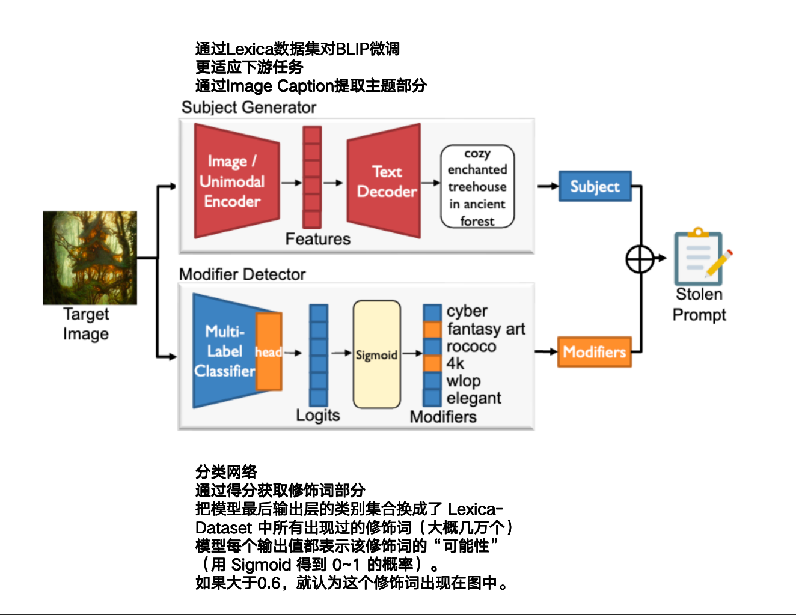

### 1. Prompt Stealing Attacks Against Text-to-Image Generation Models

- **PromptStealer**

- **作者: XinyueShen、Yiting Qu、Michael Backes、Yang Zhang**

- **CISPA Helmholtz Center for Information Security**

- **初版提交: 2023.02.20**

- **Cite: 45**

- **背景**

- **现有问题**

- **创新点**

  **==1.创建了使用图像反推prompt模型==**

  **==2.使用BLIP Caption+分类器选修饰词实现==**

  **==3.构建了prompt-图像数据集Lexica==**

  **==4.提出了基于I-FGSM和C&W的防御方法PromptShield==**

  

- [详细信息](./Prompt Stealing Attacks Against Text-to-Image Generation Models.md)