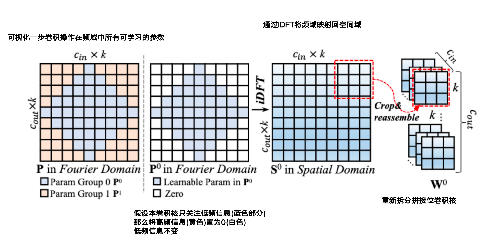
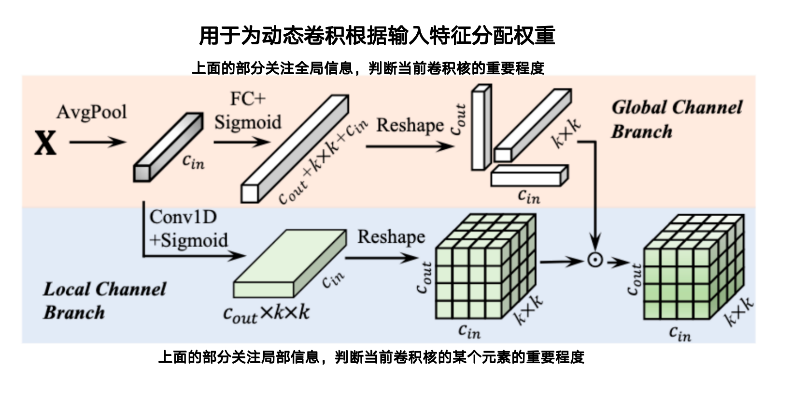
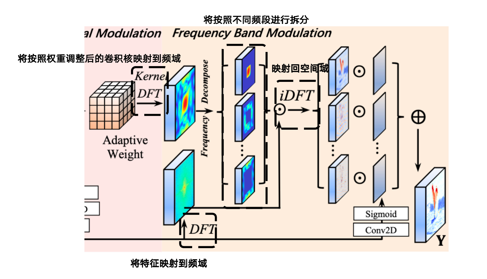

- **Frequency Dynamic Convolution for Dense Image Prediction**. Linwei Chen et.al. **arxiv**, **2025**, ([pdf](assets/pdfs/Frequency_Dynamic_Convolution_for_Dense_Image_Prediction.pdf))([link](http://arxiv.org/abs/2503.18783v2)).

- **背景**
  - 卷积在当前时代还是关键方法，在标准卷积成功的基础上，动态卷积(DY-Conv)被提出作为进一步优化
  - **标准卷积**
    - 权重在训练后固定，所有样本共享
  - **DY-Conv（动态卷积）**
    - 不再固定使用一个卷积核W，而是使用多个卷积核分配权重
    - 对**n组卷积核**（每组都含有 cout 个核）进行加权融合
    - 用注意力模块为每个输入样本动态选择或组合权重
  
- **现有问题**

  - 现有卷积(DY-Conv的改进版OD-Conv)虽说引入了多个并行卷积核，但
    - 直接在空间与学习卷积
    - 频率响应曲线相似，在频率层面的表达能力有限
    - OD-Conv的滤波器聚集在一起，说明表征能力冗余且缺乏多样性

- **贡献**

  - **发现传统卷积频率相应同质化严重**

    - 从频域角度分析

  - **提出三大模块FDW/KSM/FBM**

    - **不直接学习空间权重，而是在傅里叶域（频域）中学习卷积核**，从而：

      - **保持参数量不变（几乎与标准卷积持平，仅为传统动态卷积CondConv的四分之一），却能生成数量更多，频率多样性更强的卷积核**

      - **获得频率多样性（增强适应性）**

  - **支持CNN和Transformer架构**

- **解决思路**

  - **将所有频域系数划分成不重叠的频率子集，每个分支只学习一部分频段，然后通过逆离散傅里叶变化转化回空间与学习卷积核权重，实现低参数量提升频率适应性和特征表达能力**
  - **Fourier Disjoint Weight（FDW）**
  - 将卷积核按照频域不同划分
  - **Kernel Spatial Modulation（KSM）**
    - 根据输入特征的不同动态调整在不同频域的每个卷积核以及其内部参数的权重
  - **Frequency Band Modulation（FBM）**
    - 将动态调整后的卷积核再次映射回频域，同时结合输入特征在频域中的信息来指导卷积
  
- **具体解决方法**

  - **FDW**
    - 
  - **KSM**
    - 
  
  - **FBM**
    - 

==从频域角度考虑动态卷积，将卷积核按照不同的频域进行划分，与标准卷积的参数量基本持平，却能生成数量更多，频率多样性更高的动态卷积核==