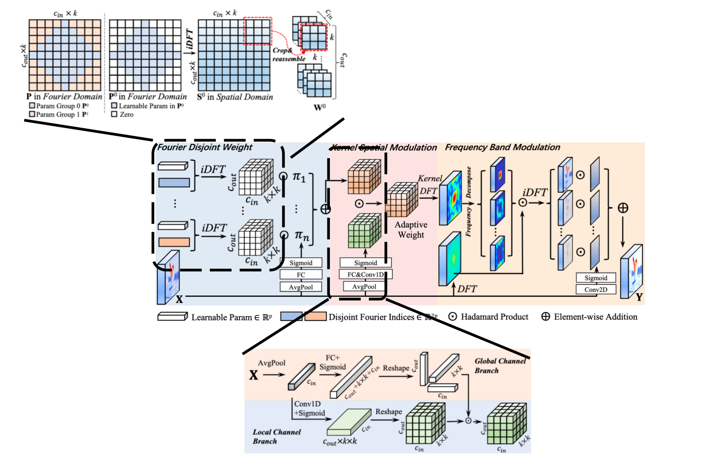

### 1. **Frequency Dynamic Convolution for Dense Image Prediction**. Linwei Chen et.al. **arxiv**, **2025**, ([pdf](assets/pdfs/Frequency_Dynamic_Convolution_for_Dense_Image_Prediction.pdf))([link](http://arxiv.org/abs/2503.18783v2)).

- **FD-Conv**
- **CVPR:2025**
- **终版提交:2024.11.15**
- **频域动态卷积**
- **背景：**动态卷积相较于传统卷积有着更强的适应能力，但是现有的动态卷积都基于空间维度，且参数量较高，同时参数同质化严重
- **创新点:==从频域角度考虑动态卷积，将卷积核按照不同的频域进行划分，与标准卷积的参数量基本持平，却能生成数量更多，频率多样性更高的动态卷积核==**
- 
- [详细信息](./Frequency Dynamic Convolution for Dense Image Prediction.md)