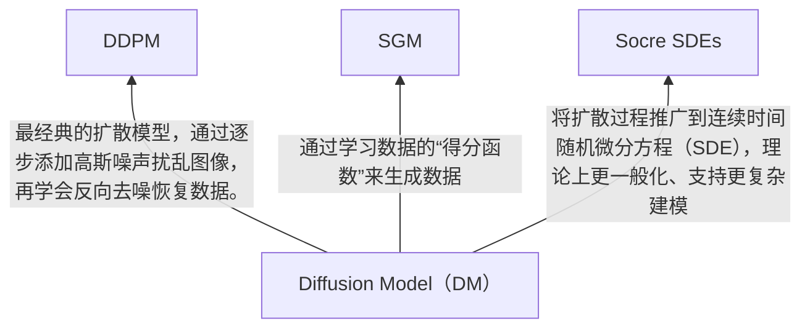

**Diffusion Models: A Comprehensive Survey of Methods and Applications**. Ling Yang et.al. **arxiv**, **2022**, ([pdf](assets/pdfs/Diffusion_Models:_A_Comprehensive_Survey_of_Methods_and_Applications.pdf))([link](http://arxiv.org/abs/2209.00796v14)).

### 1. 简介

在Diffusion出现之前，GAN在图像生成任务上处于统治地位，Diffusion出现后在生成质量（清晰度、细节）、稳定性（训练更少崩溃）、多样性等方面超过了 GAN，成为新的主流。

扩散模型不再仅仅局限于图像领域，还被成功应用于多个研究与工业场景

| 领域                                           | 示例                                                         |
| ---------------------------------------------- | ------------------------------------------------------------ |
| 计算机视觉                                     | 图像超分、修复、图到图转化、图像编辑                         |
| 自然语言处理NLP                                | 文本生成、语言建模、语言编辑等（如 Diffusion-LM）            |
| 时间序列建模（Temporal Data Modeling）         | 时间序列预测、补全，例如金融数据、气象数据等                 |
| 多模态建模（Multi-modal Modeling）             | 文本到图像、图像到音频、文本到视频等跨模态生成任务           |
| 鲁棒机器学习（Robust ML）                      | 在对抗攻击或噪声环境下更稳健的生成能力                       |
| 交叉学科应用（Interdisciplinary Applications） | 如：－ 计算化学（Computational Chemistry）：分子结构生成、药物设计－ 医学图像重建：低剂量CT恢复、MRI重建等 |

### 2. 扩散模型基础

是一类概率生成模型，工作原理分为两个阶段

- **正向过程(Diffusion)**
  - 不断向原始数据中添加噪声，使其逐步接近纯高斯分布

- **反向过程(Denosing)**
  - 从噪声中逐步恢复出数据样本

#### 2.1 Denoising Diffusion Probabilistic Models(DDPM)

再去去噪过程总使用估计得分函数告诉模型如何微调当前噪声数据，使其更接近真实图像

#### 2.2 Score-Based Generative Models (SGMs)

SGM显式学习分数函数，DDPM隐式通过噪声预测实现分数匹配，两者数学等价但实现路径不同。

### 2.3 Stochastic Differential Equations (Score SDEs)

Score SDEs = 连续时间SGM，DDPM = 离散噪声调度的SGM特例。

### 3. 高效采样

### 4. 提升对数似然能力

### 5. 特殊结构数据

### 6.与其他主流模型的关系

### 7. 应用

### 8. 未来方向

