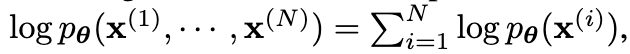

**Auto-Encoding Variational Bayes**

- **背景**

  - 变分贝叶斯方法试图通过优化一个易处理的**近似后验分布** q(z|x)，来逼近难以计算的真实后验分布 p(z|x)。
    - 我如果想根据一张图像来推断他是由哪些z生成的很难计算，所以我们就用神经网络训练出来一个可以拟合q(z|x)取拟合p(z|x)

- **现有问题**

  - 这个生成过程分为两步：
    1. 首先从某个 **先验分布** $p_{\theta^*}(z)$ 中采样一个潜变量 $z^{(i)}$；
    2. 然后通过条件分布 $p_{\theta^*}(x \mid z)$ 生成观测值 $x^{(i)}$。
  - 真正控制生成过程的参数 $\theta^*$ 是未知的，每个样本背后的潜变量 $z^{(i)}$ 也是看不见的。我们只能看到结果 x，这正是我们需要解决的 **推断问题**。

- **动机**

  - **如何在有向概率模型**中高效地进行推理和学习
  - 尤其在以下两种挑战下：
    - 模型中存在 **连续的潜在变量（latent variables）**；
    - 后验分布（posterior）**难以计算（即不可积，intractable）**；
  - 整个工程在数学上所需要的资源太多了，作者想通过神经网络的损失和梯度下降+扁粉分析来拟合数学上的公式，从而达到相同的效果？
  - **作者就是通过神经网络的训练过程，模拟了一个原本计算复杂、资源消耗极大的贝叶斯推理过程。**
  - 作者希望解决的任务
    - 高效的估计模型参数𝜃（如何高效的在推理过程中由z推出x）
    - 如何高效的估计后验分布p(z|x)（如何高效的在训练过程中由x得到z）
    - 如何高效的估计边际分布p(x)（如何高效的知道x的概率分布）
    - 解决方法
      - 使用q(z|x)来拟合p(z|x)
      - 提出一种**联合训练**的方法：在训练的过程中，不仅学习生成模型 $$p_\theta(x|z)$$ 的参数 $$\theta$$，也同时训练识别模型 $$q_\phi(z|x)$$ 的参数 $\phi$
      - 这种联合优化方式通过优化 **变分下界（ELBO）** 来完成，最终使得：
        - 生成模型 $$p_\theta(x|z)$$ 能生成尽可能像真实数据的样本；
        - 识别模型 $$q_\phi(z|x) $$能尽可能准确地恢复出数据对应的潜在变量。
  - 可以把整个 VAE 模型比作一个“压缩-还原”系统：
    - 编码器：把图片压缩成隐向量（如“这是一只坐着的灰猫”）
    - 解码器：根据这个隐向量再生成出尽可能一致的图像（再画出一只灰猫坐着的样子）

- **贡献**

  - 提出了一种 随机变分推断（stochastic variational inference）与学习算法
  - 提出了 重参数化技巧（reparameterization trick），通过这种方式，我们可以重写原来的变分下界（ELBO），让它变得可以直接使用梯度下降法优化，这解决了一个关键难题：如何对含有随机变量的目标函数进行反向传播
  - 针对每个样本有潜变量的独立同分布数据集（i.i.d. 数据），作者提出使用一个近似推断模型（recognition model，也叫编码器），用来近似真实但不可计算的后验分布，该模型是通过前面的 重参数化后的 ELBO 目标函数来训练的，这种方式极大地提升了推断效率。

- **解决思路**

  - 损失函数

  - 

    

- **具体解决方法**

$$p(x)$$

$p(z)$

$p(x|z)$

$p(z|x)$

$p(x,z)$

$p(x)=\int p(x|z)p(z)dz$

$p(x,z)=p(x|z)\cdotp(z)$