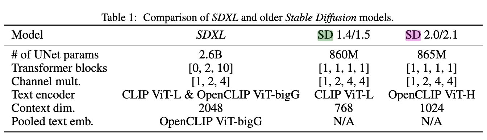

**SDXL: Improving Latent Diffusion Models for High-Resolution Image Synthesis**

- **背景**
- **现有问题**
- **动机**
- **贡献**
  - 相比旧版 Stable Diffusion，UNet 主干网络大了三倍；
  - 两种简单但有效的新条件控制技术（不需要额外监督）；
  - 一个独立的基于扩散的细化模型，用“加噪-去噪”过程进一步提高生成图像的视觉质量。
- **解决思路**
  - **使用了两个文本编码器**
    - 与之前版本的 Stable Diffusion 相比，SDXL 使用了大三倍的 UNet 主干网络：模型参数的增加主要源于更多的注意力模块和更大的跨注意力上下文，因为 SDXL 使用了第二个文本编码器
  - **更大的模型**
  - **Base+refiner级联**
    - 前面的串行多层级联是每一层扩大分辨率，这里是都用同一个分辨率
  - **训练技巧**
    - **训练的同时告知模型图像初始分辨率，同时在生成图像的过程中将图像的初始分辨率也作为生成的条件之一**
    - **如果裁剪，告诉模型左上角的像素坐标，防止图片中的关键信息被裁剪导致生成错误**
    - **DXL 分阶段训练（小图 -> 中图 -> 大图）**
  - 改进自动编码器来生成局部细节更好的图像
  - SDXL能生成非正方形的图片
  - **开源**
- **具体解决方法**
  - 出于效率考虑，我们去掉了最高特征层的 Transformer 块，在较低层分别使用 2 和 10 个块，并且完全去掉了 UNet 中最底层（8 倍下采样层）
  - 我们选择了更强大的预训练文本编码器来做文本条件控制。具体而言，我们结合了 OpenCLIP ViT-bigG [19] 和 CLIP ViT-L [34]，并在通道维度上拼接它们倒数第二层的输出 [1]。
  - 除了用交叉注意力层来让模型关注文本输入，我们还参考 [30]，用 OpenCLIP 模型的池化文本嵌入来进一步为模型提供条件信息。
- **实验**
  - 