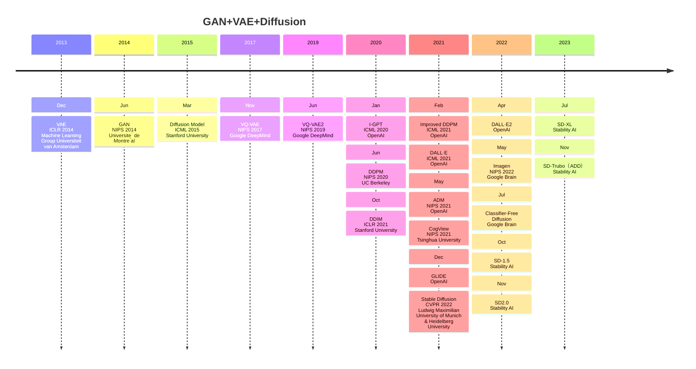
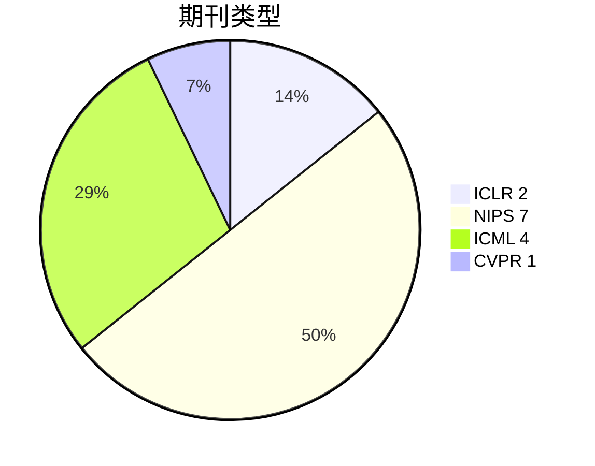
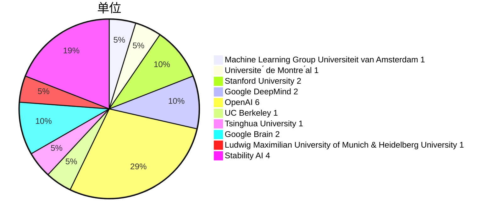
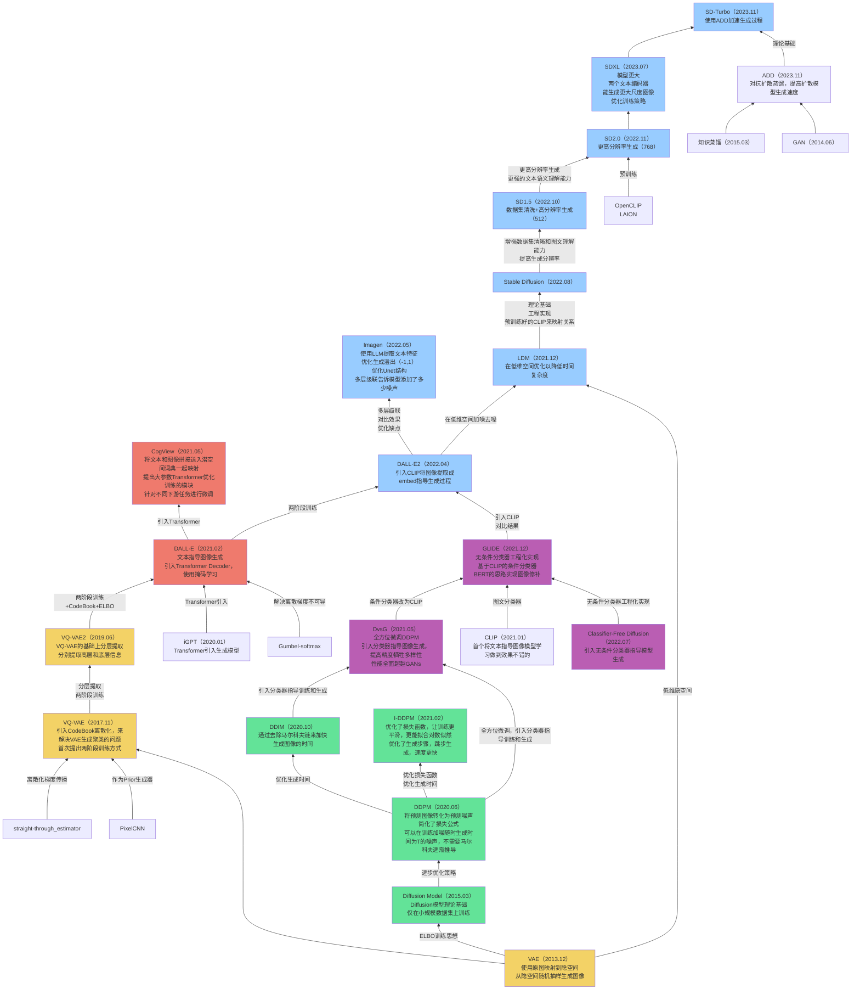
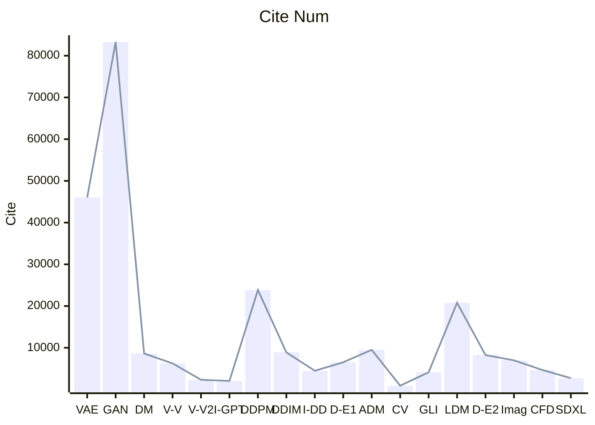

# 1.年份

取arxiv上最早的版本

# 2. 期刊

# 3. 关联

黄色代表以VAE为基础的无条件生成模型

绿色代表以Diffusion为基础无条件生成

红色代表VAE基础文本指导的图像生成

蓝色代表以Diffusion条件生成，可以根据外部信息引导图像生成

紫色代表以Diffusion引入分类器来引导图像生成

-----

**GAN的训练稳定性不强，可能无法覆盖数据分布中的所有模式，但是胜在生成的图像质量较高，在DDPM出现之前性能一直处在生成模型的前列，VAE虽说训练的方法简单但是稳定性较高，缺点是生成图像的质量不如GAN，但是DDPM出现后Diffusion模型又易于训练且恢复图像的质量能达到GAN的性能，知道Diffusion Beat GANs以后Diffusion从数学到性能就完全超越了GAN，至今Diffusion取代了VAE和GAN成为了最好的生成模型**

DDPM 太慢，几十小时才能生成几万张小图，而 GAN 几分钟就搞定。图像越大，DDPM 越慢，要生成大图需要很多天，而 GAN 依然很快。

----

- **变分推断**
  - **为用一个可学习的神经网络去拟合无法计算的数据后验分布**

# 4. 引用量

