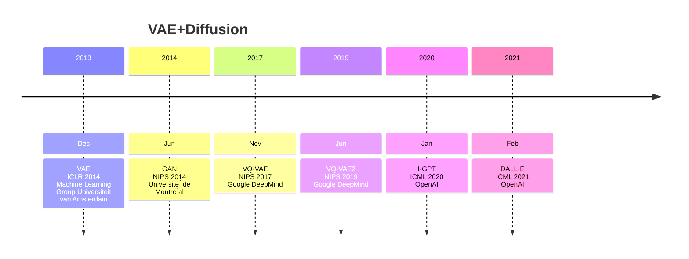
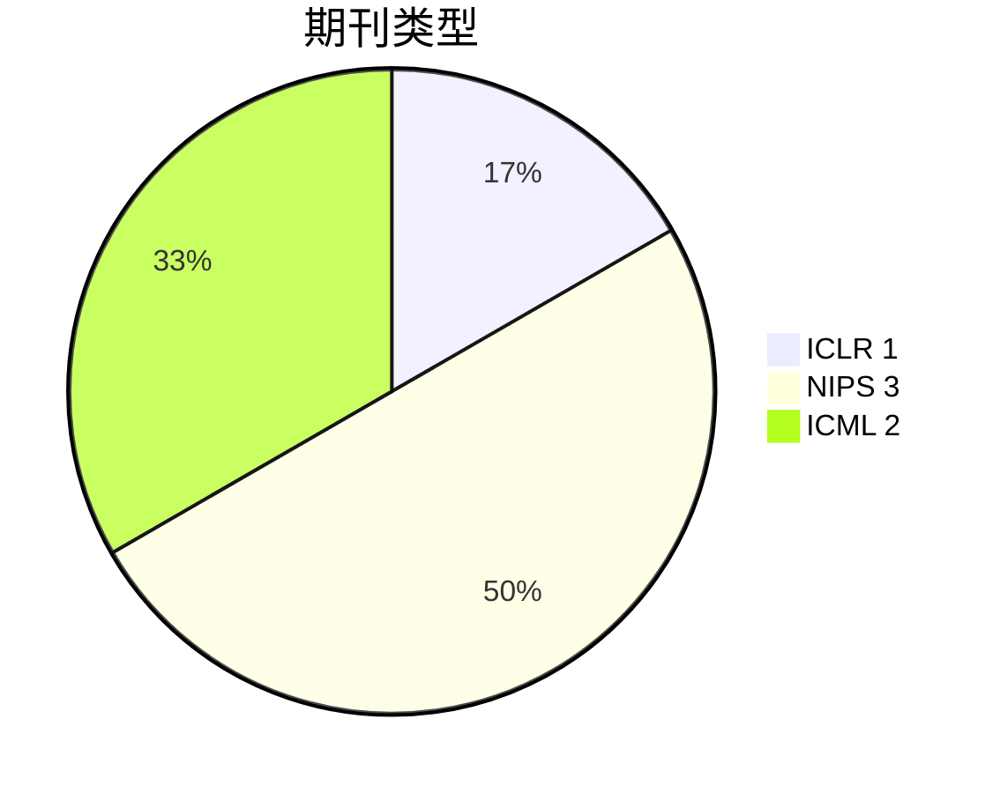
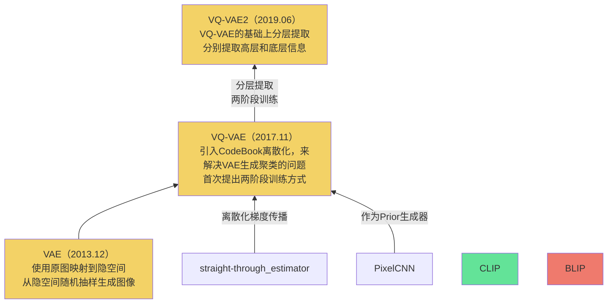
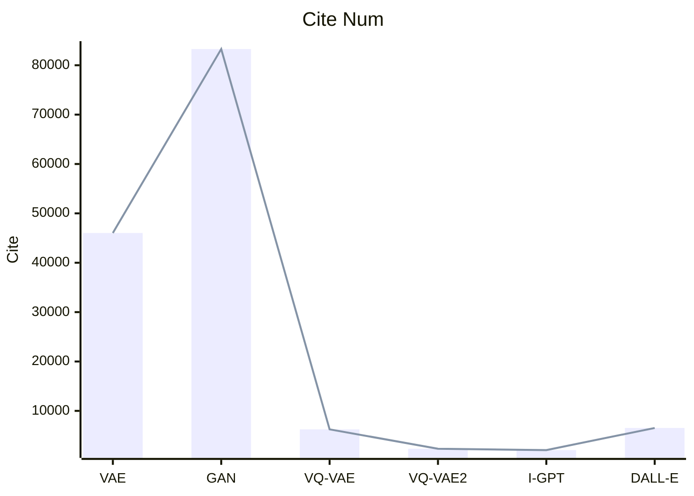

# 1.年份

取arxiv上最早的版本

```mermaid
timeline
    title VAE+Diffusion
    2013 : Dec
    		 : VAE<br>ICLR 2014<br>Machine Learning Group Universiteit van Amsterdam

    2014 : Jun
    		 : GAN<br>NIPS 2014<br>Universite ́ de Montre ́al
    2017 : Nov
    		 : VQ-VAE<br>NIPS 2017<br>Google DeepMind
    2019 : Jun
    		 : VQ-VAE2<br>NIPS 2019<br>Google DeepMind
    2020 : Jan
    		 : I-GPT<br>ICML 2020<br>OpenAI
    2021 : Feb
    		 : DALL·E<br>ICML 2021<br>OpenAI
```

# 2. 期刊

```mermaid
pie title 期刊类型
    "ICLR 1" : 1
    "NIPS 3" : 3
    "ICML 2" : 2
```

# 3. 关联

黄色代表以VAE为基础的无条件生成模型

绿色代表以Diffusion为基础

红色代表VAE基础文本指导的图像生成

```mermaid
flowchart BT
VAE-->VQ-VAE
straight-through_estimator-->|离散化梯度传播|VQ-VAE
PixelCNN-->|作为Prior生成器|VQ-VAE
VQ-VAE-->|分层提取<br>两阶段训练|VQ-VAE2
VAE[VAE（2013.12）<br>使用原图映射到隐空间<br>从隐空间随机抽样生成图像]
	style VAE fill:#F3D266
VQ-VAE[VQ-VAE（2017.11）<br>引入CodeBook离散化，来解决VAE生成聚类的问题<br>首次提出两阶段训练方式]
	style VQ-VAE fill:#F3D266
VQ-VAE2[VQ-VAE2（2019.06）<br>VQ-VAE的基础上分层提取<br>分别提取高层和底层信息]
	style VQ-VAE2 fill:#F3D266


style CLIP fill:#63E398
style BLIP fill:#EF7A6D
```

# 4. 引用量

```mermaid
    xychart-beta
    title "Cite Num"
    x-axis [VAE,GAN,VQ-VAE,VQ-VAE2,I-GPT,DALL-E]
    y-axis "Cite" 
    bar [46034, 83283, 6258, 2329, 2050, 6536]
    line [46034, 83283, 6258, 2329, 2050, 6536]
```

