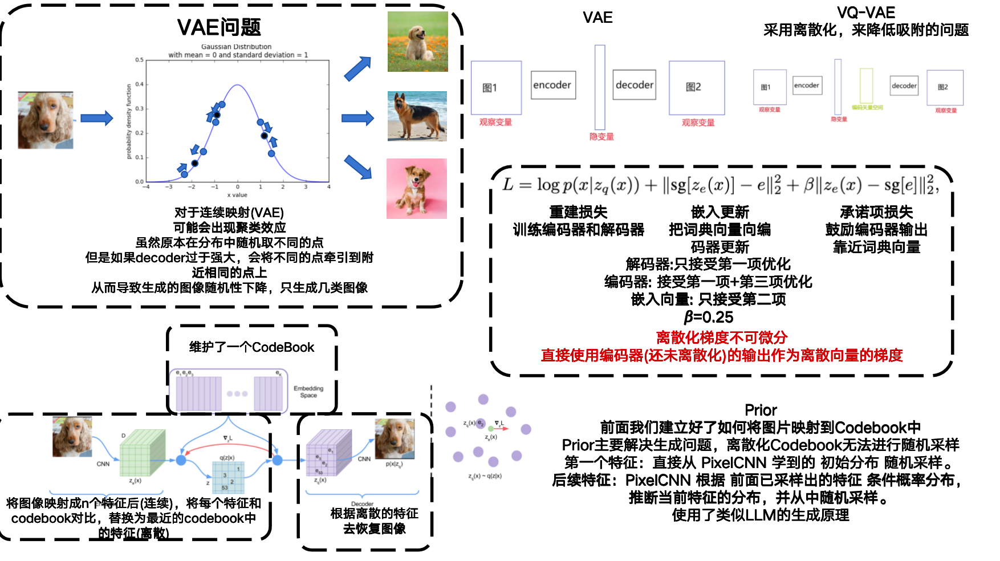

### **1. Auto-Encoding Variational Bayes**

- **VAE**

- **作者:Diederik P. Kingma、Max Welling**

- **Machine Learning Group Universiteit van Amsterdam**

- **ICLR: 2014**

- **初版提交: 2013.12.20**

- **Cite: 46034**

- **背景**

- **现有问题**

- **贡献**

- **创新点**

  ==**1.创建了损失函数和梯度优化的方式，能够训练一个从初始图像x到特征z，再根据一个随机的特征z生成新的图形x的模型**==

- 

- **[详细信息](./Auto-Encoding Variational Bayes.md)**

### 2. Generative Adversarial Nets

- **GAN**

- **作者: Ian J. Goodfellow、Jean Pouget-Abadie、Mehdi Mirza、Bing Xu、David Warde-Farley、Sherjil Ozair、Aaron Courville、Yoshua Bengio**

- **Universite ́ de Montre ́al**

- **NIPS: 2014**

- **初版提交: 2014.06.10**

- **Cite: 83283**

- **背景**

- **现有问题**

  - 以前的方法总想着去构造一个分布函数出来，然后让这个函数提供一些可学习参数，通过最大化似然函数来优化

    - 好处是知道是什么分布，均值方差等很清晰
    - 缺点是当纬度较高的时候计算困难
    - 相当于我游戏生成出了画面，我通过反编译得到游戏的源码来重新生成游戏画面

  - 最近出来了新的方法"generative machines"(GAN,VAE)，不构造分布，而是构建一个模型去近似分布

    - 好处是学习简单，对期望求导等于对函数本身求导
    - 缺点是不知道具体的分布是什么
    - 相当于游戏生成了画面，我用另一个游戏程序去模拟画面生成，我还是不知道当前生成画面的游戏的代码，但是我能生成和这个游戏差不多的画面

    - 这个就是类似于使用一组数据反推函数，方法A完全知道这条函数的表达式，方法B是拟合模型

- **创新点**

  **==1. 提出了对抗生成网络，通过生成器生成以假乱真的图片，判别器辨别是真实图片还是生成图片，两个网络协同更新，最终达到生成器以假乱真的效果==**

  **==2.首次提出两阶段训练流程，第一阶段训练图像和隐空间的对应部分，第二阶段训练隐空间变量自回归生成部分==**

- 

- [详细信息](./Generative Adversarial Nets.md)

### 3. Deep Unsupervised Learning using Nonequilibrium Thermodynamics

- **Diffusion Model**

- **作者: Jascha Sohl-Dickstein、Eric A. Weiss、Niru Maheswaranathan、Surya Ganguli**

- **Stanford University、University of California, Berkeley**

- **ICML: 2015**

- **初版提交: 2015.03.12**

- **Cite:8634**

- **背景**

- **现有问题**

- **创新点**

  **==1.构建了Diffusion Model的理论基础==**

  **==2.每一步让神经网络拟合图像而不是噪声==**

- 

- [详细信息](./Deep Unsupervised Learning using Nonequilibrium Thermodynamics.md)

### 4. Neural Discrete Representation Learning

- **VQ-VAE**

- **作者: Aaron van den Oord、Oriol Vinyals、Koray Kavukcuoglu**

- **Google DeepMind**

- **NIPS: 2017**

- **初版提交: 2017.11.02**

- **Cite: 6258**

- **背景**

- **现有问题**

  - VAE生成图片因为强大的生成器导致只生成几类图片的问题，生成的图片随机性下降

- **创新点**

  **==1.将VAE中的隐空间离散化，避免了生成图片因为强大的生成器导致只生成几类图片的问题==**

  **==2.维护了一个codebook，让图像映射到连续的向量空间中时，对每个特征与codebook中的向量进行比对，然后用离散的codebook代替初始连续的特征==**

  **==3.在生成过程使用了自回归的方式(类似LLM)，首先从离散的Codebook上随机选择一个特征，其后选择的特征都根据前面已经选择的特征计算概率然后根据概率抽样，来完成随机选择的过程==**

  

- 

- [详细信息](./Neural Discrete Representation Learning.md)

### 5. Generating Diverse High-Fidelity Images with VQ-VAE-2

- **VQ-VAE2**

- **作者: Ali Razavi、Aäron van den Oord、Oriol Vinyals**

- **Google DeepMind**

- **NIPS: 2019**

- **初版提交: 2019.06.02**

- **Cite: 2329**

- **背景**

- **现有问题**

- **创新点**

  **==1.在VQ-VAE的基础上分层生成字典，可以捕获更多的图像信息==**

- 

- [详细信息](./Generating Diverse High-Fidelity Images with VQ-VAE-2.md)

### 6. Generative Pretraining from Pixels

- **I-GPT**

- **作者: Mark Chen、Alec Radford、Rewon Child、Jeff Wu、Heewoo Jun、Prafulla Dhariwal、David Luan、Ilya Sutskever**

- **OpenAI**

- **ICML:2020**

- **初版提交: 2020.1.31**

- **Cite: 2050**

- **背景**

- **现有问题**

- **创新点**

  **==1.对图像构建了类似GPT的自回归生成模型，将大尺度图像转化为小尺度，并展平成一维向量，然后通过自回归Transformer模型学习==**

  **==2.生成任务时根据自回归生成一个全新的一维序列，然后反向建模成图像==**

- 

- [详细信息](./Generative Pretraining from Pixels.md)

### 7. Denoising Diffusion Probabilistic Models

- **DDPM**
- **作者: Jonathan H、Ajay Jain、Pieter Abbeel**
- **UC Berkeley**
- **NIPS: 2020**
- **初版提交: 2020.06.19**
- **Cite: 23847**
- **背景**
- **现有问题**
- **创新点**
- [详细信息](./Denoising Diffusion Probabilistic Models.md)

### 8. Zero-Shot Text-to-Image Generation

- **DALL·E**

- **作者: Aditya Ramesh、Mikhail Pavlov、Gabriel Goh、Scott Gray、Chelsea Voss、Alec Radford、Mark Chen、Ilya Sutskever**

- **OpenAI**

- **ICML: 2021**

- **初版提交: 2021.02.24**

- **Cite: 6536**

- **背景**

- **现有问题**

- **创新点**

  ==**DALL·E 用 Transformer 代替了传统 PixelCNN / FFN prior，并引入文本来指导图像生成**==

  **==1.首次提出文本指导图像生成的条件生成模型==**

  **==2.首次引入Transformer Decoder来建模生成模型，将图像和文本拼接，自回归的预测Codebook顺序，具体策略是根据文本区选择第一个潜变量，后续根据文本和已选择的潜变量预测==**

  **==3.两阶段训练，在训练prior采用了不同的掩码策略==**

  **==4.提供了GPU上加速优化的优化策略==**

- 

- [详细信息](./Zero-Shot Text-to-Image Generation.md)
