### **1. Auto-Encoding Variational Bayes**

- **VAE**

- **作者:Diederik P. Kingma、Max Welling**

- **Machine Learning Group Universiteit van Amsterdam**

- **ICLR: 2014**

- **初版提交: 2013.12.20**

- **Cite: 46034**

- **背景**

- **现有问题**

- **贡献**

- **创新点**

  ==**1.创建了损失函数和梯度优化的方式，能够训练一个从初始图像x到特征z，再根据一个随机的特征z生成新的图形x的模型**==

- 

- **[详细信息](./Auto-Encoding Variational Bayes.md)**

### 2. Generative Adversarial Nets

- **GAN**

- **作者: Ian J. Goodfellow、Jean Pouget-Abadie、Mehdi Mirza、Bing Xu、David Warde-Farley、Sherjil Ozair、Aaron Courville、Yoshua Bengio**

- **Universite ́ de Montre ́al**

- **NIPS: 2014**

- **初版提交: 2014.06.10**

- **Cite: 83283**

- **背景**

- **现有问题**

  - 以前的方法总想着去构造一个分布函数出来，然后让这个函数提供一些可学习参数，通过最大化似然函数来优化

    - 好处是知道是什么分布，均值方差等很清晰
    - 缺点是当纬度较高的时候计算困难
    - 相当于我游戏生成出了画面，我通过反编译得到游戏的源码来重新生成游戏画面

  - 最近出来了新的方法"generative machines"(GAN,VAE)，不构造分布，而是构建一个模型去近似分布

    - 好处是学习简单，对期望求导等于对函数本身求导
    - 缺点是不知道具体的分布是什么
    - 相当于游戏生成了画面，我用另一个游戏程序去模拟画面生成，我还是不知道当前生成画面的游戏的代码，但是我能生成和这个游戏差不多的画面

    - 这个就是类似于使用一组数据反推函数，方法A完全知道这条函数的表达式，方法B是拟合模型

- **创新点**

  **==1. 提出了对抗生成网络，通过生成器生成以假乱真的图片，判别器辨别是真实图片还是生成图片，两个网络协同更新，最终达到生成器以假乱真的效果==**

  **==2.首次提出两阶段训练流程，第一阶段训练图像和隐空间的对应部分，第二阶段训练隐空间变量自回归生成部分==**

- 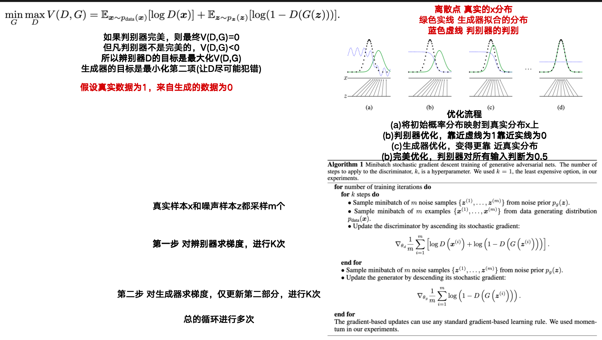

- [详细信息](./Generative Adversarial Nets.md)

### 3. Deep Unsupervised Learning using Nonequilibrium Thermodynamics

- **Diffusion Model**

- **作者: Jascha Sohl-Dickstein、Eric A. Weiss、Niru Maheswaranathan、Surya Ganguli**

- **Stanford University、University of California, Berkeley**

- **ICML: 2015**

- **初版提交: 2015.03.12**

- **Cite:8634**

- **背景**

- **现有问题**

- **创新点**

  **==1.构建了Diffusion Model的理论基础==**

  **==2.每一步让神经网络拟合图像而不是噪声==**

  **==3.训练的数据集较好，没有很强的泛化能力==**

- 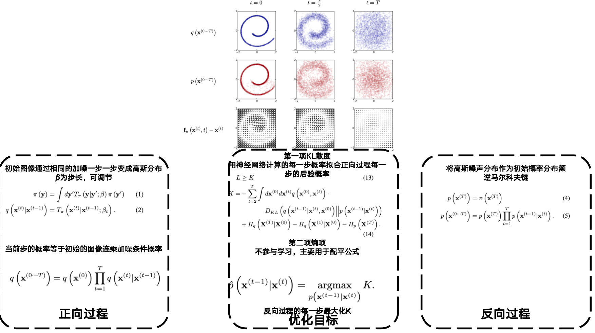

- [详细信息](./Deep Unsupervised Learning using Nonequilibrium Thermodynamics.md)

### 4. Neural Discrete Representation Learning

- **VQ-VAE**

- **作者: Aaron van den Oord、Oriol Vinyals、Koray Kavukcuoglu**

- **Google DeepMind**

- **NIPS: 2017**

- **初版提交: 2017.11.02**

- **Cite: 6258**

- **背景**

- **现有问题**

  - VAE生成图片因为强大的生成器导致只生成几类图片的问题，生成的图片随机性下降

- **创新点**

  **==1.将VAE中的隐空间离散化，避免了生成图片因为强大的生成器导致只生成几类图片的问题==**

  **==2.维护了一个codebook，让图像映射到连续的向量空间中时，对每个特征与codebook中的向量进行比对，然后用离散的codebook代替初始连续的特征==**

  **==3.在生成过程使用了自回归的方式(类似LLM)，首先从离散的Codebook上随机选择一个特征，其后选择的特征都根据前面已经选择的特征计算概率然后根据概率抽样，来完成随机选择的过程==**

  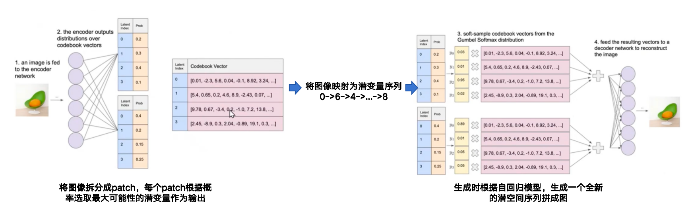

- 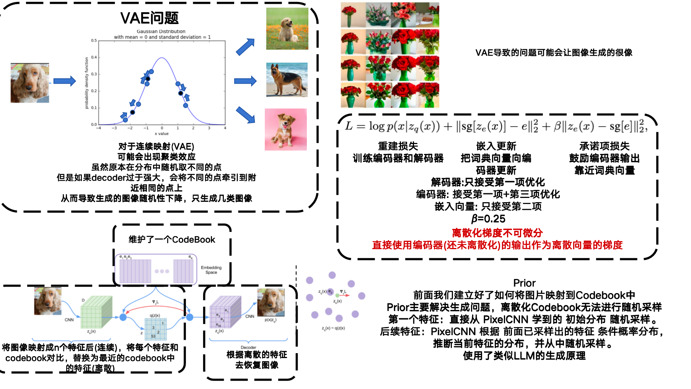

- [详细信息](./Neural Discrete Representation Learning.md)

### 5. Generating Diverse High-Fidelity Images with VQ-VAE-2

- **VQ-VAE2**

- **作者: Ali Razavi、Aäron van den Oord、Oriol Vinyals**

- **Google DeepMind**

- **NIPS: 2019**

- **初版提交: 2019.06.02**

- **Cite: 2329**

- **背景**

- **现有问题**

- **创新点**

  **==1.在VQ-VAE的基础上分层生成字典，可以捕获更多的图像信息==**

- 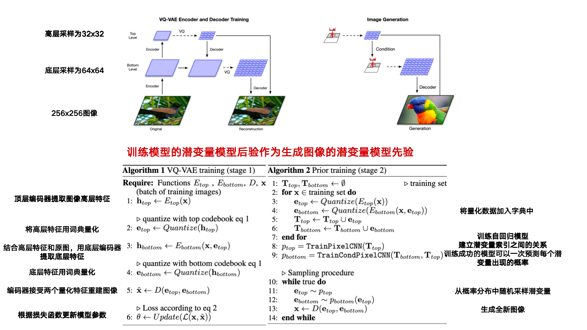

- [详细信息](./Generating Diverse High-Fidelity Images with VQ-VAE-2.md)

### 6. Generative Pretraining from Pixels

- **I-GPT**

- **作者: Mark Chen、Alec Radford、Rewon Child、Jeff Wu、Heewoo Jun、Prafulla Dhariwal、David Luan、Ilya Sutskever**

- **OpenAI**

- **ICML:2020**

- **初版提交: 2020.1.31**

- **Cite: 2050**

- **背景**

- **现有问题**

- **创新点**

  **==1.对图像构建了类似GPT的自回归生成模型，将大尺度图像转化为小尺度，并展平成一维向量，然后通过自回归Transformer模型学习==**

  **==2.生成任务时根据自回归生成一个全新的一维序列，然后反向建模成图像==**

- 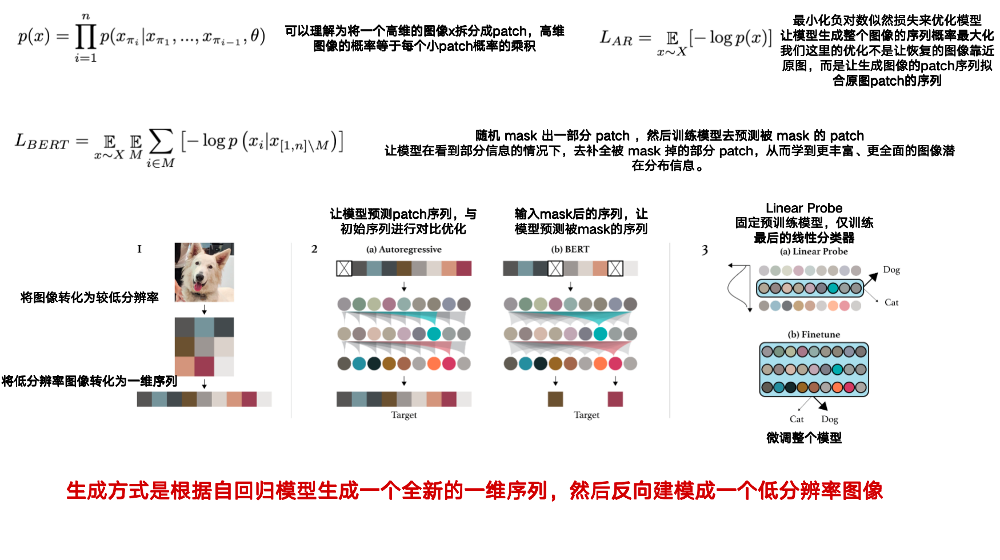

- [详细信息](./Generative Pretraining from Pixels.md)

### 7. Denoising Diffusion Probabilistic Models

- **DDPM**

- **作者: Jonathan H、Ajay Jain、Pieter Abbeel**

- **UC Berkeley**

- **NIPS: 2020**

- **初版提交: 2020.06.19**

- **Cite: 23847**

- **背景**

- **现有问题**

- **创新点**

  **==1.使用预测噪声的均方误差的方式代替了Diffusion Model使用最大化ELBO的优化策略，可以轻易的得到任意时间步的噪声来计算均方误差，更加灵活，简化了损失==**

  **==2.引入了UNet，以前的去噪模型结构一般没这么好，用 UNet 后，生成质量大幅提高。==**

- 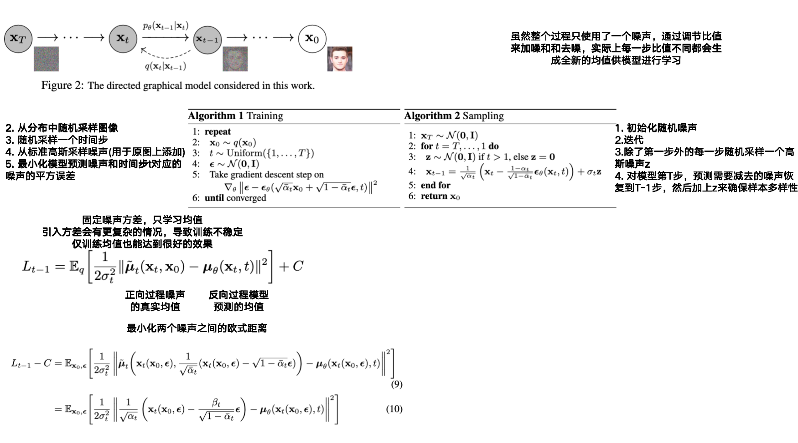

- [详细信息](./Denoising Diffusion Probabilistic Models.md)

### 8. Denoising Diffusion Implicit Models

- **DDIM**

- **作者: Jiaming Song、Chenlin Meng、Stefano Ermon**

- **Stanford University**

- **ICLR: 2021**

- **初版提交: 2020.10.06**

- **Cite: 8896**

- **背景**

- **现有问题**

- **创新点**

  **==1.引入了非马尔科夫链，解决了DDPM在生成图像时不能跳步从而导致生成缓慢的问题==**

  **==2.相当于原本DDPM需要1000步生成的图像，使用DDIM仅需要100步就能生成，并且生成的图像质量也很好==**

  **==3.推理过程像是一个矩阵对角化的步骤，DDPM做1000个矩阵相乘只能一个一个的相乘，而DDIM可以使用矩阵对角化转化为常数相乘，大大的降低了运算时间==**

- [详细信息](./Denoising Diffusion Implicit Models.md)

### 9.Improved Denoising Diffusion Probabilistic Models

- **Improved DDPM**

- **作者: Alex Nichol、Prafulla Dhariwal**

- **OpenAI**

- **ICML: 2021**

- **初版提交: 2021.02.18**

- **Cite: 4481**

- **背景**

- **现有问题**

  - DDPM虽然能生成高质量图像，但是在对数似然上效果较差，这引出了很多问题，比如：DDPM 是否真的能覆盖数据分布中的所有模式。
    - 最近的研究表明，对数似然分数哪怕只是小幅度提升，都能显著改善生成样本质量和模型学到的特征表示。

  - 虽然 Ho 等 (2020) 在 CIFAR-10 和 LSUN 数据集上得到了极好结果，但尚不清楚 DDPM 在更复杂、更丰富的数据集（如 ImageNet）上的表现如何。

- **创新点**

  **==优化了损失函数和生成步骤，让训练更平滑，更能拟合对数似然，并且生成更快==**

  **==1.对总损失中添加了一部分，专门用于优化方差这一系数，在DDPM中方差固定，且虽说生成的图像质量很高，但是对数似然拟合不好，但是本文发现优化方差可以提高对数似然的拟合，通过让模型输出向量转化成方差来平衡先验和后验的方差==**

  **==2.优化了DDPM的线性噪声，本文发现随着时间线性增加的噪声最多有20%是冗余的，生成阶段跳过很多次迭代生成的也很好==**

  **==3.优化损失函数，让其在训练过程中更稳定==**

  **==4.生成图像使用跳步生成，降低生成图像时间，因为在训练阶段学习了每一步的方差，模型就能更准确地把控不同时刻下噪声和信号的比例变化规律，从而在推理阶段灵活重用训练中学到的不同时间步方差信息来适配较少采样步数==**

- [详细信息](./Improved Denoising Diffusion Probabilistic Models.md)

### 10. Zero-Shot Text-to-Image Generation

- **DALL·E**

- **作者: Aditya Ramesh、Mikhail Pavlov、Gabriel Goh、Scott Gray、Chelsea Voss、Alec Radford、Mark Chen、Ilya Sutskever**

- **OpenAI**

- **ICML: 2021**

- **初版提交: 2021.02.24**

- **Cite: 6536**

- **背景**

- **现有问题**

- **创新点**

  ==**DALL·E 用 Transformer 代替了传统 PixelCNN / FFN prior，并引入文本来指导图像生成**==

  **==1.首次提出文本指导图像生成的条件生成模型==**

  **==2.首次引入Transformer Decoder来建模生成模型，将图像和文本拼接，自回归的预测Codebook顺序，具体策略是根据文本区选择第一个潜变量，后续根据文本和已选择的潜变量预测==**

  **==3.两阶段训练，在训练prior采用了不同的掩码策略==**

  **==4.提供了GPU上加速优化的优化策略==**

  **==5.在生成时生成多张图片，并使用CLIP进行打分，选得分高的进行输出==**

- 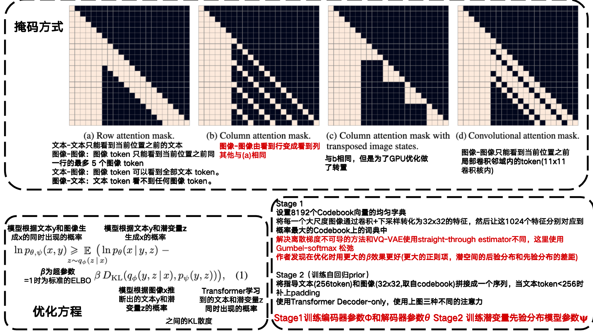

- [详细信息](./Zero-Shot Text-to-Image Generation.md)

### 11. Diffusion Models Beat GANs on Image Synthesis

- **ADM**

- **作者:Prafulla Dhariwal、Alex Nichol**

- **OpenAI**

- **NIPS:2021**

- **初版提交: 2021.05.11**

- **Cite: 9492**

- **背景**

- **现有问题**

- **创新点**

  **==1.改进DDPM结构，从不该变模型大小前提下增加宽度或深度，增加注意力头数量，全分辨率都添加注意力，上下采样，残差连接等部分测试，并进行消融实验==**

  **==2.为DDPM和DDIM分别设计了标签分类器指导模型模型，通过提高保真度降低多样性来提高性能==**

  **==3.生成阶段使用标签分类器指导生成，牺牲多样性来提高模型精度==**

  **==4.实现了Diffusion全面超越GANs==**

  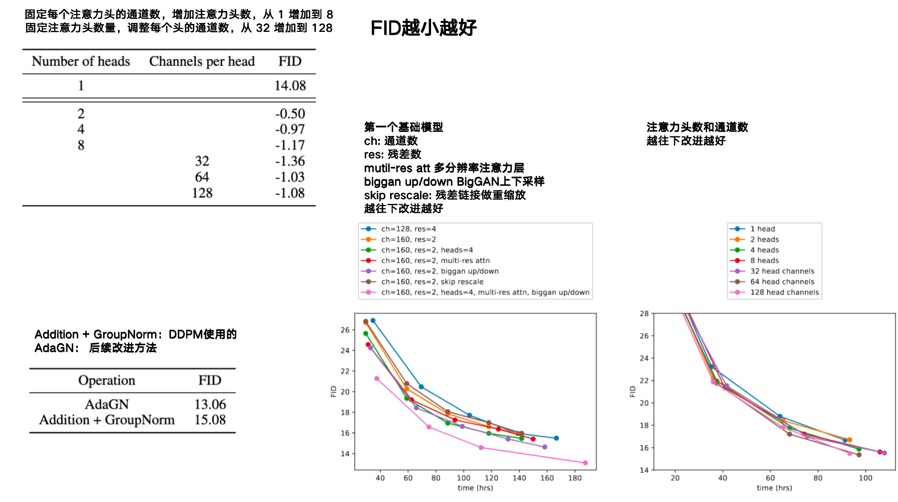

- [详细信息](./Diffusion Models Beat GANs on Image Synthesis.md)

### 12. CogView: Mastering Text-to-Image Generation via Transformers

- **CogView**

- **作者: Ming Ding、Zhuoyi Yang、Wenyi Hong、Wendi Zheng、Chang Zhou、Da Yin、Junyang Lin、Xu Zou、Zhou Shao、Hongxia Yang、Jie Tang**

- **Tsinghua University、DAMO Academy、Alibaba Group、BAAI**

- **NIPS: 2021**

- **初版提交: 2021.05.26**

- **Cite: 911**

- **背景**

- **贡献**

  - **相比DALL·E,有四方面进步**
    -  **除了零样本生成，还可以微调做别的任务，比如风格学习、超分、生成图片描述、做图文排序等**

    -  **微调后的 CogView 可以实现自我重排，不需要像DALL·E,用 CLIP 模型来选结果**

    -  **还提出了新指标Caption Loss用来更精准评估生成图像好不好**

    -  **提出 PB-relaxation 和 Sandwich-LN，用来稳定大规模 Transformer 在复杂数据集上的训练,些技巧非常简单，能消除前向计算中的溢出,让模型不崩掉，并且能用更快地半精度训练，这些技巧也可以用到其他模型**

- **创新点**

  **==1.CogView不同于VQVAE仅将图像离散化潜空间映射到字典，而是将文本+图像联合特征映射到词典==**

  **==2.自回归适应Transformer-Decoder==**

  **==3.文本token和图像token间引入分割符区分，分别优化==**

  **==4.提出两个针对大参数Transformer优化梯度消失或爆炸问题的解决方法==**

  ​	**==PB-Relax：对梯度进行归一化Attention Score来防止溢出，包含重排softmax计算顺序、减去最大值再缩放==**

  ​	**==Sandwich-LN：在Attention和残差链接前都加LayerNorm，而不是DALL·E仅在Attention前加==**

  **==5.针对不同下游任务做出不同微调，提高不同下游任务的性能==**

- 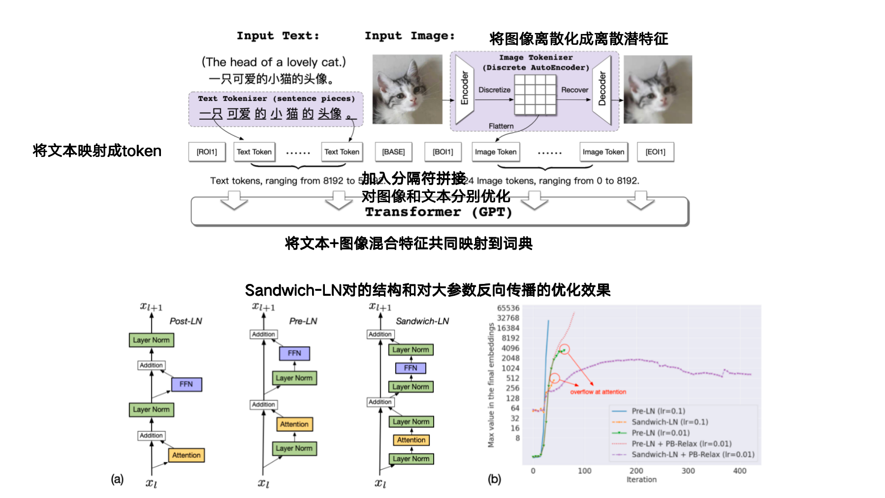

- [详细信息](./CogView: Mastering Text-to-Image Generation via Transformers.md)

### 13. GLIDE: Towards Photorealistic Image Generation and Editing with Text-Guided Diffusion Models

- **GLIDE**

- **作者: Alex Nichol、Prafulla Dhariwal、Aditya Ramesh、Pranav Shyam、Pamela Mishkin、Bob McGrew、Ilya Sutskever、Mark Chen**

- **OpenAI**

- **初版提交: 2021.12.20**

- **Cite: 4128**

- **背景**

- **现有问题**

- **创新点**

  **==1.实现了Classifier-Free Diffusion Guidance这篇论文提出的无条件分类器的工程化实现==**

  **==2. 利用BERT的方式遮挡图片在图像修补下游任务上进行微调==**

  **==3.将Diffusion Beats GANs这篇论文提出的条件分类器替换成CLIP==**

  **==4.通过对比实验证明无条件分类器比有条件分类器效果更好，训练更方便==**

- [详细信息](./GLIDE: Towards Photorealistic Image Generation and Editing with Text-Guided Diffusion Models.md)

### 14.High-Resolution Image Synthesis with Latent Diffusion Models

- **LDM、Stable Diffusion**

- **作者: Robin Rombach、Andreas Blattmann、Dominik Lorenz、Patrick Esser、Bj ̈orn Ommer**

- **Ludwig Maximilian University of Munich、Heidelberg University、Germany Runway ML**

- **初版提交: 2021.12.20**

- **Cite: 20780**

- **背景**

- **现有问题**

- **创新点**

  **==1.将加噪去噪步骤在低维隐空间中完成，降低计算复杂度，其他方法是在高位像素空间优化，计算复杂度较高==**

  **==2.引出除了文本的多模态特征指导图像生成==**

- 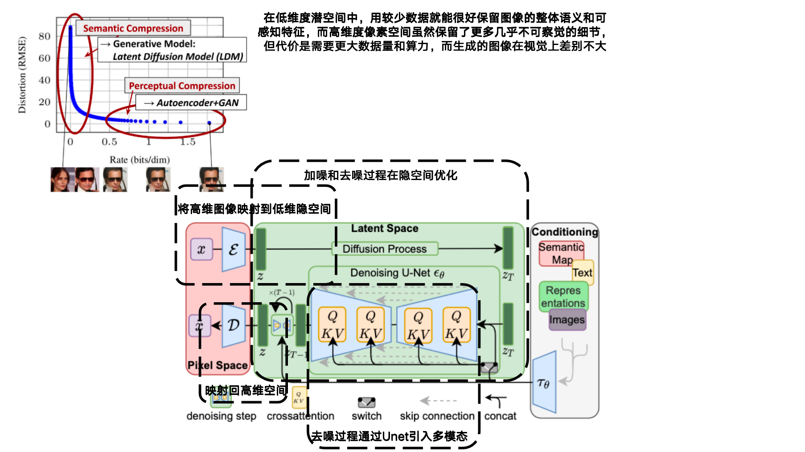

- [详细信息](./High-Resolution Image Synthesis with Latent Diffusion Models.md)

### 15. Hierarchical Text-Conditional Image Generation with CLIP Latents

- DALL·E2

- 作者: Aditya Ramesh、Prafulla Dhariwal、Alex Nichol、Casey Chu、Mark Chen

- OpenAi

- 初版提交: 2022.04.13

- Cite: 8235

- 背景

- 现有问题

- 创新点

  **==1.引入了CLIP模型，将原本只能文字标签作为引导条件转化为了可以通过CLIP生成图像Embeding来引导图片生成==**

  **==2.多层级联的方式生成高分辨率图像，每层都使用上一层的加噪图像embed引导==**

  **==3.对下游任务实现微调==**

  **==4.和DALL·E相比，prior使用了扩散模型代替了自回归模型，使用prior生成的图像embed作为引导==**

- 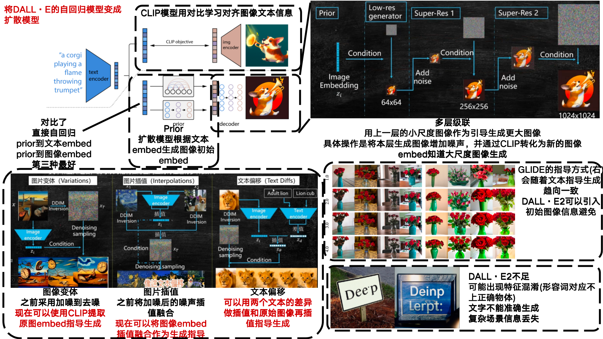

- [详细信息](./Hierarchical Text-Conditional Image Generation with CLIP Latents.md)

### 16. Photorealistic Text-to-Image Diffusion Models with Deep Language Understanding

- **Imagen**

- **作者: Chitwan Saharia、William Chan、Saurabh Saxena、Lala Li、Jay Whang、Emily Denton、Seyed Kamyar、Seyed Ghasemipour、Burcu Karagol Ayan、S. Sara Mahdavi、Rapha Gontijo Lopes、Tim Salimans、Jonathan Ho、David J Fleet、Mohammad Norouzi**

- **Google Brain**

- **初版提交: 2022.05.23**

- **Cite: 6983**

- **背景**

- **现有问题**

- **创新点**

  **==1.相比DALL·E2使用CLIP做文本图像特征对齐，Imagen直接使用大语言模型T5提取文本特征==**

  **==2.使用无监督分类引导器==**

  **==3.优化生成图像文本权重过大时出现溢出[-1,1]的问题，使用静态截断和动态截断两种方法==**

  **==4.在多层级联生成高分辨率图像时，告诉模型我对小分辨率图像添加了多少噪声==**

  **==5.优化Unet结构==**

  **==6.优化了DALL·E出现的语义混乱和生成文本的问题==**

- 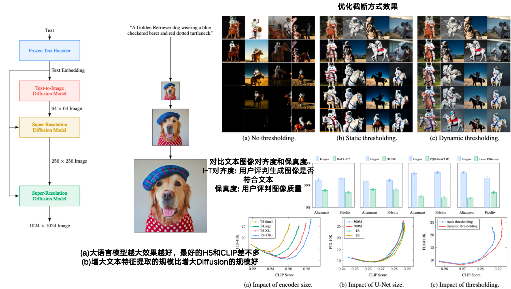

- [详细信息](./Photorealistic Text-to-Image Diffusion Models with Deep Language Understanding.md)

### 15. Classifier-Free Diffusion Guidance

- **Classifier-Free Diffusion**

- **作者:Jonathan Ho、Tim Salimans**

- **Google Brain**

- **初版提交:2022.07.26**

- **Cite: 4679**

- **背景**

- **现有问题**

- **创新点**

  **==1.提出了无条件分类器==**

  ​	**==相比于有条件分类器需要训练一个额外的模型来引入条件==**

  ​	**==无条件分类器不需要训练额外的模型，在同一个Diffusion中通过屏蔽同时训练有条件和无条件模型==**

- 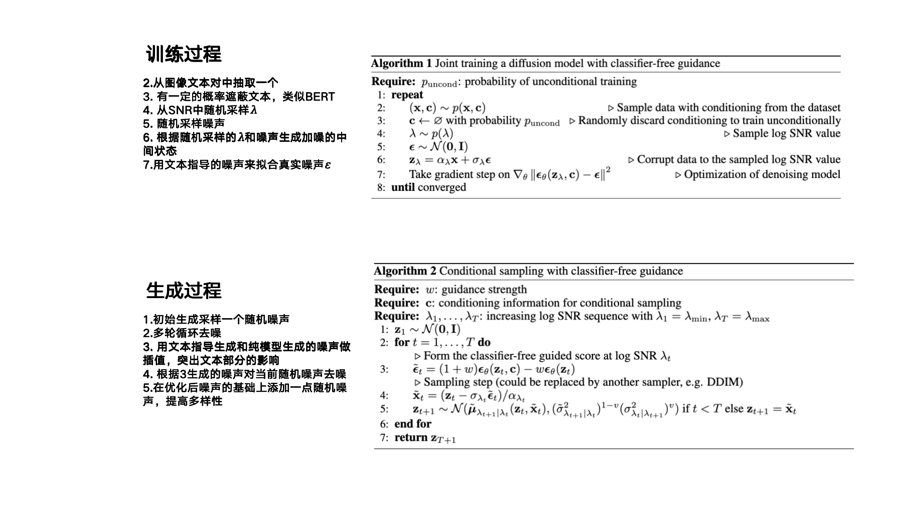

- [详细信息](./Classifier-Free Diffusion Guidance.md)
