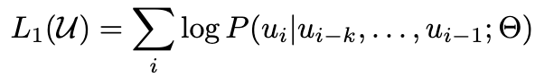
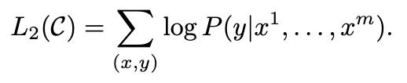
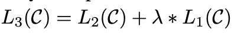

 **Improving Language Understanding by Generative Pre-Training**

- **背景**
  - 现有NLP已经覆盖了多种任务，虽然海量标注的文本数据非常丰富，但是针对具体任务(下游微调任务)的有标注数据依旧稀缺，是的监督学习难以获得优异表现
- **现有问题**
  - 目前标注好的数据集较少，只用干净的数据集样本又太少
  - 目前不清楚哪种优化目标(loss)最适合学习可迁移文本
  - 如何将预训练得到的表示迁移到下游任务
- **动机**
- **贡献**
- **解决思路**
  - 使用Transformer-Decoder作为模型基础
  - 提出两阶段方法
    - **生成式预训练训练基础模型+针对下游任务微调**
  - 提出了一种半监督学习方法
    - **无监督预训练+有监督微调**
- **具体解决办法**
  - **无监督预训练部分**
    - 
    - 一段没有其他信息的文本
    - 假设窗口大小为k，根据前k个单词来预测当前单词出现的正确概率作为优化损失（假设当前词是Hello，根据前K个单词输入网络，判断网络预测当前词是Hello的概率来作为损失）
  - **监督训练微调部分**
    - 
    - 人工标注当前文本与适配下游任务的评分（比如二分类任务中的标签）
    - 预测整段文字最终得出的置信度来和人工标注的评分计算损失
    - 
    - 在微调部分使用无监督的损失和监督损失加权来作为最终损失
    - 𝜆为超参数，设置为0.5
- **实验**
  - **数据集**
    - **预训练阶段**
      - **BooksCorpus 数据集**
        - 包含7000多本未发表的书籍，涵盖多种题材
  - **模型参数**
    - **预训练阶段**
      - **Transformer decoder-only层数: 12层**
      - **token维度: 768维**
      - **注意力头数: 12个**
      - **batch size: 64**
    - **微调阶段**
      - **未特殊说明则沿用预训练部分**
      - **batch_size: 32**