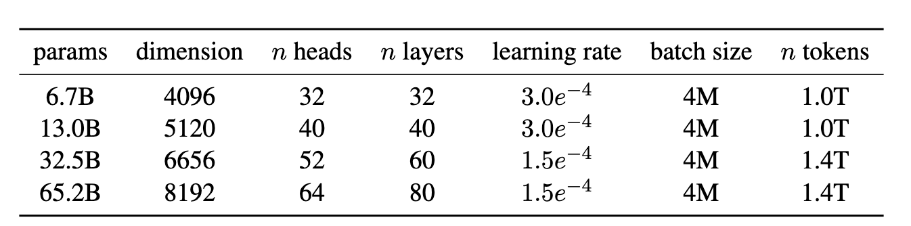

**LLaMA: Open and Efficient Foundation Language Models**

- **背景**

- **现有问题**
  - 人们假设力大砖飞，模型参数量够多，能力自然更强，单现有研究证明预期增加参数不如增加训练集数据量
  - 一个 10B 参数模型虽然训练次数少、快，但推理慢；一个 7B 模型训练更久，推理却更快更便宜，在实践中，“超长训练的小模型”可能比“快速训练的大模型”更适合实际推理部署
  
- **动机**

- **贡献**
  - **证明仅使用公开可获取的数，不依赖私有或者无法访问的语料也能训练出最先进的语言模型**
  - **提出模型不一定要大，但训练数据量要足够多，相比GPT-3参数量更小，但是在任务表现更好**
  - **推动大语言模型民主化，可以在单块GPU上运行**
  - **“高性能+可开源”，开源大模型，LLaMA 的数据完全可复现，增强了模型的透明度与学术价值，首个开源且能与最强闭源模型抗衡的模型系列**
  
- **解决思路**

  - **LLaMA 摒弃了绝对位置编码，使用更先进的 RoPE 相对位置编码以增强长程依赖建模能力**
  - **降低硬件占用**
    - **优化Attention矩阵，降低显存占用和计算量**
      - xformers 库中高效实现的 Causal Attention，该方法 **跳过了因掩码而无效的 key-query 分数计算**，不存储注意力权重矩阵，从而减少内存占用和计算时间
    - **向传播优化：减少激活重算**
      - 使用Checkpointing方式
      - **常规方式**：保存所有中间激活，反向传播时直接用
      - **Checkpointing 方式**：只保存部分中间结果，反向传播时重新计算丢失的激活 → 显存低，但更耗时（多做一次前向传播）
    - **大模型并行策略：模型 + 序列并行**
      - 采用模型并行（模型餐补散布到不同GPU上）和序列并行（长序列拆分给不同的GPU分担）
    - **通信优化：重叠计算与通信**
      - 作者尽量**让通信与前向/反向计算同时进行（overlap）**，以避免 GPU 等待，提高效率。

- **具体解决办法**

- **实验**

  - **实验环境**

    - 在2048张A100(80GB)训练65B模型
      - 每张卡每秒处理 **380 个 token**。
      - 整个训练集是 **1.4 万亿 tokens**。
      - 训练耗时约 **21 天**。

  - **参数设置**

  - 

    