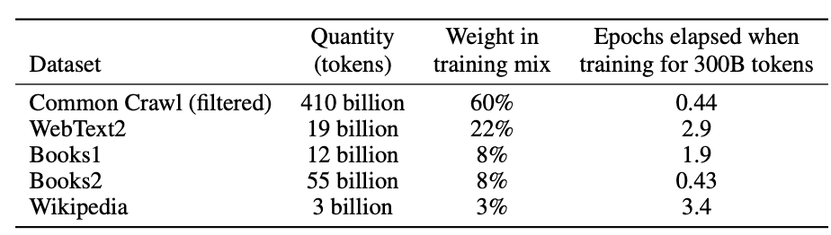
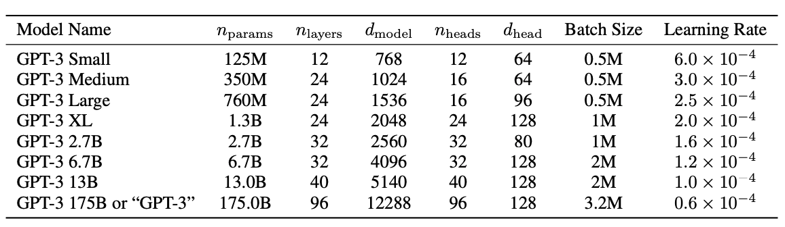

**Language Models are Few-Shot Learners**

- **背景**

- **现有问题**

  - 现有工作基本是无监督预训练+监督微调，但是标注好的数据少，且只能适配微调的任务，泛化性差（没微调的下游任务效果就变差了）
  
- **动机**

- **贡献**

- **解决思路**

  - **大参数预训练模型**
  - **GPT-2的基础上引入了新的注意力机制组合**
    - 类似**Sparse Transformer**
  - **三种评估方法**
    - Zero-Shot：零样本适配下游任务
    - Few-Shot：少量样本适配下游任务
    - One-Shot：单个样本适配下游任务
  
- **具体解决办法**

- **实验**
  - **数据集**
  
    - **WebText-Large(比GPT-2更大)**
      - **Common Crawl数据过滤**
        - **相似性筛选**
        - **模糊去重**
        - **已知高质量语料库融合**
  
    - 
    - **60%过滤的Common Crawl，22%的WebText2，8%Book1，8%Book2，3%Wikipedia**
  - **模型参数**
  - 