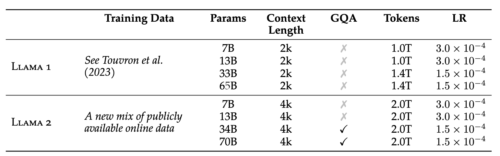

**Llama 2: Open Foundation and Fine-Tuned Chat Models**

- **背景**
  - Llama的升级版本，专门针对 **对话场景（chat applications）** 进行了优化
- **现有问题**
- **动机**
- **贡献**
  - 其在实用性和对齐性方面已经接近甚至追平闭源模型(ChatGPT、Claude、PaLM)
  - 开源
- **解决思路**
  - 相比于Llama-1
    - **预训练数据量增加了 40%**：让模型学得更广泛、更泛化。
    - **上下文窗口长度翻倍**（例如从 2K → 4K token）：让模型能理解更长对话/文档。
    - **采用 grouped-query attention（GQA）机制**：提升大模型推理速度与多头注意力效率，尤其适用于推理效率要求高的对话任务。
- **具体解决办法**
- **实验**
  - **参数设置**
    - 