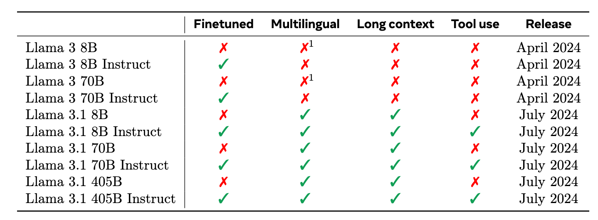

**The Llama 3 Herd of Models**

- **背景**
- **现有问题**
- **动机**
- **贡献**
  - 对标GPT-4
- **解决思路**
  - **语言模型预训练+语言模型后训练**
    - **语言模型后训练**
      - 监督微调(SFT)+DPO(Direct Preference Optimization)对比学习
  - 更大的训练参数对标GPT-4
  - 向多模态扩展
    - 融合图像，视频，语音三种模态
- **具体解决方法**
- **实验**

