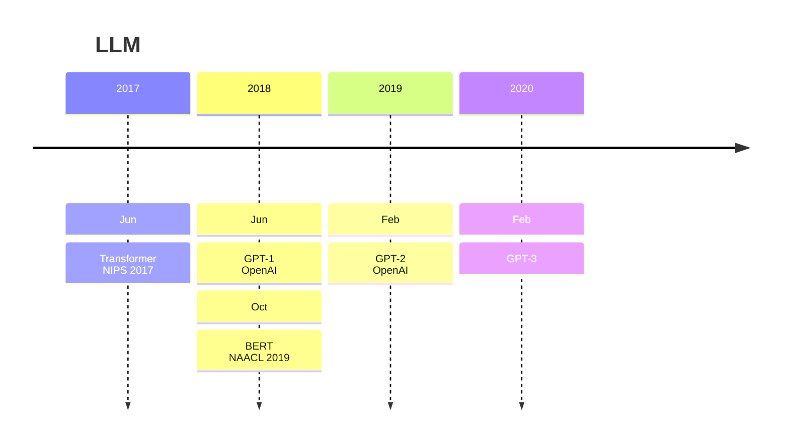
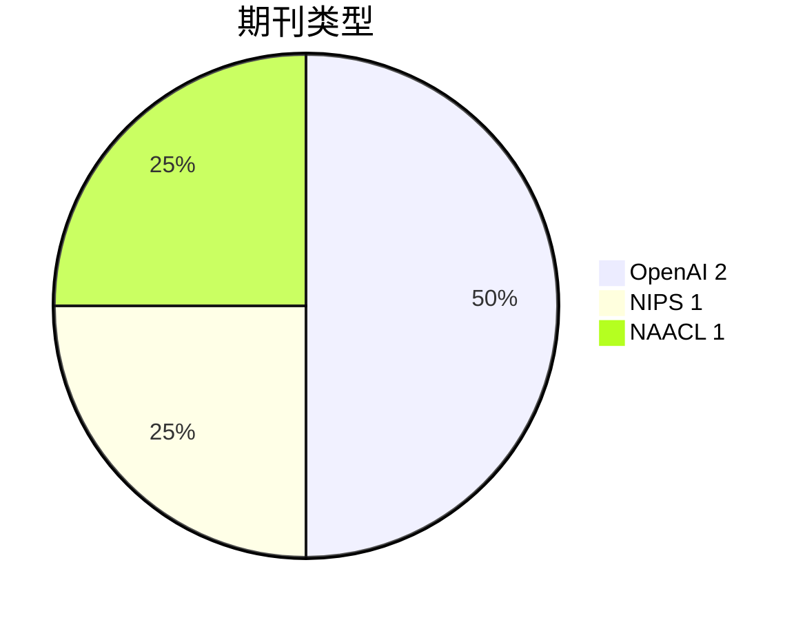
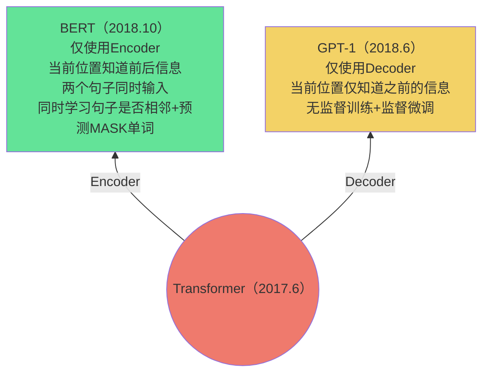
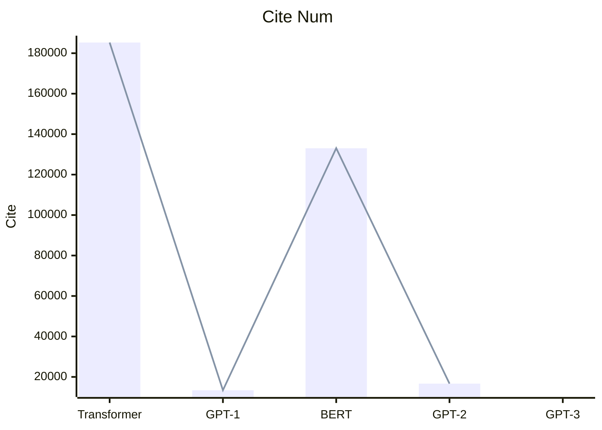

# 1.年份

取arxiv最新版本提交时间与论文截稿时间之间的较早时间

```mermaid
timeline
    title LLM
    2017 : Jun
    		 : Transformer<br>NIPS 2017
    2018 : Jun
    		 : GPT-1<br>OpenAI
    		 : Oct
    		 : BERT<br>NAACL 2019
    2019 : Feb
    		 : GPT-2<br>OpenAI
    2020 : Feb
    		 : GPT-3
```

# 2. 期刊

```mermaid
pie title 期刊类型
		"OpenAI 2" : 2
		"NIPS 1" : 1
		"NAACL 1" : 1
```

# 3. 关联

绿色代表Transformer-Encoder only

黄色代表Transformer-Decoder only

红色代表Transformer-Encoder+Decoder

```mermaid
flowchart BT
Transformer-->|Encoder|BERT
Transformer-->|Decoder|GPT-1


Transformer@{ shape: circle, label: "Transformer（2017.6）" }
				style Transformer fill:#EF7A6D
GPT-1[GPT-1（2018.6）<br>仅使用Decoder<br>当前位置仅知道之前的信息<br>无监督训练+监督微调]
	style GPT-1 fill:#F3D266
BERT[BERT（2018.10）<br>仅使用Encoder<br>当前位置知道前后信息<br>两个句子同时输入<br>同时学习句子是否相邻+预测MASK单词]
	style BERT fill:#63E398
```

# 4. 引用量

```mermaid
    xychart-beta
    title "Cite Num"
    x-axis [Transformer,GPT-1,BERT,GPT-2,GPT-3]
    y-axis "Cite" 
    bar [185289,13424,133047,16676]
    line [185289,13424,133047,16676]
```

