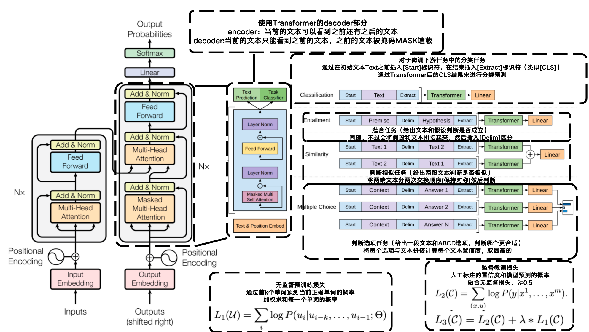
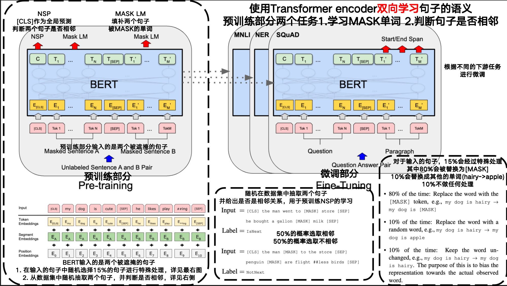
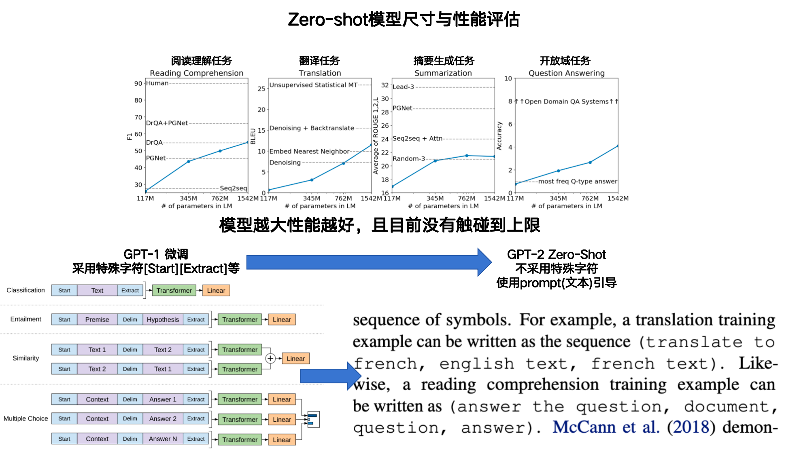
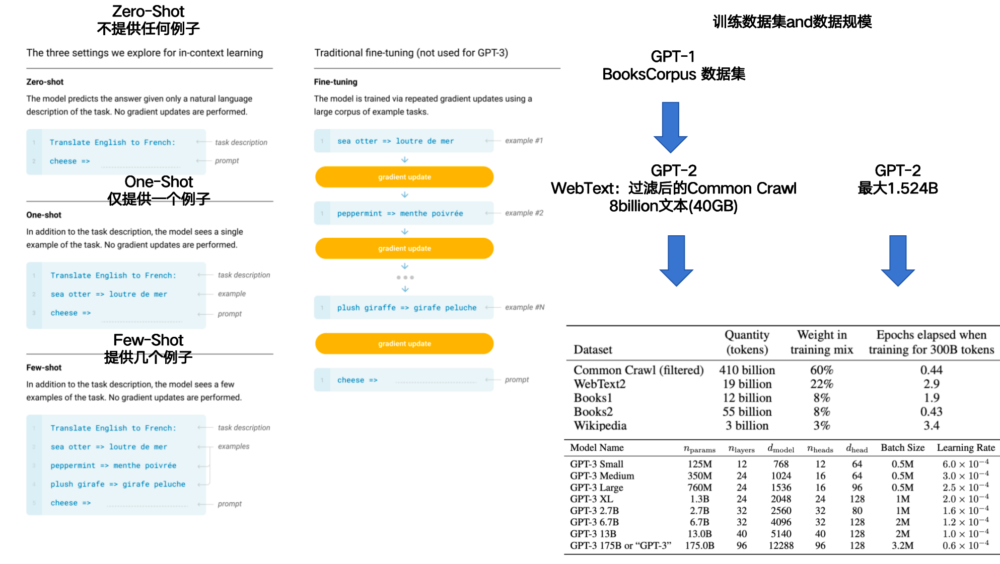
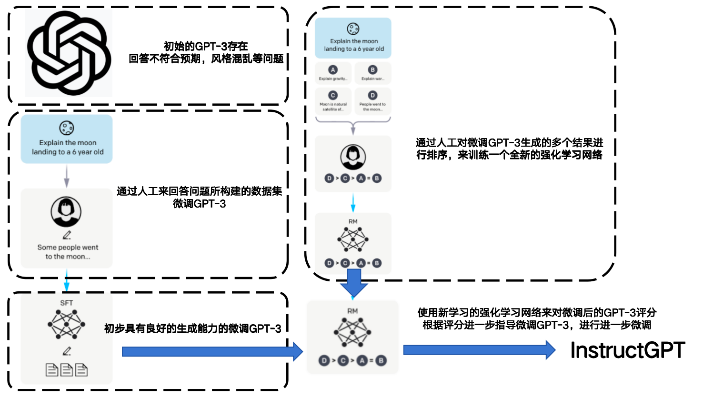
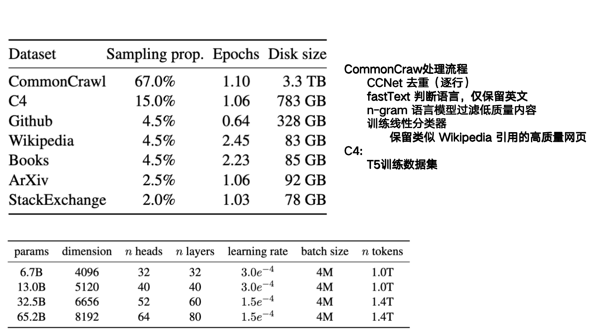
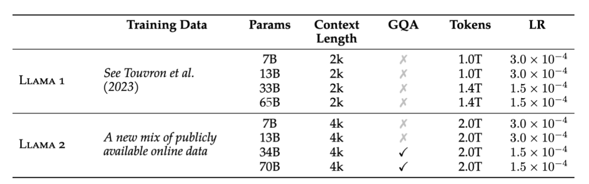

### 1. **(Decoder)Improving Language Understanding by Generative Pre-Training**

- **GPT-1**

- **作者:Alec Radford、Karthik Narasimhan、Tim Salimans、Ilya Sutskever**

- **OpenAI**

- **终版提交:2018.06**

- **Cite:13424**

- **现有问题:**NLP领域没有大量的标注好的数据，并且现有的优化损失不确定

- **创新点:**

  **==1.使用了无监督预训练+监督微调的办法适配下游任务==**

  **==2.使用了Transformer-decoder设计==**

  **==3.定义了无监督训练与监督微调不同的损失函数==**

- 

- [详细信息](./Improving Language Understanding by Generative Pre-Training.md)

### 2. (Encoder)BERT: Pre-training of Deep Bidirectional Transformers for Language Understanding

- **BERT**

- **作者: Jacob Devlin、Ming-Wei Chang、 KentonLee、Kristina Toutanova**

- **Google**

- **NAACL:2019**

- **终版提交: 2018.10**

- **Cite:133047**

- **现有问题:**现在没有基于Transformer Encoder（双向）学习文本任务的工作

- **贡献:**

  - **展示了双向预训练对语言表示的重要性**
  - **一个统一模型+微调可以适应不同任务,且效果很好**
  - **在11项自然语言处理任务上实现SOTA**

- **创新点:**

  **==1.首次使用Transformer Encoder构建，当前单词可以看到前后文本的语义==**

  **==2.使用自监督预训练+监督微调==**

  **==3.自监督采用两个被[MASK]的句子同时输入，同时学习两个句子是否相邻+预测[MASK]的单词==**

- 

- [详细信息](./BERT: Pre-training of Deep Bidirectional Transformers for Language Understanding.md)

### 3. (Decoder)Language Models are Unsupervised Multitask Learners

- **GPT-2**

- **作者: Alec Radford、Jeffrey Wu、Rewon Child、David Luan、Dario Amodei、Ilya Sutskever** 

- **OpenAI**

- **终版提交: 2019.02**

- **Cite: 16676**

- **现有问题:**

- **贡献:**

  - **在GPT-1的基础上扩大了模型规模与训练数据**

  - **提出了Zero-Shot(微调不修改模型参数)**

- **创新点:**

  **==1.首次尝试预训练+Zero-Shot，在适配下游任务时不对模型参数进行调整==**

  **==2.发现随着模型增大，在Zero-Shot任务上还远没有触及上限==**

  **==3.引入了prompt的思想==**

- 

- [详细信息](./Language Models are Unsupervised Multitask Learners.md)

### 4. (Decoder)Language Models are Few-Shot Learners

- **GPT-3**
- **作者:Tom B. Brown、Benjamin Mann、Nick Ryder、Melanie Subbiah、 Jared Kaplan、Prafulla Dhariwal、Arvind Neelakantan、Pranav Shyam、Girish Sastry 、Amanda Askell、Sandhini Agarwal、Ariel Herbert-Voss、Gretchen Krueger、Tom Henighan 、Rewon Chil、 Aditya Ramesh、Daniel M. Ziegler、Jeffrey Wu、Clemens Winter 、Christopher Hesse、Mark Chen、Eric Sigler、Mateusz Litwin、Scott Gray 、Benjamin Chess、Jack Clark、Christopher Berner 、Sam McCandlish、Alec Radford、Ilya Sutskever、Dario Amodei**
- **OpenAI**
- **NIPS:2020**
- **终版提交:2020.5**
- **Cite:48070**
- **现有问题:**
- **贡献:**
- **创新点:**
- **==1.更大的参数量与数据集==**
- **==2.真正实现了预训练后的模型不经微调就可以适配下游任务==**
- 
- [详细信息](./Language Models are Few-Shot Learners.md)

### 5. (Decoder)Training language models to follow instructionswith human feedback

- **InstructGPT**

- **作者:Long Ouyang、Jeff Wu、Xu Jiang、Diogo Almeida、Carroll L. Wainwright、 Pamela Mishkin、Chong Zhang、Sandhini Agarwal、Katarina Slama、Alex Ray、 John Schulman、Jacob Hilton、Fraser Kelton、Luke Miller、Maddie Simens 、Amanda Askell、Peter Welinder、Paul Christiano、Jan Leike、Ryan Lowe**

- **OpenAI**

- **终版提交:2022.03.04**

- **Cite: 15295**

- **现有问题:**

- **贡献:** 

- **创新点:** 

  **==1.通过创建人工标注的数据集来优化GPT-3的生成能力，避免出现说瞎话种族歧视等问题==**

  **==2.通过人工评分来创建了一个强化学习网络进一步指导GPT-3微调==**

  **==3.详细列举了数据标注的相关工作，后续如果有数据标注的任务可以借鉴==**

  **==整个流程被称为RLHF(Reinforcement Learning with Human Feedback)，可以理解为让模型更像人？==**

- 

- [详细信息](./Training language models to follow instructionswith human feedback.md)

### 6. (Decoder)LLaMA: Open and Efficient Foundation Language Models

- **Llama-1**
- **作者:Hugo Touvron、Thibaut Lavril、Gautier Izacard、Xavier Martinet、Marie-Anne Lachaux、Timothee Lacroix、Baptiste Rozière、Naman Goyal、Eric Hambro、Faisal Azhar、Aurelien Rodriguez、Armand Joulin、Edouard Grave、Guillaume Lample**
- **MetaAI**
- **终版提交: 2023.02.27**
- **现有问题:** 
- **贡献:** 
  - **证明仅使用公开可获取的数，不依赖私有或者无法访问的语料也能训练出最先进的语言模型**
  - **提出模型不一定要大，但训练数据量要足够多，相比GPT-3参数量更小，但是在任务表现更好**
  - **推动大语言模型民主化，可以在单块GPU上运行**
  - **“高性能+可开源”，开源大模型，LLaMA 的数据完全可复现，增强了模型的透明度与学术价值，首个开源且能与最强闭源模型抗衡的模型系列**
  
- **创新点:** 
  **==1.优化训练过程，让训练更民主化==**

  **==2.开源==**
  
  **==3.全部采用公开可获取的数据集==**
  
  **==4.相比于GPT-3，参数量更小，效果更好==**
  
- 
- [详细信息](./LLaMA: Open and Efficient Foundation Language Models.md)

### 7. Llama 2: Open Foundation and Fine-Tuned Chat Models

- **Llama-2/Llama-2-Chat**

- **作者: Hugo Touvron、Louis Martin、Kevin Stone、Thomas Scialom**

- **MetaAI**

- **终版提交: 2023.07.19**

- **Cite: 15730**

- **现有问题:**

- **贡献:**

- **创新点:**

  **==1.开源==**

  **==2.参数量更多==**

  **==3.引入GQA提高学习能力==**

- 

- [详细信息](Llama 2: Open Foundation and Fine-Tuned Chat Models.md)

### 8. (Decoder)GPT-4 Technical Report

- **GPT-4**

- **作者: OpenAI**

- **终版提交: 2024.03.04**

- **Cite: 12771**

- **现有问题:**

- **贡献:**

  - **GPT首次多模态模型，可以接受图像输入了**
  - **可以控制GPT的语气和态度** 

- **创新点:**

  **==1.借鉴了InstructGPT微调让GPT更像人==**

- [详细信息](./GPT-4 Technical Report.md)

### 9. The Llama 3 Herd of Models

- Llama-3
- 作者: MetaAI Llama Team
- 终版提交: 2024.11.23
- Cite:5189
- 现有问题: 
- 贡献:
- 创新点
