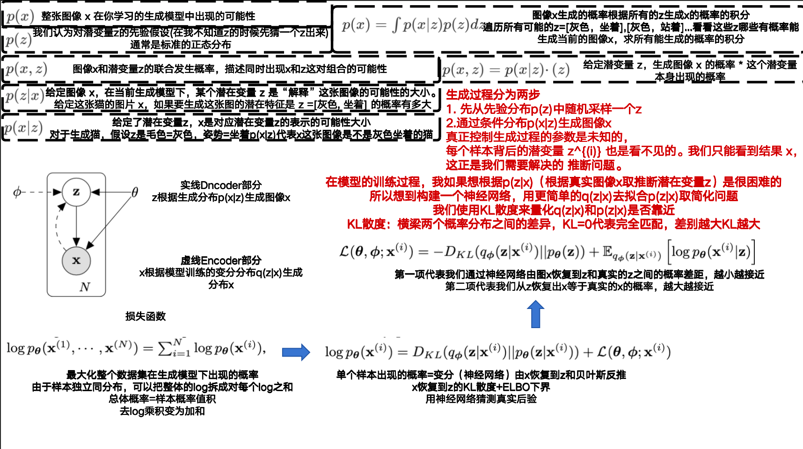
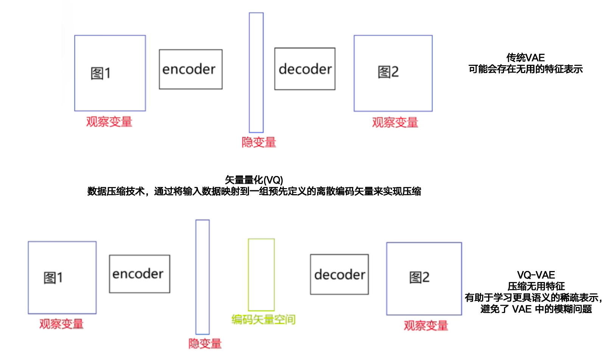

### **1. Auto-Encoding Variational Bayes**

- **VAE**

- **作者:Diederik P. Kingma、Max Welling**

- **Machine Learning Group Universiteit van Amsterdam**

- **ICLR: 2014**

- **初版提交: 2013.12.20**

- **Cite: 46034**

- **背景**

- **现有问题**

- **贡献**

- **创新点**

  ==**1.创建了损失函数和梯度优化的方式，能够训练一个从初始图像x到特征z，再根据一个随机的特征z生成新的图形x的模型**==

- 

- **[详细信息](./Auto-Encoding Variational Bayes.md)**

### 2. Neural Discrete Representation Learning

- **VQ-VAE**

- **作者: Aaron van den Oord、Oriol Vinyals、Koray Kavukcuoglu**

- **Google DeepMind**

- **NIPS: 2017**

- **初版提交: 2017.11.02**

- **Cite: 6258**

- **背景**

- **现有问题**

- **创新点**

  **==1.将VAE中的隐空间离散化，同时进行压缩，省去了无用的特征，进而提高了生成图像的模糊问题==**

- 

- [详细信息](./Neural Discrete Representation Learning.md)
