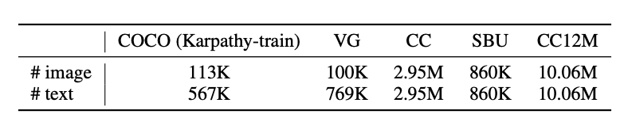

**Align before Fuse: Vision and Language Representation Learning with Momentum Distillation**

- **背景**
- **现有问题**
  - 现有使用目标检测做多模态图像处理的部分是提前预训练好的
    - 特征提取是固定的，可能会导致跨模态融合的时候不好学习如何对齐
    - 目标检测器依赖严重，没有好的目标检测器多模态模型训练也不好
  - 训练图文多来自网页，噪声过大，使用MLM(掩码)建模可能会拟合错误信息（生成的语义可能比给出的语义更好，但是把标签当做唯一正确答案来训练，不利于泛化性）
- **动机**
  - 摒弃多模态图像处理中的目标检测模型，核心思想**先对齐再融合**
- **贡献**
- **解决思路**
  - **Align Before Fuse**
    - 摒弃目标检测模型
    - 对图文特征先对齐再融合
  - **MoD**
    - 借鉴动量编码器，使用教师网络生成软标签，可以容忍因为噪声与语义多样性造成原始标签中潜在的错误或模糊信息
    - 模型不再因为预测出“合理但不同于标注”的结果而被惩罚
  - **全新的损失函数**
    - ITC(对比学习)+ITC~MoD~+MLM(MASK)+MLM~MoD~+ITM
- **具体解决办法**
- **实验**

  - **数据集**
    - **Web-scale**
      - 自动生成标签(大噪声)
      - Conceptual Captions (CC)
      - SBU Captions
    - **In-domain**
      - 高质量数据集
      - COCO Caption
      - Visual Genome(VG)
    - **扩展版本**
      - 更大更嘈杂
      - CC12M
    - 

  - **模型参数**
    - **文本**
      - BERT-base
      - 参数量: 123.7M
    - **图像**
      - ViT-B/16
      - 参数量: 85.8M
      - **增强策略**
        - RandAugment去除颜色与分割