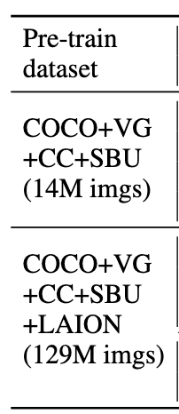

**BLIP: Bootstrapping Language-Image Pre-training for  Unified Vision-Language Understanding and Generation**

- **背景**
- **现有问题**
  - 目前多模态任务只能适配理解类任务(VQA，图文检索)，没有办法很好的适配生成类任务(Caption)，也就是说只用Encoder而没用Decoder，但是现有的Encoder-Decoder模型又不够灵活
  - 可用于训练的干净数据集太小，大数据集又噪声太多
- **动机**
  - 创建一个Encoder-Decoder结合的任务，并且自由的根据下游任务去适配不同的模型
- **贡献**
  - **CapFilt性能提升**
  - **多种任务取的SOTA**
- **解决思路**
  - **MED**
    - **多出生成任务了，同时可以根据不同的下游任务适配不同的模型结构**
      - 单模态编码器
      - 图像引导的文本Encoder适应理解任务
      - 图像引导的文本Deocder适应生成任务
  - **CapFilt**
    - **数据集出发，从爬出来的嘈杂数据过滤信息，使用过滤器来过滤嘈杂信息，再使用生成器根据图像生成字幕补充数据**
    - Caption
      - 将训练好的MED模型微调成Captioner，自动生成图像描述
    - Filltering
      - 将另一个MED模型微调成过滤器，判断那些caption有质量
  - 训练
    - 使用
      - 理解类：ITC(CLIP+ALBEF动量编码器)
      - 理解类：ITM(ALBEF)
      - 生成类：IM(GPT)
- **具体解决办法**
- **实验**
  - **数据集**
    - 