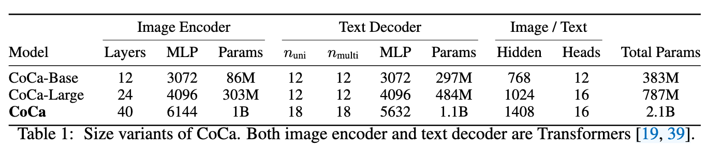
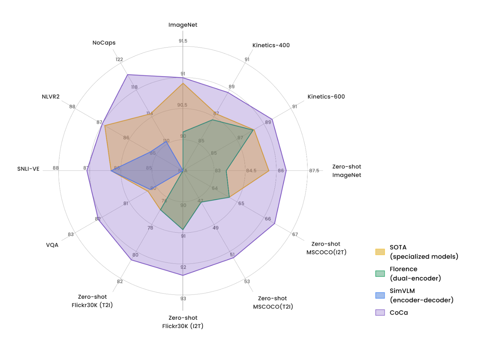

**CoCa: Contrastive Captioners are Image-Text Foundation Models**

- **背景**
- **现有问题**
- **动机**
  - 对比学习的CLIp和声测还能搞学习的SimVLM结合起来
- **贡献**
- **解决思路**
  - 从头开始端到端训练
  - ITC(CLIP)+LM(GPT)
- **具体解决办法**

- **实验**
  - **数据集**
    - **JFT-3B**
      - Google数据集
      - 人工标注的标签图像数据，图像+一组固定标签（如“cat”, “animal”）
    - **ALIGN**
      - 网络抓取数据
      - 图像 + 对应 alt-text（自由文本，质量较低）
  - **模型参数**
    - 

