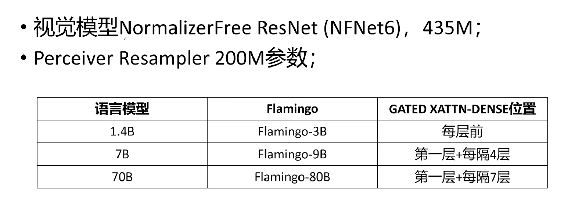
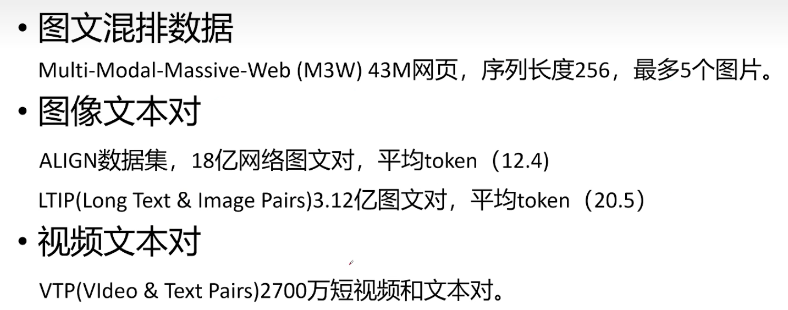

**Flamingo: a Visual Language Model for Few-Shot Learning**

- **背景**

- **现有问题**

- **动机**

- **贡献**

  - **桥接强大的预训练视觉模型和大语言模型**
  - **可以处理任意图片，文本，视频混杂的数据（\<image\>\<text\>\<image\>\<video\>混合排序输入）**
  - **无缝接收图像或者视频作为输入**

- **解决思路**

- **具体解决方法**

- **实验**

  - **模型参数**
    - 

  - 数据集
    -  