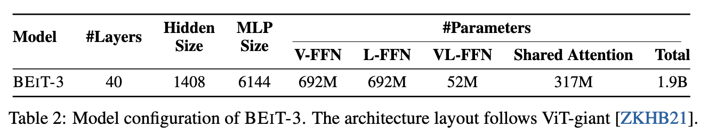
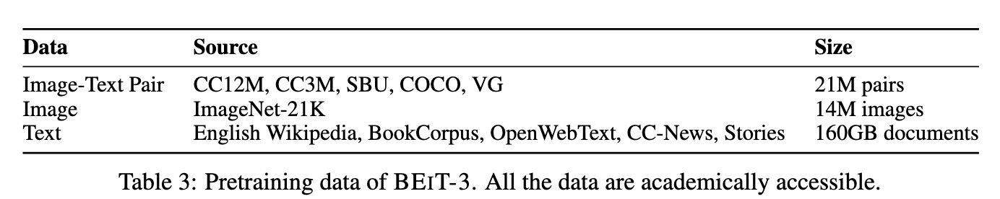
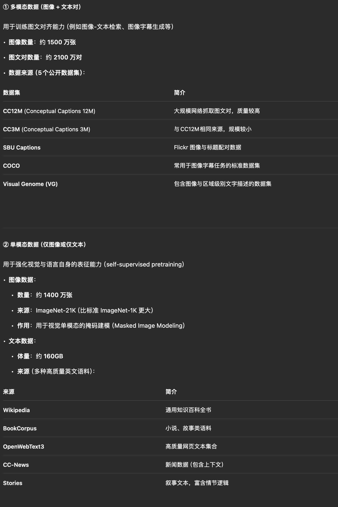

**Image as a Foreign Language: BEIT Pretraining for All Vision and Vision-Language Tasks**

- **背景**

  - 随着Transformer、ViT和NLP的自监督发展，图像自监督也逐渐兴起，逐渐抹除模态之间的差距，实现大一统
    - 通过构建大规模基础模型（foundation model），并在海量数据上进行预训练，从而一次训练、多任务适应
- **现有问题**
- **动机**

  - 朝着大一统的方向努力，试图构建一个一次性预训练一次性泛化的模型
  - 训练出一个统一的通用模型（general-purpose foundation model），既能处理语言，又能处理图像，甚至能处理它们的组合（即图文对）
- **贡献**
- **解决思路**

  - **Multiway Transformers（VLMo中的MoME）**
    
    - 可以同时处理文本、图像、图文对，而不是训练三个单独的模型
    
  - **统一的 Masked “Language” Modeling（MLM）训练目标**
    - 对图像
      - 输入被MASK的image patch，输出目标是恢复其语义token(BEiT)
    - 对文本
      - BERT
    - 图文对
      - mask的部分图文，预测另一模态信息(图文互补)
  
  - **扩大模型与数据的规模**
    - 只使用公开数据
  
- **具体解决办法**
- **实验**

  - **模型参数**
    - 

  - **数据集**
    - 
    - 