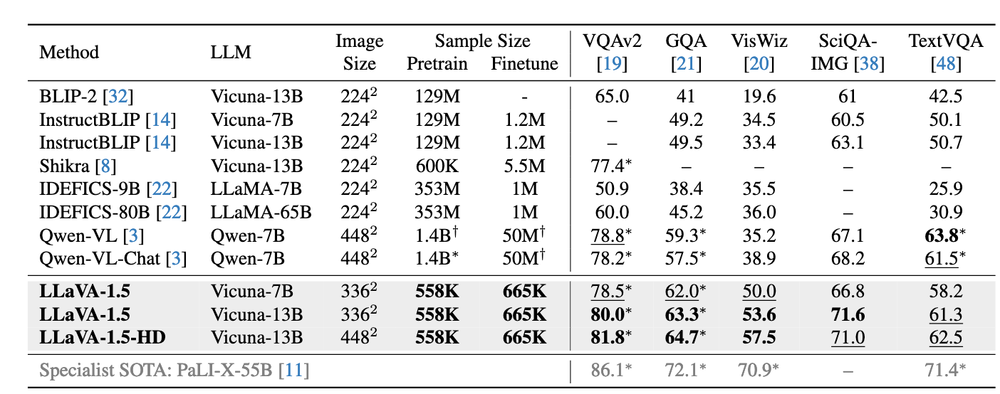

**Improved Baselines with Visual Instruction Tuning**

- **背景**

  - **LLaVA** 在对话类任务上表现更强（如 MMBench）
  - **InstructBLIP** 在传统 VQA 任务上表现更好（如 ScienceQA）

  

- **现有问题**

  - LLaVA
    - 强在真是对话，弱在学术基准
    - 偏向于回答长的答案
  - InstructBLIP
    - 强在学术评估，弱在真是对话
    - 倾向于回答短答案

- **动机**

- **贡献**
  - 简单结构也可以很强大
    - 使用最简单的视觉语言连接器MLP
    - 融入学术VQA数据集
    - 训练开销低，仅需公开数据
  - 探索多模态训练中的问题
    - 支持更高分辨率输入
    - 合成能力：能否推理多个视觉对象之间的关系
    - 数据效率：训练集随机下采样75%，性能下降不大
    - 防止幻觉

- **解决思路**

  - **解决LLaVA在特定任务需要短答案**

    - 提出一种 **单一且明确的 response prompt**：

      > **“Answer the question using a single word or phrase.”**
    - 将该提示词附加在希望获得短答案的 VQA 问题后。

  - **改进模块**

    - 将线性投影层替换为两层MLP

  - 加入新的学术数据集

  - 进一步扩展能力

    - 更高分辨率输入(336x336)
    - 更换视觉编码器为CLIP ViT-L/336px（比 ViT-L/14 分辨率更高，模型更强）
    - 提升感知细节能力，减少幻觉
    - 扩展LLM(小模型->13B)

- **具体解决方法**

- **实验**

  - **模型参数**
    - 