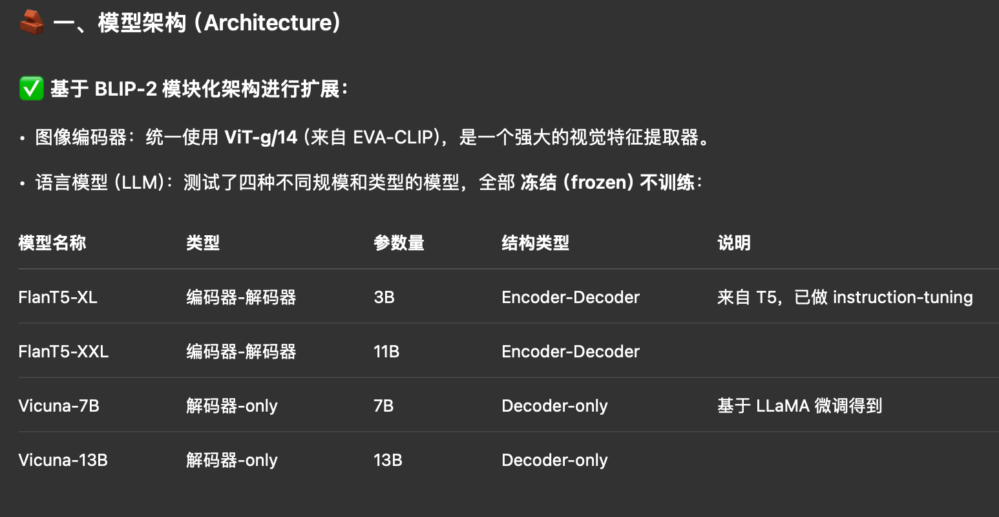

**InstructBLIP: Towards General-purpose Vision-Language Models with Instruction Tuning**

- **背景**

- **现有问题**

- **动机**

- **贡献**
  - **首次大规模系统地研究视觉-语言任务的指令微调**
  - **通过 Q-Former 融合指令信息，实现更灵活的视觉特征感知**
  - **更强的泛化能力**
  - **开源代码**
  
- **解决思路**
  - **使用训练好的BLIP-2进行下游微调**
    - 图像编码器和LLM部分冻结
    - Q-Former可学习
  - **BLIP-2 Q-Former的基础上引入Instruction-aware 特征提取机制**
  
- **具体解决方法**

  - **构建了通用视觉语言助手，收集并转化涵盖了11类任务的26个公开数据集**

    - 图像描述
      - COCO
      - Flickr30K
    - 带阅读理解的图像描述
      - TextCaps
    - 视觉推理
      - NLVR2
      - GQA
    - 图像问答
      - VQAv2
      - OK-VQA
    - 知识驱动图像问答
      - A-OKVQA
      - ScienceQA
    - 阅读理解图像问答
      - TextVQA
      - OCR-VQA
    - 视频问答
      - MSVD-QA
      - MSRVTT-QA
    - 多轮视觉对话问答
      - VisDial
    - 图像分类
      - ImageNet
    - 指令微调数据
      - LLaVA-Instruct-150K

  - 为每个任务类型设计了10~15个自然语言指令模板

    - 目的是将原始数据（通常是 <image, question/answer>）转换为

    - ```
      Human: <image> + 指令
      Assistant: 回答或描述
      ```

  - 对于原始数据中 答案很短的任务（如 ImageNet 分类），为了防止模型“习惯性产出短句”，在模板中添加指令词，如 briefly, short answer 等，以适当调控回答长度

  - LLaVA-Instruct-150K,这个数据集本身已经是“指令-响应”结构，因此 无需额外设计模板

- **实验**

  - 