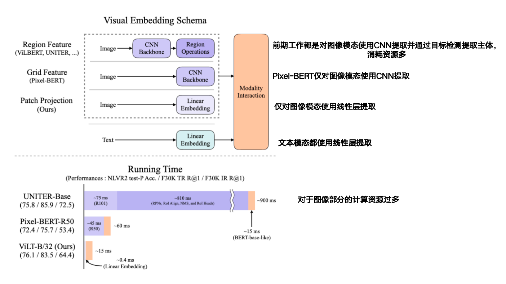
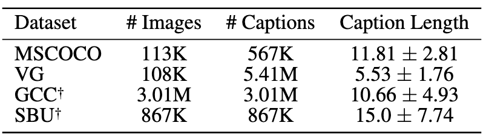

**ViLT: Vision-and-Language Transformer  Without Convolution or Region Supervision**

- **背景**
  - 现有的VLP模型，在处理图文任务时通常采用预训练的图像编码器来提取图像中的目标(目标检测)，然后将图像特征和文本输入送入一个 Transformer 模块进行跨模态融合。
    - 文本部分一致采用BERT
    - 图像部分各不相同
  - 模型预训练阶段通常包括两类目标
    - **Image-Text Matching (ITM)**：判断图文是否匹配（即这张图是否对应这段话）
    - **Masked Language Modeling (MLM)**：遮挡文本中的部分词语，让模型预测它们（如 BERT 一样）
  - 将图像输入VLP模型中时不能直接输入像素点，而是要先将图像像素嵌入(embed)为向量
  - 多数 VLP 模型使用的不是整张图像的特征，而是通过目标检测器提取出来的一些物体区域（region-level）特征
    - 通常在 Visual Genome 数据集(目标检测)上预训练
- **现有问题**
  - 目前普遍认为视觉特征越好，跨模态性能越强，且学术研究敬称忽略计算负担，不便于在实际中应用。现有的模型因为在图像模态需要经过目标检测，所以效率很低且表达能力受限。
  - 
- **动机**
  - 轻量化现有VLP
    - 对文本使用Transformer
    - 放弃使用目标检测来提取特征，对图像使用类似于ViT的思想
- **贡献**
  - 提供了一个结构极简的VLP
  - 首次完全抛弃视觉区域特征(不适用目标检测提取)
  - 引入了整词遮蔽和图像增强
- **解决思路**
  - **采用单流架构**
    - 结构更简单、参数更少
  - **图像和文本都通过同一个Transformer编码器处理**
    - 用类似文本处理的方式对图像进行千层嵌入，然后将图像和文本在输入是就拼接在一起进入Transformer
  - **使用ViT的Transformer来融合特征**
  - **提出两种全新的训练技巧**
    - **整词遮挡**
      - BERT存在WordPiece，会将长的单词拆分为多个子词，然后对子词进行掩码
      - 本模型不加拆分的遮蔽整个词，强迫模型从图像中学习被遮蔽单词
    - **图像增强**
      - 常规改变颜色增强可能使图文不匹配（白色的狗在草地上，改变颜色变成黄色）
      - 使用RandAugment默认操作，但去除颜色翻转和遮挡
- **具体解决办法**
- **实验**
  - **RandAugment**
    - **N=2**
      - 每张图像随机使用两个增强
    - **M=9**
      - 每个操作的强度为9
  - **数据集**
    - 