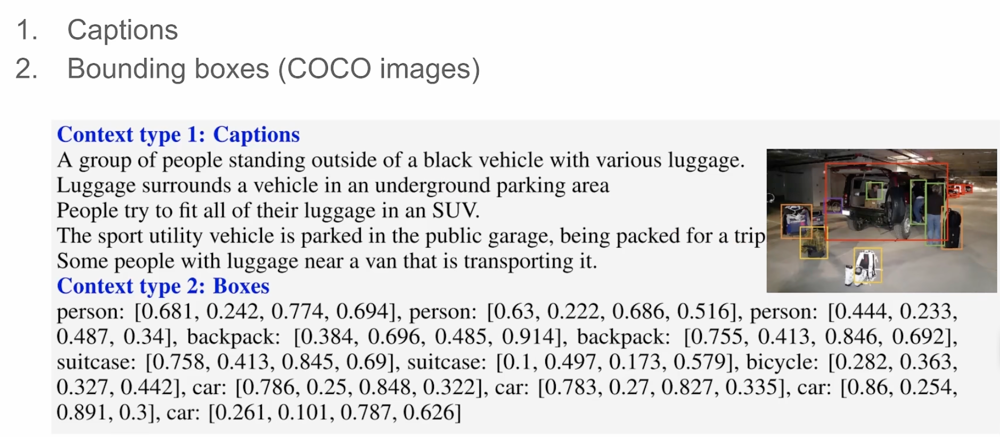

**Visual Instruction Tuning**

- **背景**
- **现有问题**
  - 现有的数据集无法满足模型对于跨模态之间学习的要求
- **动机**
  - 利用LLM来强化数据集中的文字部分
- **贡献**
  - 多模态指令数据构建
  - 构建大型多模态模型
  - 提出多模态指令基准
  - 开源
    - 多模态训练数据（由 GPT-4 生成）
    - 模型代码与权重
    - 两个用于图文任务评估的 benchmark
- **解决思路**
  - **COCO数据集举例，有的是**
    - **图片**
    - **图片匹配的Caption**
    - **Bounding Boxes(物体检测标注)**
    - 
    - 通过LLM来扩展这部分信息，具体操作是将已知信息输入到LLM中
      - **图文对话**
        - 提问包括
          - 图像中对象的类别（what is this）
          - 数量（how many people）
          - 行为（what is the person doing）
          - 位置（where is the bag）
          - 关系（who is standing to the left of the car）
      - 详细描述
        - 提供一张图片后，生成**全面细致的场景描述**
      - 复杂推理
        - 更高阶的能力测试，如：
          - 判断难点（What challenge do these people face?）
          - 推断动机、事件因果、隐含信息等。
  - **两阶段训练**
    - **第一阶段**
      - 冻结视觉编码器和LLM(Vicuna)，端到端训练线性投射层
      - 对每张图片随机采样一个问题，正确答案是原始图像的Caption
      - 每个样本就是一轮 instruction-following 对话
    - **第二阶段**
      - 冻结视觉编码器，微调线性投影和LLM
      - 使用LLM优化后的158K条图文对，在三种任务中均匀采样
      - 使用**ScienceQA**数据集，
      - 这是一个 **大规模的科学多模态问答基准集**，每个样本包含：
        - 问题（Question）
        - 上下文（Context）：可以是文字，也可以是图像
        - 答案及其解释（Answer + Explanation）
- **具体解决办法**
- **实验**
  - 生成数据集LLM
    - GPT-4
  - 消融实验
    - GPT-4比ChatGPT生成的要好
  - 预训练参数
    - LLM
      - Vicuna
    - 视觉编码器
      - CLIP的ViT-L/14
  - 数据集
    - 第一段训练
      - CC3M
        - 筛选出59.5W对图文对
    - 第二阶段训练
      - LLM优化数据集
      - ScienceQA