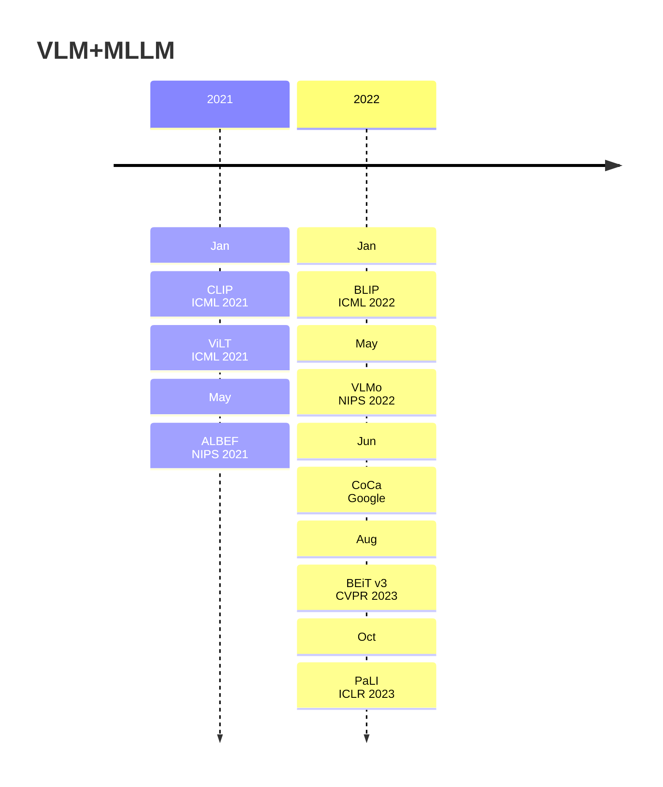
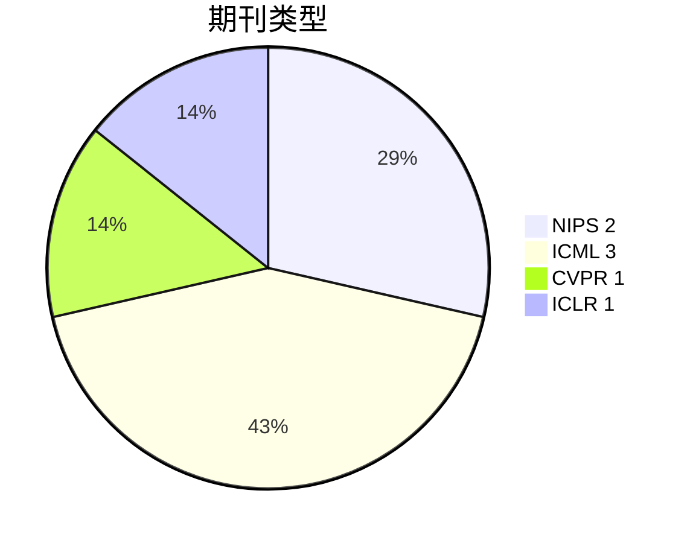
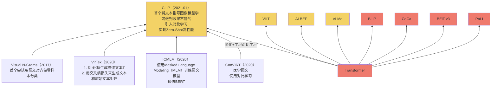
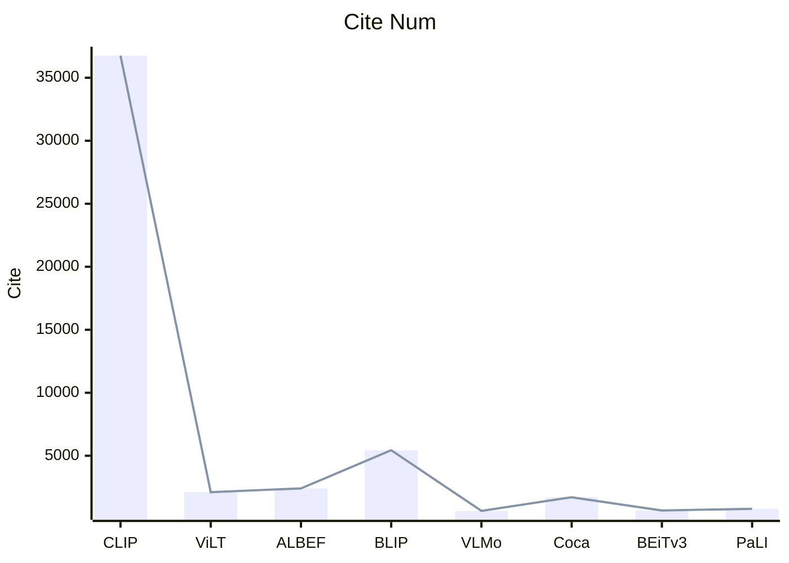

# 1.年份

取arxiv最新版本提交时间与论文截稿时间之间的较早时间

# 2. 期刊

# 3. 关联

绿色代表Transformer-Encoder only

黄色代表Transformer-Decoder only

红色代表Transformer-Encoder+Decoder

视觉编码器应该大于文本编码器

融合模块很重要

对比学习ITC Loss很好(ITC(Iamge-Text-Contrastive))

目标检测WPA Loss算起来很慢(WPA（Word Patch Alignment）)

BERT的Mask Loss不错 [Mask Language Modling]

Image Text Matching Loss不错

所以好的Loss=ITC+ITM+MLM

# 4. 引用量

