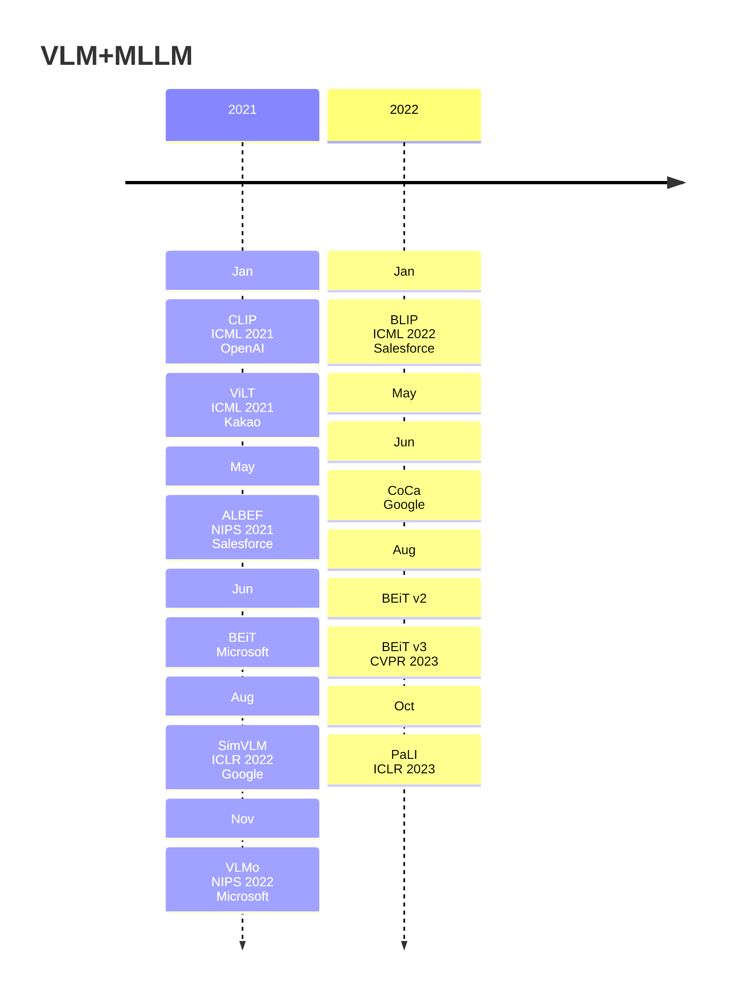
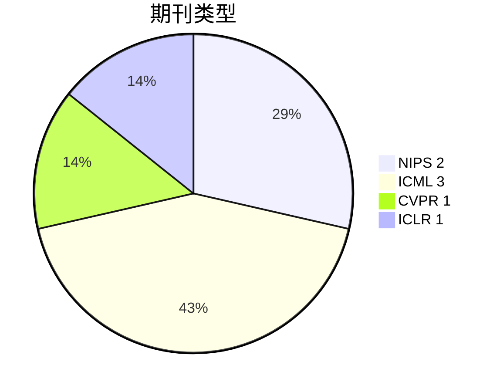
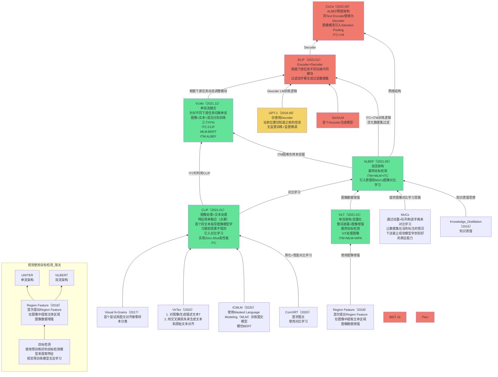
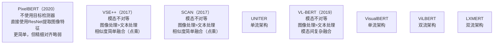
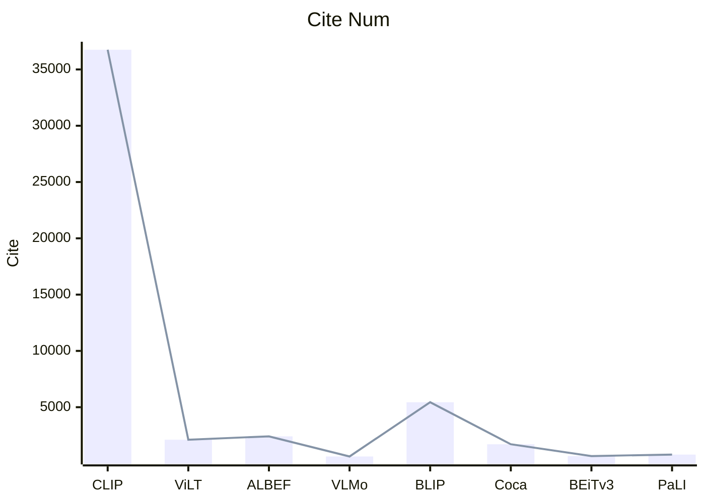

# 1.年份

取arxiv最新版本提交时间与论文截稿时间之间的较早时间

# 2. 期刊

# 3. 关联

绿色代表Transformer-Encoder only

黄色代表Transformer-Decoder only

红色代表Transformer-Encoder+Decoder

- 单流架构
  - 图像和文本的嵌入 在输入阶段就拼接（concatenate）在一起，然后统一送入同一个 Transformer 中处理
  - 优点
    - 模态间融合充分、交互层次深
    - 结构简洁（只有一个Transformer Encoder）
  - 缺点
    - 文本图像的token共享Attention空间，可能会相互干扰
    - 对内存和计算的要求高
- 双流架构
  - 图像和文本分别用 两个独立的 Transformer 编码器处理，直到某一层才进行交互（比如通过 Cross Attention）
  - 优点
    - 模态内部的建模更纯净，不容易干扰。
    - 更易调控图像和文本的参数配比。
  - 缺点
    - 模型更复杂，**参数量更大**。
    - 模态间交互较晚，可能错失早期融合的效果。

视觉编码器应该大于文本编码器

融合模块很重要

对比学习ITC Loss很好(ITC(Iamge-Text-Contrastive))

目标检测WPA Loss算起来很慢(WPA（Word Patch Alignment）)

BERT的Mask Loss不错 [Mask Language Modling]

Image Text Matching Loss不错

所以好的Loss=ITC+ITM+MLM

# 4. 引用量

