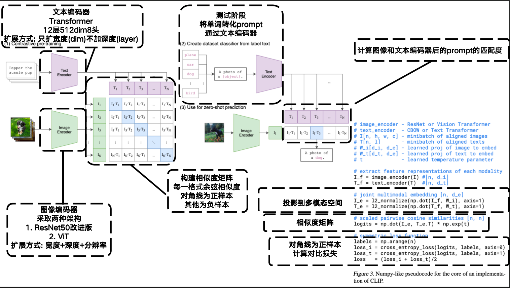
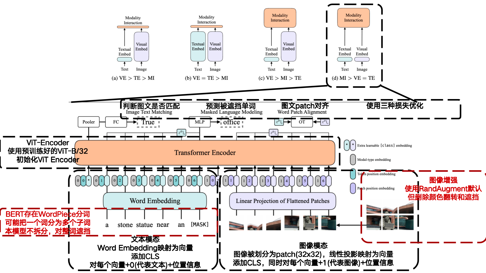
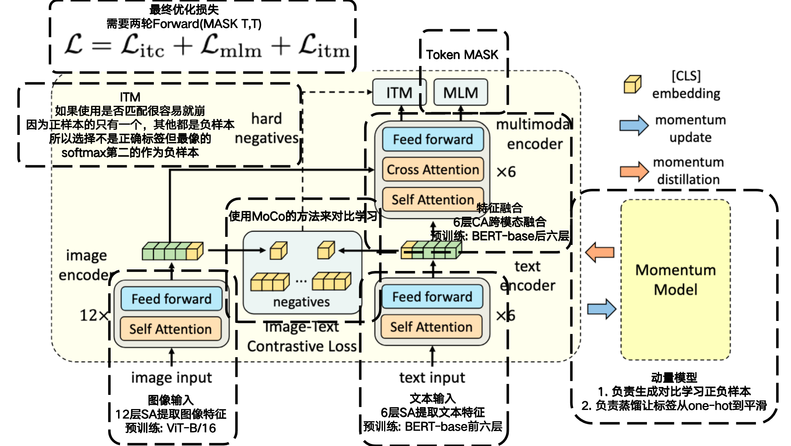
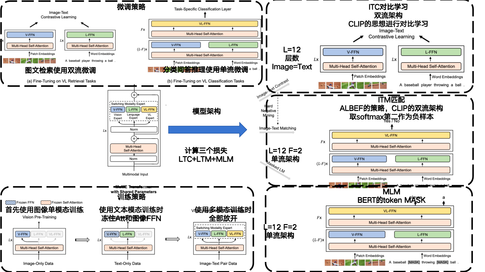
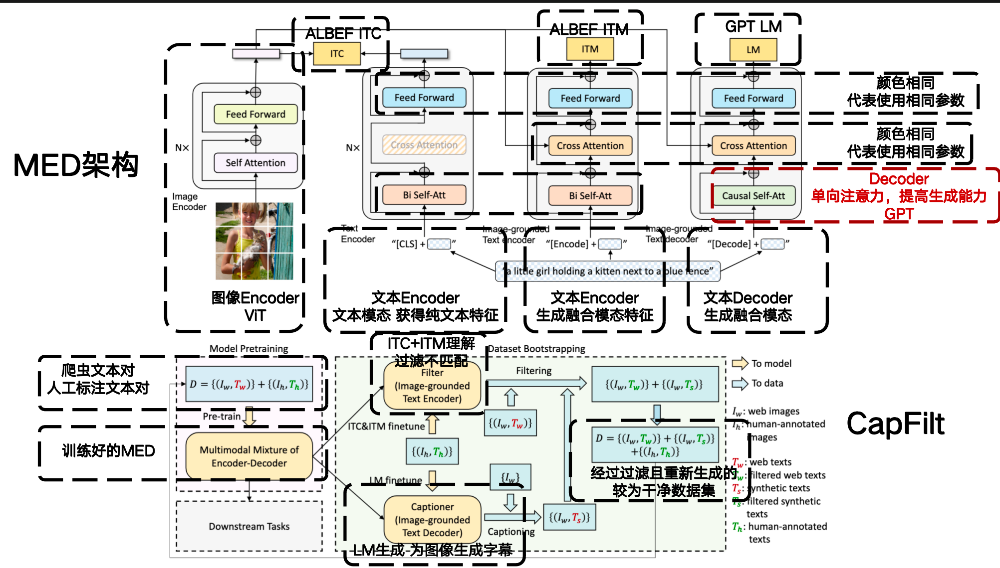
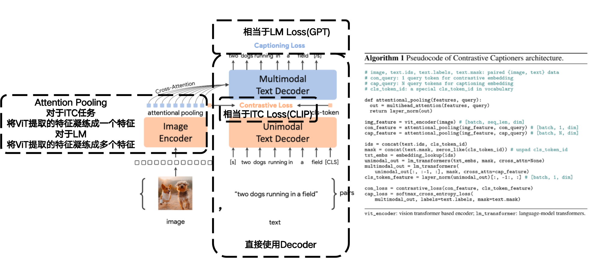

### 1. Learning Transferable Visual Models From Natural Language Supervision

- **CLIP**

- **作者: Alec Radford 、Jong Wook Kim、Ilya Sutskever**

- **OpenAI**

- **ICML:2021**

- **终版提交: 2021.01**

- **Cite: 36752**

- **背景:**
  - 基于纯文本预训练+零样本适配下游任务的统一语言模型推动了NLP进入任务无关，零样本迁移的新时代
  - 在NLP领域 大数据弱监督>小数据强监督
  - 在CV领域预训练仍然高度依赖人工标注

- **现有问题:**传统的计算机视觉模型（分类器）只能识别固定的一组标签，但是现有任务的文本指导图像识别参数量和数据量又不够

- **贡献:**

  - **1.利用自然语言监督信号定义全新的分类器，实现Zero-Shot学习**
  - **2.将大量参数和数据引入指导学习**

- **创新点:**

  **==文本:Transformer 图像:ResNet or ViT==**

  **==1.首个使用文本指导图像学习且Zero-Shot效果很好的模型，让分类任务不局限于给定的分类，提高了迁移性==**

  **==2.引入对比学习(ITC)来指导模型训练==**

  **==3.从头训练，不使用预训练权重==**

  **==4.只保留线性投影==**

  ==**5.简单的数据增强，随机缩放再裁剪**==

  **==6.特征融合简单融合，仅使用点乘（双流架构）导致图文检索任务效果好，但是复杂交互VQA、NLVR2等推理任务上效果不佳==**

- 

- [详细信息](./Learning Transferable Visual Models From Natural Language Supervision.md)

### 2. ViLT: Vision-and-Language Transformer  Without Convolution or Region Supervision

- **ViLT**

- **作者: Wonjae Kim、Bokyung Son、Ildoo Kim**

- **韩国Kakao公司**

- **ICML:2021**

- **终版提交:2021.01**

- **Cite:2115**

- **背景:**现有的VLP模型，在处理图文任务时通常采用预训练的图像编码器来提取图像中的目标(目标检测)，然后将图像特征和文本输入送入一个 Transformer 模块进行跨模态融合。

- **现有问题:**模型不够轻量化，大部分对于图像的操作太冗余，或者是在特征融合部分效果不好

- **创新点:**

  **==1.对现有模型进行轻量化，首次尝试了图像ViT+文本Transformer(单流架构)==**

  **==2.提出了图像增强和整词MASK的训练策略==**

  **==3.对现有工作进行了总结==**

  **==4.摒弃了目标检测模块，提高了模型效率==**

  **==5.除了ITM+MLM+WPA损失==**

  ​	**==后续好像证明WPA耗费的资源过大==**

  **==6.指出了双流架构（CLIP）因为仅通过点乘融合特征导致跨模态理解能力有限==**

- 

- [详细信息](./ViLT: Vision-and-Language Transformer  Without Convolution or Region Supervision)

### 3. Align before Fuse: Vision and Language Representation Learning with Momentum Distillation

- **ALBEF**

- **作者: Junnan Li、Ramprasaath R. Selvaraju、Akhilesh D. Gotmare、Shafiq Joty、Caiming Xiong、Steven C.H. Hoi**

- **Salesforce**

- **NIPS:2021**

- **终版提交:2021.05**

- **Cite: 2412**

- **背景**

- **现有问题**

  - **现有模型使用预训练好的目标检测模型提取图像特征，耗时多且不能学习**
  - **现有的数据集要么不够大要么噪声太多**

- **创新点**

  **==1.摒弃目标检测模块，使用预训练好的ViT和BERT初始化权重，Image Embeding>Text Embeding，使用注意力增强特征融合（单流），提高跨模态表征能力==**

  ==**2.使用动量模型（MoCo）来生成对比学习正负样本，同时使用动量模型来对one-hot标签平滑（蒸馏思想）避免因为语义多样性误导学习(MoD)**==

  **==3.使用ITC~MoD~+MLM~MoD~+ITM（softmax第二作为负样本避免崩，困难负样本挖掘）==**

  

- [详细信息](./Align before Fuse: Vision and Language Representation Learning with Momentum Distillation.md)

### 4. VLMo: Unified vision-language pre-training with mixture-of-modality-experts

- **VLMo**

- **作者: Hangbo Bao、Wenhui Wang、Li Dong、Qiang Liu、Owais Khan Mohammed、Kriti Aggarwal、Subhojit Som、Furu Wei**

- **Microsoft**

- **NIPS: 2022**

- **终版提交: 2022.05**

- **Cite: 623**

- **现有问题:** 

  - 双流架构在融合模态时只是简单融合，在一些要求模态交互较深的下游任务时效果较差(如VR)
  - 单流架构在融合模态使用Cross-Attention交互，所以图像和文本的特征是混合在一起的，在做图文检索的时候每判断一个分类就需要重新跑一遍模型，运行效率缓慢，而双流架构因为分别对图像和文本进行编码，可以提前离线存储编码特征，在图文检索时只需要提前调用保存好的特征做简单的内积就可以得到，效率较高

- **创新点**

  **==1.提出了一种能根据不同下游任务自适应调整单双流架构的模型==**

  **==2.使用图像单模态预训练+文本单模态预训练+图像文本混合模态训练的模型，分别训练三个FFN==**

  **==3.对于ITC使用CLIP的方式，ITM使用ALBEF的方式，MLM使用BERT的方式==**

  **==4.使用了大量的实验证明了Self-Attention是可以共享参数的，仅训练不同的FFN就可以了==**

- 

- [详细信息](./VLMo: Unified vision-language pre-training with mixture-of-modality-experts.md)

### 5. BLIP: Bootstrapping Language-Image Pre-training for  Unified Vision-Language Understanding and Generation

- **BLIP**

- **作者: Junnan Li、Dongxu Li、Caiming Xiong、Steven Hoi**

- **Salesforce**

- **ICML: 2022**

- **终版提交: 2022.01**

- **Cite: 5442**

- **背景:** 

- **现有问题:** 
  - 目前多模态任务只能适配理解类任务(VQA，图文检索)，没有办法很好的适配生成类任务(Caption)，也就是说只用Encoder而没用Decoder，但是现有的Encoder-Decoder模型又不够灵活
  - 可用于训练的干净数据集太小，大数据集又噪声太多
  
- **创新点:** 

  **==1.创建了MED，包含Encoder和Decoder，不光可以完成理解任务，也可以很好的完成生成任务(Caption)，与VLMo相同，可以根据不同的下游任务选取模型不同的部分，更加灵活==**

  **==2.创建了CaptFilt，通过生成字幕和过滤不配对文本图像对来过滤数据集噪声==**

- 

- [详细信息](./BLIP: Bootstrapping Language-Image Pre-training for  Unified Vision-Language Understanding and Generation.md)

### 6. CoCa: Contrastive Captioners are Image-Text Foundation Models

- **CoCa**

- **作者: Jiahui Yu、Zirui Wang**

- **Google**

- **终版提交: 2022.06**

- **Cite: 1710**

- **背景:** 

- **现有问题:** 

- **创新点:** 

  **==1.利用了ALBEF的架构，将Text Encoder替换为了Decoder==**

  **==2.仅使用ITC+LM训练==**

  **==3.引入Attention Pooling提取图像特征==**

- 

- [详细信息](./CoCa: Contrastive Captioners are Image-Text Foundation Models.md)
