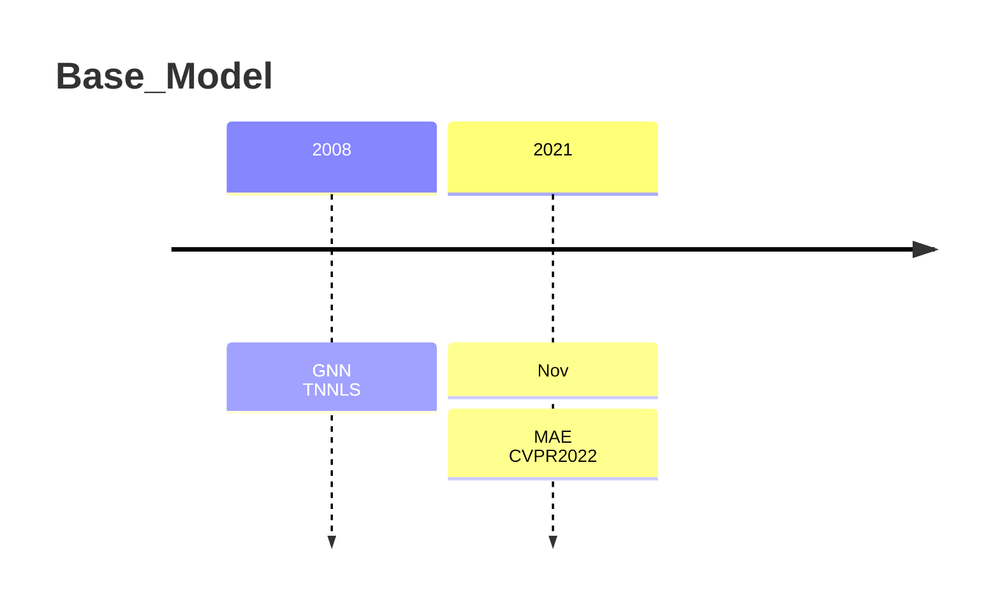
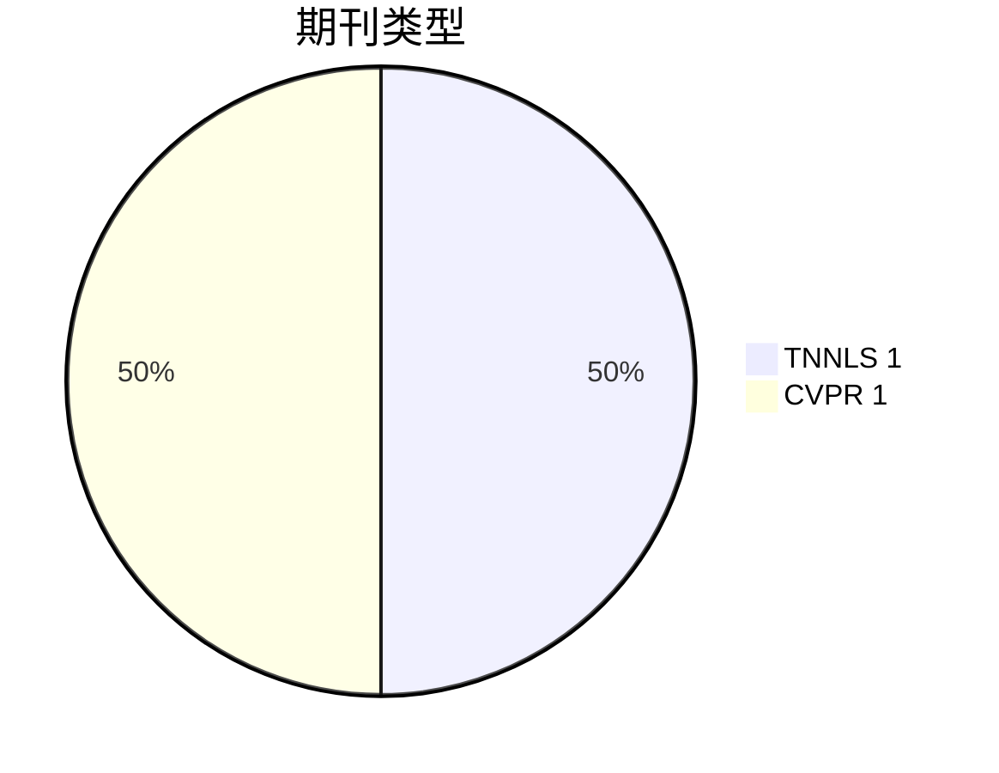
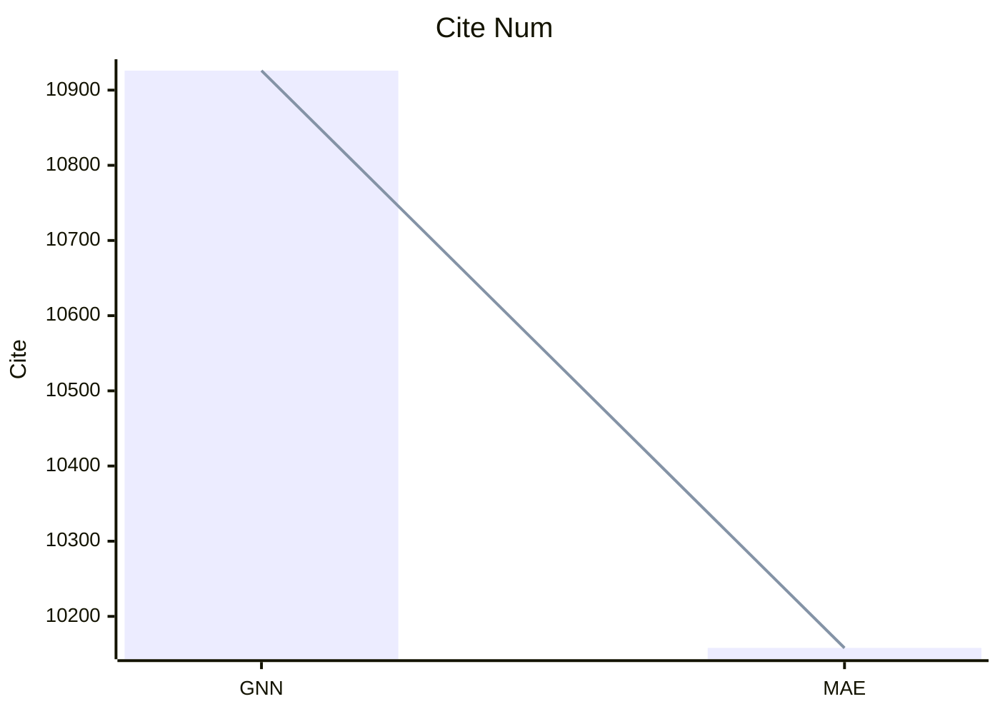

# 1.年份

取arxiv最新版本提交时间与论文截稿时间之间的较早时间

```mermaid
timeline
    title Base_Model
    2008 : GNN<br>TNNLS
    2021 : Nov
    		 : MAE<br>CVPR2022
```

# 2. 期刊

```mermaid
pie title 期刊类型
    "TNNLS 1" : 1
    "CVPR 1" : 1
```

# 3. 关联

# 4. 引用量

```mermaid
    xychart-beta
    title "Cite Num"
    x-axis [GNN,MAE]
    y-axis "Cite" 
    bar [10926,10158]
    line [10926,10158]
```

