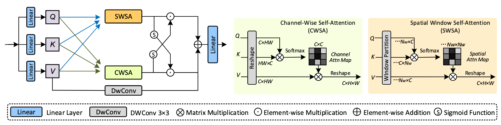
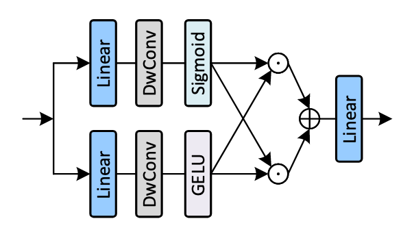
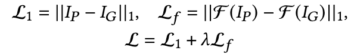

**Compacter: A Lightweight Transformer for Image Restoration**

- **背景**

  - 尽管深度学习方法在图像恢复（Image Restoration, IR）任务中表现出色，但**模型参数量庞大**，难以部署在边缘设备上。
  
- **现有问题**

  - **单维注意力机制局限性**
  
    - **空间注意力（Spatial Attention）**：关注“**哪里**”重要（例如纹理区域）；
    - **通道注意力（Channel Attention）**：关注“**什么类型的特征**”重要；
    - 问题是：**仅使用其中一种注意力机制时，信息交互不全面，难以捕捉特征之间的复杂关系。**
  
  - 但交替使用空间/通道注意力 → 参数激增
  
    - 些模型尝试**交替堆叠空间注意力和通道注意力**来弥补上述问题，但这会导致网络变得臃肿。
    - 对于轻量模型，**参数冗余是致命问题**，因为模型容量有限，不能负担复杂结构。
  
  - **序列式结构建模能力不足**
  
    - 序列堆叠的方式容易忽略更复杂的、**高阶、多方向的关系建模**。
    - **真实图像中像素间存在非局部、高阶的交互**，需要更灵活的建模方式。
  
  - **缺乏局部建模能力**
  
    - 自注意力机制擅长建模**全局上下文**，但在捕捉局部细节方面不如卷积。
    - 图像恢复是一个对**像素级细节非常敏感**的任务，如果忽略局部信息，结果容易模糊或出现伪影。
  
  - **轻量模型深度受限，能力瓶颈更突出**
    - **轻量模型无法像大模型那样堆很多层**，所以不能通过“加深网络”来补救结构表达能力的不足。
    - 这使得上述问题（如注意力机制单一、交互不足）在轻量网络中**更加严重**。
  
- **动机**

  - 其设计目标是**在减少参数量的同时保持恢复性能**。
  
- **贡献**

  - **提出了两个关键模块CASA和DSGM**
  - **在多个图像恢复任务上取得SOTA**

- **解决思路**

  - **CASA（Compact Adaptive Self-Attention）**
  - **Projection Sharing（投影共享）**
    - 对于通道注意力和窗口注意力使用同一套QKV
  - **Adaptive Interaction（自适应交互）**
      - CASA 不仅独立建模**空间自注意力**和**通道自注意力**，还引入机制使两者交互。这种交互是**双向的**，即空间和通道信息可以彼此调制，形成**全向信息融合**
      - 在空间与通道两个维度上进行**交叉信息传播与融合**；
      - 实现**全向的信息建模**（全局语义关联增强）。
    - **Heterogeneous Aggregation（异构聚合）**
      - 自注意力关注的是**全局信息**，但对本地信息建模不够强（尤其对像素细节）。CASA 为了解决这一问题，引入**深度可分离卷积（depth-wise convolution）**对 Value 进行并行处理，补充局部细节。
    - 在 Value 上引入 **Depth-wise Convolution**：
        - 弥补Transformer对**局部信息建模能力的不足**；
      - 实现**局部+全局的耦合建模**。
  - **DSGM（Dual Selective Gated Module）**

    - 设计了**双通道选择门控模块**（DSGM）：

      - 对每个像素点进行**上下文自适应聚合**；
      - 实现**全局语义引导的局部增强**。
  - **双域损失**
    - L1+频域损失
    - 快速傅里叶变换（FFT）提取图像频域表示，然后计算频域中的误差

- **具体解决办法**

  - **CASA**
    - **投影共享**
    - **自适应交互**
    - **异质聚合**
    - 
  - **DSGM**
    - 
  - **双域损失**
    - 
    - 𝜆=0.1

==定义了通道+窗口结合且QKV在两种Attention中共享的Attention与全新的MLP，使用频域损失+L1损失==