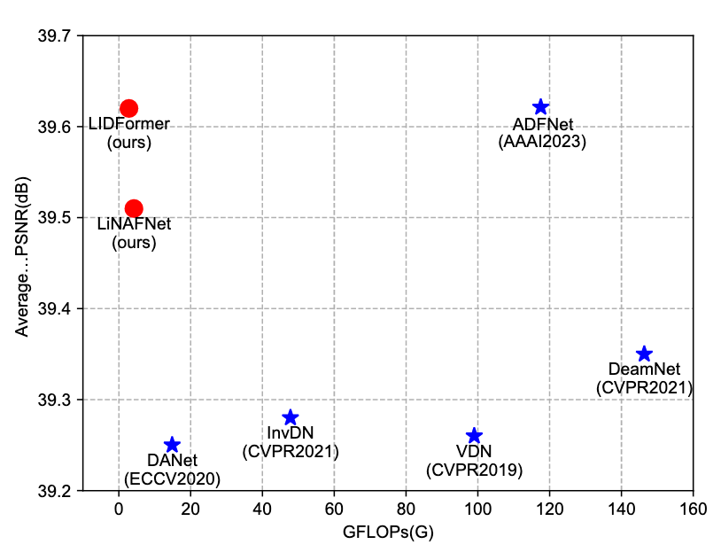

**Efficient lightweight image denoising with triple attention transformer**

- **背景**

- **现有问题**

  - ==仅对比了早些年的工作==

  - 

- **动机**

- **贡献**

  - **提出了LIDFormer框架**

  - **CPFR模块的设计**

  - **TMDTA模块的提出**

  - **实验验证与泛化能力**

- **解决思路**

  - **Discrete Wavelet Transform（DWT）**

    - 输入图像首先通过 **离散小波变换（DWT）** 处理，得到其低频部分。
    - 低频图像信息保留图像结构主干，同时减少高频噪声和细节——这 **显著减少后续计算量**。

  - **CPFR**

    - 为了解决低频图像缺少细节的问题，作者引入了 **CPFR 模块**，核心思想是：

      - **重复利用浅层（细节强）和深层（语义强）特征**
      - 在网络中聚合不同层级的信息，弥补低频图缺失的细节

      这样可以 **在不增加大计算量的前提下增强特征表达能力**。

  - **TMDTA**

    - 可以在 **三个维度上（可能是 H/W/C）建模全局上下文依赖**
    - 基于 **卷积替代部分自注意力计算**，减少复杂度

- **具体解决办法**

