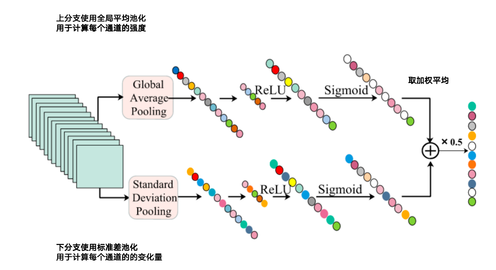

**Lattice Network for Lightweight  Image Restoration**

- **背景**

  - 深度学习在图像恢复（IR）任务中取得了巨大进展，残差块（Residual Block, RB）是其中最常用的结构之一，提升了模型性能。
  
- **现有问题**

  - 传统模型往往依赖大量堆叠的 RB，这会导致显著的内存消耗和计算成本，尤其在边缘设备或轻量部署场景中变得不切实际
  
- **动机**

  - 目标是设计一种**更节省计算和内存的结构**通过**连接两个 RB 之间的关系**而不是盲目堆叠，提升建模能力。
  - 设计灵感来自信号处理中 **lattice filter（格滤波器）** 的拓扑结构；格滤波器强调结构中的**信息流交叉与自适应组合**。
  - 不从零设计新模块，而是从“如何组合已有的 Residual Blocks (RBs)”出发；
  
- **贡献**

  - **设计了一种全新的Lattice Block LB**

  - **实现RB的多样组合方式与自适应链接**

  - **LB实现轻量设计，显著减少参数**

  -  **提出三个具体实例模型并融合对比损失**

- **解决思路**
  -  **Lattice Block（LB）**
    - 使用了“**蝶形拓扑结构**”（典型于 FFT / 格滤波器），来连接一对 RB；
    - 信息可以通过多个路径流动，不再是简单串联。
  -  **对比损失函数（contrastive loss）**
     -  通过正负样本推离和拉进，从两个方面优化
     -  第一阶段仅使用重建损失训练，第二阶段微调使用对比损失与重建损失1:1优化
  
- **具体解决办法**

  - > 1. **c = w₁·x₁ + x₂**
    >
    > 2. **c = x₁ + w₂·x₂**
    >
    > 3. **c = w₁·x₁ + w₂·x₂**
    >
    > 1,2是常见的残差结构，3是本文使用的方式

  - **Lattice Filter**

    - 
    - 
    - 所有不同组合系数可能出现的组合方式
    - 

  - **Lattice Block（LB）**

    - LB借鉴Lattice Filter的设计
    - 
  
  - **LB中组合系数的学习机制**
  
    - 通过通道注意力机制
  
  - 上分支使用全局平均池化（判断强度），下分支使用全局标准池化（判断变化性）
    - 两个权重取平均
  
  - 
  
    
  
  - **引入对比学习**
  
    - 对比学习的关键是正样本和负样本
      - 正样本：希望模型靠近的样本
      - 负样本：希望模型远离的样本
      - 锚点样本：当前网络的恢复图像
  
    - 早期的工作使用初始的低清图作为负样本，但是本文觉得使用这种图像作为负样本太差了，所以使用预训练的网络生成多个图像作为负样本（阶段一训练的版本）
    - 
    - 𝜆是超参数，实验中固定为1
    - 阶段一仅用重建损失训练
    - 阶段二在原有模型的基础上加入对比损失进行微调
  

==优化CNN中的残差链接，从单个动态调整（c = x₁ + w₂·x₂）变为双向动态调整(c = w₁·x₁ + w₂·x₂)==
==为SR和IR工作设计了不同的网络==

==使用对比学习作为后期微调，选取初步训练的恢复版本作为负样本，GT作为正样本==

相比于LatticeNet: Towards lightweight image super-resolution with lattice block(2020ECCV)的改进是

- 模块泛化
- 引入对比损失优化性能
- 细节与可视化分析拓展
- 更全面的实验验证