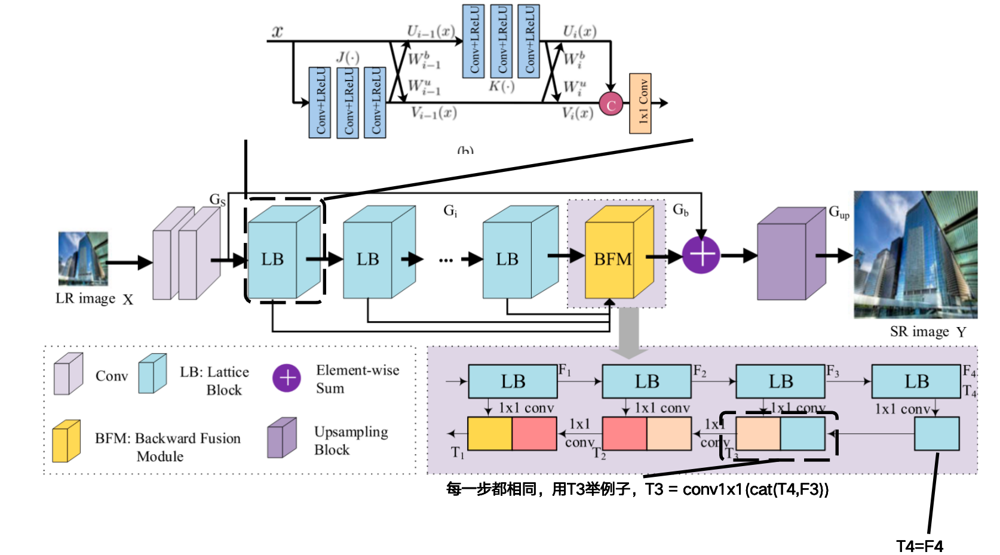

### **1. (SR)Transformer for Single Image Super-Resolution**. Zhisheng Lu et.al. **arxiv**, **2021**, ([pdf](assets/pdfs/Transformer_for_Single_Image_Super-Resolution.pdf))([link](http://arxiv.org/abs/2108.11084v3)).

- **ESRT**
- **CVPRW:2022**
- **终版提交:2022.4.22**
- **Cite:566**
- **Transformer**
- **现有问题:现有SR工作的网路轻量化不足**
- **创新点:==线性结构，提出了新型的网络架构，使用卷积+共享+通道Att，降低通道数，以及注意力图拆分的方式来降低计算量==**
- 
- [详细信息](Transformer for Single Image Super-Resolution.md)

### 2. (IR/SR)Lattice Network for Lightweight  Image Restoration

- **LatticeNets**

- **TPAMI:2023**

- **终版提交:2023.4.4**

- **Cite:67**

- **现有问题:**现有工作残差链接没有考虑到动态性

- **创新点:**

  **==1. 优化CNN中的残差链接，从单个动态调整（c = x₁ + w₂·x₂）变为双向动态调整(c = w₁·x₁ + w₂·x₂)==**

  ==**2. 为SR和IR工作设计了不同的网络**==

  **==3. 使用对比学习作为后期微调，选取初步训练的恢复版本作为负样本，GT作为正样本==**

- **对SR网络**

- 

- **对IR网络**

- 

- [详细信息](./Lattice Network for Lightweight  Image Restoration.md)

### 3. (IR/SR)Compacter: A Lightweight Transformer for Image Restoration

- **Compacter**
- **ACMMM:2024**
- **终版提交:2024.4.12**
- **Cite:0**
- **现有问题:现有工作轻量化不足**
- **创新点:==定义了通道+窗口结合且QKV在两种Attention中共享的Attention与全新的MLP，使用频域损失+L1损失==**
- 
- [详细信息](./Compacter: A Lightweight Transformer for Image Restoration.md)

- {{2305.11474}}
- RAMiT
- CVPRW:2024
- 终版提交:2024.4.18
- Cite:16
- 现有问题:
- 创新点:
- 

### 4. (SR)**Efficient Attention-Sharing Information Distillation Transformer forLightweight Single Image Super-Resolution**. Karam Park et.al. **arxiv**, **2025**, ([pdf](assets/pdfs/Efficient_Attention-Sharing_Information_Distillation_Transformer_for__Lightweight_Single_Image_Super-Resolution.pdf))([link](http://arxiv.org/abs/2501.15774v2)).

- **ASID**

- **AAAI:2025**

- **终版提交:2024.8.19**

- **Cite:2**

- **现有问题:Transformer不够轻量化**

- **创新点:==线性结构，使用了通道注意力+窗口注意力==**

- **==1.使用通道划分蒸馏(区别对待不同重要性的通道)，每次处理后一半通道直接输出，另一半继续处理==**

- **==2.Attention中Q@K后的矩阵权重共享来解决Transformer轻量化的问题==**

- 

- [详细信息](./Efficient Attention-Sharing Information Distillation Transformer for Lightweight Single Image Super-Resolution.md)

